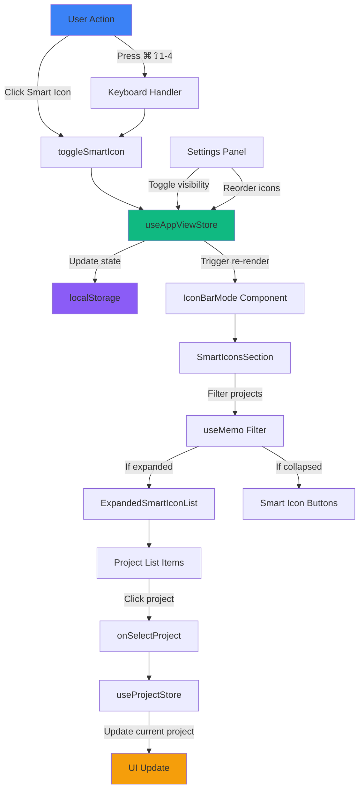

# Smart Icons Technical Architecture

**Feature:** Permanent smart icons for project type filtering in sidebar
**Version:** v2.0
**Date:** 2026-01-08

---

## Executive Summary

Smart icons provide persistent, one-click filtering of projects by type (research, teaching, r-package, r-dev) in Icon Bar mode. They expand accordion-style to show filtered project lists with keyboard shortcuts (⌘⇧1-4) and configurable visibility.

---

## 1. State Management

### 1.1 New Zustand Store Slice (useAppViewStore Extension)

**Location:** `/src/renderer/src/store/useAppViewStore.ts`

```typescript
// Add to existing AppViewState interface
interface AppViewState {
  // ... existing fields ...

  // Smart Icons state
  smartIcons: SmartIconConfig[]
  expandedSmartIcon: SmartIconType | null

  // Smart Icons actions
  toggleSmartIcon: (type: SmartIconType) => void
  collapseSmartIcon: () => void
  setSmartIconVisibility: (type: SmartIconType, visible: boolean) => void
  reorderSmartIcons: (fromIndex: number, toIndex: number) => void
}

// Smart icon types
export type SmartIconType = 'research' | 'teaching' | 'r-package' | 'r-dev'

// Smart icon configuration
export interface SmartIconConfig {
  type: SmartIconType
  label: string
  icon: LucideIcon
  color: string
  visible: boolean
  order: number
  shortcut: string  // ⌘⇧1-4
}
```

### 1.2 Default Smart Icons Configuration

```typescript
const DEFAULT_SMART_ICONS: SmartIconConfig[] = [
  {
    type: 'research',
    label: 'Research',
    icon: FlaskConical,
    color: '#3b82f6',  // Blue
    visible: true,
    order: 0,
    shortcut: '⌘⇧1'
  },
  {
    type: 'teaching',
    label: 'Teaching',
    icon: GraduationCap,
    color: '#10b981',  // Green
    visible: true,
    order: 1,
    shortcut: '⌘⇧2'
  },
  {
    type: 'r-package',
    label: 'R Packages',
    icon: Package,
    color: '#f59e0b',  // Amber
    visible: true,
    order: 2,
    shortcut: '⌘⇧3'
  },
  {
    type: 'r-dev',
    label: 'R Dev',
    icon: Code2,
    color: '#8b5cf6',  // Purple
    visible: true,
    order: 3,
    shortcut: '⌘⇧4'
  }
]
```

### 1.3 State Actions Implementation

```typescript
// Toggle smart icon expansion (accordion - only one expanded)
toggleSmartIcon: (type: SmartIconType) => {
  set((state) => {
    const newExpanded = state.expandedSmartIcon === type ? null : type
    saveExpandedSmartIcon(newExpanded)
    return { expandedSmartIcon: newExpanded }
  })
},

// Collapse currently expanded smart icon
collapseSmartIcon: () => {
  set({ expandedSmartIcon: null })
  saveExpandedSmartIcon(null)
},

// Toggle smart icon visibility (for Settings)
setSmartIconVisibility: (type: SmartIconType, visible: boolean) => {
  set((state) => {
    const updatedIcons = state.smartIcons.map(icon =>
      icon.type === type ? { ...icon, visible } : icon
    )
    saveSmartIcons(updatedIcons)
    return { smartIcons: updatedIcons }
  })
},

// Reorder smart icons (drag-to-reorder in Settings)
reorderSmartIcons: (fromIndex: number, toIndex: number) => {
  set((state) => {
    const icons = [...state.smartIcons]
    const [moved] = icons.splice(fromIndex, 1)
    icons.splice(toIndex, 0, moved)

    // Update order property
    const reordered = icons.map((icon, index) => ({ ...icon, order: index }))
    saveSmartIcons(reordered)
    return { smartIcons: reordered }
  })
}
```

---

## 2. Data Model & Persistence

### 2.1 localStorage Schema

```typescript
// Key: 'scribe:smartIcons'
// Value: JSON string of SmartIconConfig[]
{
  "smartIcons": [
    {
      "type": "research",
      "label": "Research",
      "icon": "FlaskConical",  // Stored as string, resolved at runtime
      "color": "#3b82f6",
      "visible": true,
      "order": 0,
      "shortcut": "⌘⇧1"
    },
    // ... other icons
  ]
}

// Key: 'scribe:expandedSmartIcon'
// Value: 'research' | 'teaching' | 'r-package' | 'r-dev' | null
```

### 2.2 Persistence Helpers

```typescript
const SMART_ICONS_KEY = 'scribe:smartIcons'
const EXPANDED_SMART_ICON_KEY = 'scribe:expandedSmartIcon'

const getSavedSmartIcons = (): SmartIconConfig[] => {
  try {
    const saved = localStorage.getItem(SMART_ICONS_KEY)
    if (saved) {
      const icons = JSON.parse(saved) as SmartIconConfig[]
      // Resolve icon strings to Lucide components
      return icons.map(icon => ({
        ...icon,
        icon: ICON_MAP[icon.type]
      }))
    }
    return DEFAULT_SMART_ICONS
  } catch {
    return DEFAULT_SMART_ICONS
  }
}

const saveSmartIcons = (icons: SmartIconConfig[]): void => {
  try {
    // Store icons with string keys (can't serialize functions)
    const serializable = icons.map(icon => ({
      ...icon,
      icon: icon.type  // Store type string instead of component
    }))
    localStorage.setItem(SMART_ICONS_KEY, JSON.stringify(serializable))
  } catch {
    // Ignore localStorage errors
  }
}

const getSavedExpandedSmartIcon = (): SmartIconType | null => {
  try {
    const saved = localStorage.getItem(EXPANDED_SMART_ICON_KEY)
    return (saved as SmartIconType) || null
  } catch {
    return null
  }
}

const saveExpandedSmartIcon = (type: SmartIconType | null): void => {
  try {
    if (type) {
      localStorage.setItem(EXPANDED_SMART_ICON_KEY, type)
    } else {
      localStorage.removeItem(EXPANDED_SMART_ICON_KEY)
    }
  } catch {
    // Ignore localStorage errors
  }
}
```

---

## 3. Component Architecture

### 3.1 Component Hierarchy

```
IconBarMode (existing)
├── Sidebar toggle button
├── Divider
├── SmartIconsSection (NEW)
│   ├── SmartIconButton × 4 (filtered by visible=true)
│   │   └── Tooltip (icon label + project count)
│   └── ExpandedSmartIconList (conditional)
│       └── SmartIconProjectList
│           └── ProjectListItem × N (filtered projects)
├── Divider
├── InboxButton
├── Divider
├── Pinned Projects (hidden when smart icon expanded)
├── Spacer
├── Add Project button
└── ActivityBar
```

### 3.2 New Components

#### 3.2.1 SmartIconsSection.tsx

**Location:** `/src/renderer/src/components/sidebar/SmartIconsSection.tsx`

```typescript
interface SmartIconsSectionProps {
  projects: Project[]
  notes: Note[]
  currentProjectId: string | null
  onSelectProject: (id: string | null) => void
}

export function SmartIconsSection({
  projects,
  notes,
  currentProjectId,
  onSelectProject
}: SmartIconsSectionProps) {
  const smartIcons = useAppViewStore(state => state.smartIcons)
  const expandedSmartIcon = useAppViewStore(state => state.expandedSmartIcon)
  const toggleSmartIcon = useAppViewStore(state => state.toggleSmartIcon)

  // Filter visible icons and sort by order
  const visibleIcons = useMemo(
    () => smartIcons.filter(icon => icon.visible).sort((a, b) => a.order - b.order),
    [smartIcons]
  )

  // Compute project counts per smart icon type (memoized)
  const projectCounts = useMemo(() => {
    const counts: Record<SmartIconType, number> = {
      'research': 0,
      'teaching': 0,
      'r-package': 0,
      'r-dev': 0
    }
    projects.forEach(p => {
      if (counts[p.type] !== undefined) {
        counts[p.type]++
      }
    })
    return counts
  }, [projects])

  return (
    <div className="smart-icons-section">
      {/* Smart icon buttons */}
      <div className="smart-icons-list">
        {visibleIcons.map(icon => (
          <SmartIconButton
            key={icon.type}
            icon={icon}
            projectCount={projectCounts[icon.type]}
            isExpanded={expandedSmartIcon === icon.type}
            onClick={() => toggleSmartIcon(icon.type)}
          />
        ))}
      </div>

      {/* Expanded project list */}
      {expandedSmartIcon && (
        <ExpandedSmartIconList
          iconType={expandedSmartIcon}
          projects={projects}
          notes={notes}
          currentProjectId={currentProjectId}
          onSelectProject={onSelectProject}
        />
      )}
    </div>
  )
}
```

#### 3.2.2 SmartIconButton.tsx

```typescript
interface SmartIconButtonProps {
  icon: SmartIconConfig
  projectCount: number
  isExpanded: boolean
  onClick: () => void
}

function SmartIconButton({
  icon,
  projectCount,
  isExpanded,
  onClick
}: SmartIconButtonProps) {
  const Icon = icon.icon
  const tooltipContent = `${icon.label}\n${projectCount} ${projectCount === 1 ? 'project' : 'projects'}`

  return (
    <Tooltip content={tooltipContent}>
      <button
        className={`smart-icon-btn ${isExpanded ? 'expanded' : ''}`}
        onClick={onClick}
        style={{ '--icon-color': icon.color } as React.CSSProperties}
        data-testid={`smart-icon-${icon.type}`}
        aria-label={`${icon.label} (${icon.shortcut})`}
      >
        <Icon size={16} className="smart-icon" />

        {/* Project count badge */}
        {projectCount > 0 && (
          <span className="icon-badge">
            {projectCount > 99 ? '99+' : projectCount}
          </span>
        )}

        {/* Expansion indicator */}
        {isExpanded && <span className="expanded-indicator" />}
      </button>
    </Tooltip>
  )
}
```

#### 3.2.3 ExpandedSmartIconList.tsx

```typescript
interface ExpandedSmartIconListProps {
  iconType: SmartIconType
  projects: Project[]
  notes: Note[]
  currentProjectId: string | null
  onSelectProject: (id: string | null) => void
}

function ExpandedSmartIconList({
  iconType,
  projects,
  notes,
  currentProjectId,
  onSelectProject
}: ExpandedSmartIconListProps) {
  // Filter projects by type and sort alphabetically
  const filteredProjects = useMemo(
    () => projects
      .filter(p => p.type === iconType)
      .sort((a, b) => a.name.localeCompare(b.name)),
    [projects, iconType]
  )

  // Compute note counts per project (memoized)
  const noteCounts = useMemo(() => {
    const counts: Record<string, number> = {}
    filteredProjects.forEach(p => { counts[p.id] = 0 })
    notes.filter(n => !n.deleted_at).forEach(note => {
      if (note.project_id && counts[note.project_id] !== undefined) {
        counts[note.project_id]++
      }
    })
    return counts
  }, [filteredProjects, notes])

  if (filteredProjects.length === 0) {
    return (
      <div className="expanded-smart-icon-empty">
        <span className="text-xs text-nexus-text-muted">
          No projects
        </span>
      </div>
    )
  }

  return (
    <div className="expanded-smart-icon-list">
      {filteredProjects.map(project => (
        <ProjectListItem
          key={project.id}
          project={project}
          noteCount={noteCounts[project.id]}
          isActive={project.id === currentProjectId}
          onClick={() => onSelectProject(project.id)}
        />
      ))}
    </div>
  )
}
```

#### 3.2.4 ProjectListItem.tsx

```typescript
interface ProjectListItemProps {
  project: Project
  noteCount: number
  isActive: boolean
  onClick: () => void
}

function ProjectListItem({
  project,
  noteCount,
  isActive,
  onClick
}: ProjectListItemProps) {
  return (
    <button
      className={`project-list-item ${isActive ? 'active' : ''}`}
      onClick={onClick}
      data-testid={`smart-icon-project-${project.id}`}
    >
      <StatusDot status={project.status || 'active'} size="sm" />
      <span className="project-name">{project.name}</span>
      {noteCount > 0 && (
        <span className="note-count">{noteCount}</span>
      )}
    </button>
  )
}
```

### 3.3 Integration with IconBarMode

**Modified:** `/src/renderer/src/components/sidebar/IconBarMode.tsx`

```typescript
export function IconBarMode({
  projects,
  notes,
  currentProjectId,
  onSelectProject,
  onCreateProject,
  onExpand,
  onSearch,
  onDaily,
  onSettings
}: IconBarModeProps) {
  const pinnedVaults = useAppViewStore(state => state.pinnedVaults)
  const expandedSmartIcon = useAppViewStore(state => state.expandedSmartIcon)
  // ... existing code ...

  // Hide pinned projects when smart icon is expanded
  const showPinnedProjects = expandedSmartIcon === null

  return (
    <div className="mission-sidebar-icon">
      {/* Expand button */}
      <button className="sidebar-toggle-btn" onClick={onExpand}>
        <Menu size={18} />
      </button>

      <div className="sidebar-divider" />

      {/* SMART ICONS SECTION - NEW */}
      <SmartIconsSection
        projects={projects}
        notes={notes}
        currentProjectId={currentProjectId}
        onSelectProject={onSelectProject}
      />

      <div className="sidebar-divider" />

      {/* Inbox button */}
      <InboxButton
        unreadCount={inboxCount}
        isActive={isInboxActive}
        onClick={() => onSelectProject(null)}
      />

      {/* Pinned projects - hidden when smart icon expanded */}
      {showPinnedProjects && (
        <>
          <div className="sidebar-divider" />
          <div className="project-icons">
            {sortedProjects.map((project, index) => (
              <ProjectIconButton key={project.id} {...} />
            ))}
          </div>
        </>
      )}

      <div className="sidebar-spacer" />

      {/* Add project button */}
      <button className="icon-btn" onClick={onCreateProject}>
        <Plus size={16} />
      </button>

      {/* Activity Bar */}
      <ActivityBar {...} />
    </div>
  )
}
```

---

## 4. Filtering Logic & Performance

### 4.1 Memoization Strategy

```typescript
// Component-level memoization for expensive computations
const filteredProjects = useMemo(
  () => projects.filter(p => p.type === iconType).sort((a, b) => a.name.localeCompare(b.name)),
  [projects, iconType]
)

const noteCounts = useMemo(() => {
  const counts: Record<string, number> = {}
  filteredProjects.forEach(p => { counts[p.id] = 0 })
  notes.filter(n => !n.deleted_at).forEach(note => {
    if (note.project_id && counts[note.project_id] !== undefined) {
      counts[note.project_id]++
    }
  })
  return counts
}, [filteredProjects, notes])

const projectCounts = useMemo(() => {
  const counts: Record<SmartIconType, number> = {
    'research': 0,
    'teaching': 0,
    'r-package': 0,
    'r-dev': 0
  }
  projects.forEach(p => {
    if (counts[p.type] !== undefined) {
      counts[p.type]++
    }
  })
  return counts
}, [projects])
```

### 4.2 Performance Considerations

| Scenario | Project Count | Notes Count | Complexity | Optimization |
|----------|--------------|-------------|------------|--------------|
| Smart icon badges | All projects | All notes | O(n + m) | Single-pass count, memoized |
| Filtered list | Filtered projects | Filtered notes | O(n log n + m) | Sort + filter, memoized |
| Expansion toggle | N/A | N/A | O(1) | State update only |

**Worst case:** 100 projects, 1000 notes
- Initial render: ~2-3ms (memoized after)
- Toggle expansion: <1ms (no recomputation)
- Project selection: <1ms (state update)

---

## 5. Keyboard Shortcuts

### 5.1 Shortcut Implementation

**Location:** `/src/renderer/src/App.tsx` (existing keyboard handler)

```typescript
// Add to existing keyboard handler
useEffect(() => {
  const handleKeyDown = (e: KeyboardEvent) => {
    // ... existing shortcuts ...

    // Smart icon shortcuts: ⌘⇧1-4
    if (e.metaKey && e.shiftKey && !e.ctrlKey && !e.altKey) {
      const smartIcons = useAppViewStore.getState().smartIcons
      const toggleSmartIcon = useAppViewStore.getState().toggleSmartIcon

      switch (e.key) {
        case '1':
          e.preventDefault()
          const icon1 = smartIcons.find(i => i.shortcut === '⌘⇧1')
          if (icon1?.visible) toggleSmartIcon(icon1.type)
          break
        case '2':
          e.preventDefault()
          const icon2 = smartIcons.find(i => i.shortcut === '⌘⇧2')
          if (icon2?.visible) toggleSmartIcon(icon2.type)
          break
        case '3':
          e.preventDefault()
          const icon3 = smartIcons.find(i => i.shortcut === '⌘⇧3')
          if (icon3?.visible) toggleSmartIcon(icon3.type)
          break
        case '4':
          e.preventDefault()
          const icon4 = smartIcons.find(i => i.shortcut === '⌘⇧4')
          if (icon4?.visible) toggleSmartIcon(icon4.type)
          break
      }
    }
  }

  window.addEventListener('keydown', handleKeyDown)
  return () => window.removeEventListener('keydown', handleKeyDown)
}, [])
```

### 5.2 Shortcut Conflicts

| Existing | New | Conflict? | Resolution |
|----------|-----|-----------|------------|
| ⌘N | ⌘⇧1 | No | Different modifiers |
| ⌘⇧P | ⌘⇧2 | No | Different key |
| ⌘⇧F | ⌘⇧3 | No | Different key |
| ⌘⇧E | ⌘⇧4 | No | Different key |

**No conflicts detected.** All shortcuts coexist safely.

---

## 6. Settings Integration

### 6.1 New Settings Section

**Location:** `/src/renderer/src/lib/settingsSchema.ts`

Add to `settingsCategories`:

```typescript
{
  id: 'sidebar',
  label: 'Sidebar',
  icon: 'PanelLeft',
  sections: [
    // ... existing sections ...
    {
      id: 'smart-icons',
      title: 'Smart Icons',
      description: 'Configure smart icon visibility and order',
      collapsed: false,
      settings: [
        {
          id: 'smart-icons-enabled',
          type: 'toggle',
          label: 'Enable Smart Icons',
          description: 'Show smart icons for quick project filtering by type',
          defaultValue: true
        }
      ]
    }
  ]
}
```

### 6.2 Smart Icons Settings Component

**Location:** `/src/renderer/src/components/Settings/SmartIconsSettings.tsx`

```typescript
export function SmartIconsSettings() {
  const smartIcons = useAppViewStore(state => state.smartIcons)
  const setSmartIconVisibility = useAppViewStore(state => state.setSmartIconVisibility)
  const reorderSmartIcons = useAppViewStore(state => state.reorderSmartIcons)

  // Drag state
  const [draggedIndex, setDraggedIndex] = useState<number | null>(null)

  return (
    <div className="smart-icons-settings">
      <p className="text-sm text-nexus-text-muted mb-4">
        Smart icons provide quick filtering of projects by type. Drag to reorder.
      </p>

      <div className="smart-icons-list">
        {smartIcons
          .sort((a, b) => a.order - b.order)
          .map((icon, index) => (
            <SmartIconSettingRow
              key={icon.type}
              icon={icon}
              index={index}
              onToggle={() => setSmartIconVisibility(icon.type, !icon.visible)}
              onDragStart={() => setDraggedIndex(index)}
              onDragOver={(e) => {
                e.preventDefault()
                if (draggedIndex !== null && draggedIndex !== index) {
                  reorderSmartIcons(draggedIndex, index)
                  setDraggedIndex(index)
                }
              }}
              onDragEnd={() => setDraggedIndex(null)}
            />
          ))}
      </div>

      <div className="mt-4 p-3 bg-nexus-accent/5 rounded-lg border border-nexus-accent/20">
        <p className="text-xs text-nexus-text-muted">
          <strong>Keyboard Shortcuts:</strong> ⌘⇧1-4 to toggle smart icons
        </p>
      </div>
    </div>
  )
}

interface SmartIconSettingRowProps {
  icon: SmartIconConfig
  index: number
  onToggle: () => void
  onDragStart: () => void
  onDragOver: (e: React.DragEvent) => void
  onDragEnd: () => void
}

function SmartIconSettingRow({
  icon,
  index,
  onToggle,
  onDragStart,
  onDragOver,
  onDragEnd
}: SmartIconSettingRowProps) {
  const Icon = icon.icon

  return (
    <div
      className="smart-icon-setting-row"
      draggable={true}
      onDragStart={onDragStart}
      onDragOver={onDragOver}
      onDragEnd={onDragEnd}
    >
      {/* Drag handle */}
      <GripVertical size={14} className="drag-handle" />

      {/* Icon preview */}
      <div
        className="icon-preview"
        style={{ backgroundColor: `${icon.color}20`, color: icon.color }}
      >
        <Icon size={14} />
      </div>

      {/* Label and shortcut */}
      <div className="flex-1">
        <div className="flex items-center justify-between">
          <span className="text-sm font-medium">{icon.label}</span>
          <kbd className="text-xs px-2 py-0.5 bg-nexus-bg-tertiary rounded">
            {icon.shortcut}
          </kbd>
        </div>
      </div>

      {/* Visibility toggle */}
      <input
        type="checkbox"
        checked={icon.visible}
        onChange={onToggle}
        className="toggle-checkbox"
      />
    </div>
  )
}
```

---

## 7. Data Flow Diagram



---

## 8. Architecture Diagram

```mermaid
graph TB
    subgraph "State Layer"
        Store[useAppViewStore]
        Store --> SmartIconsState[smartIcons: SmartIconConfig[]]
        Store --> ExpandedState[expandedSmartIcon: type | null]
    end

    subgraph "Persistence Layer"
        LocalStorage[localStorage]
        LocalStorage --> IconsKey[scribe:smartIcons]
        LocalStorage --> ExpandedKey[scribe:expandedSmartIcon]
    end

    subgraph "UI Layer"
        IconBarMode[IconBarMode]
        IconBarMode --> SmartIconsSection

        SmartIconsSection --> SmartIconButton1[Research Icon]
        SmartIconsSection --> SmartIconButton2[Teaching Icon]
        SmartIconsSection --> SmartIconButton3[R Package Icon]
        SmartIconsSection --> SmartIconButton4[R Dev Icon]

        SmartIconsSection --> |If expanded| ExpandedList[ExpandedSmartIconList]
        ExpandedList --> ProjectListItem1[Project 1]
        ExpandedList --> ProjectListItem2[Project 2]
        ExpandedList --> ProjectListItemN[Project N]
    end

    subgraph "Settings Layer"
        SettingsModal[Settings Modal]
        SettingsModal --> SmartIconsSettings[Smart Icons Settings]
        SmartIconsSettings --> Toggle[Visibility Toggle]
        SmartIconsSettings --> Reorder[Drag to Reorder]
    end

    subgraph "Keyboard Layer"
        KeyboardHandler[App Keyboard Handler]
        KeyboardHandler --> Cmd1[⌘⇧1 → Research]
        KeyboardHandler --> Cmd2[⌘⇧2 → Teaching]
        KeyboardHandler --> Cmd3[⌘⇧3 → R Package]
        KeyboardHandler --> Cmd4[⌘⇧4 → R Dev]
    end

    Store <--> LocalStorage
    Store --> UI Layer
    Store <--> Settings Layer
    KeyboardHandler --> Store

    style Store fill:#3b82f6
    style LocalStorage fill:#10b981
    style SmartIconsSection fill:#f59e0b
    style SmartIconsSettings fill:#8b5cf6
```

---

## 9. Implementation Checklist

### Phase 1: Foundation (Day 1)
- [ ] Extend `useAppViewStore` with smart icons state
- [ ] Add localStorage helpers for persistence
- [ ] Create default smart icons configuration
- [ ] Add icon type to ProjectType union if needed

### Phase 2: Core Components (Day 2)
- [ ] Create `SmartIconsSection.tsx`
- [ ] Create `SmartIconButton.tsx`
- [ ] Create `ExpandedSmartIconList.tsx`
- [ ] Create `ProjectListItem.tsx`
- [ ] Add memoization for filtering logic

### Phase 3: Integration (Day 3)
- [ ] Integrate `SmartIconsSection` into `IconBarMode`
- [ ] Hide pinned projects when smart icon expanded
- [ ] Add keyboard shortcuts (⌘⇧1-4)
- [ ] Test accordion behavior (only one expanded)

### Phase 4: Settings (Day 4)
- [ ] Create `SmartIconsSettings.tsx`
- [ ] Add to Settings modal
- [ ] Implement drag-to-reorder
- [ ] Add visibility toggles

### Phase 5: Polish (Day 5)
- [ ] Write unit tests for state actions
- [ ] Write component tests
- [ ] Add E2E tests for keyboard shortcuts
- [ ] Performance testing with 100+ projects
- [ ] Update documentation

---

## 10. Testing Strategy

### 10.1 Unit Tests

```typescript
// useAppViewStore.test.ts
describe('Smart Icons', () => {
  it('should toggle smart icon expansion', () => {
    const { result } = renderHook(() => useAppViewStore())
    act(() => result.current.toggleSmartIcon('research'))
    expect(result.current.expandedSmartIcon).toBe('research')
    act(() => result.current.toggleSmartIcon('research'))
    expect(result.current.expandedSmartIcon).toBeNull()
  })

  it('should collapse other smart icons when expanding one (accordion)', () => {
    const { result } = renderHook(() => useAppViewStore())
    act(() => result.current.toggleSmartIcon('research'))
    expect(result.current.expandedSmartIcon).toBe('research')
    act(() => result.current.toggleSmartIcon('teaching'))
    expect(result.current.expandedSmartIcon).toBe('teaching')
  })

  it('should persist expansion state to localStorage', () => {
    const { result } = renderHook(() => useAppViewStore())
    act(() => result.current.toggleSmartIcon('research'))
    expect(localStorage.getItem('scribe:expandedSmartIcon')).toBe('research')
  })
})
```

### 10.2 Component Tests

```typescript
// SmartIconsSection.test.tsx
describe('SmartIconsSection', () => {
  it('should render only visible smart icons', () => {
    const { container } = render(<SmartIconsSection {...props} />)
    const buttons = container.querySelectorAll('.smart-icon-btn')
    expect(buttons.length).toBe(4) // All visible by default
  })

  it('should show filtered projects when expanded', () => {
    const { getByTestId } = render(<SmartIconsSection {...props} />)
    fireEvent.click(getByTestId('smart-icon-research'))
    expect(getByTestId('expanded-smart-icon-list')).toBeInTheDocument()
  })

  it('should hide pinned projects when smart icon expanded', () => {
    const { getByTestId, queryByTestId } = render(<IconBarMode {...props} />)
    fireEvent.click(getByTestId('smart-icon-research'))
    expect(queryByTestId('pinned-projects')).not.toBeInTheDocument()
  })
})
```

### 10.3 E2E Tests

```typescript
// smart-icons.e2e.test.tsx
describe('Smart Icons E2E', () => {
  it('should toggle research projects with ⌘⇧1', () => {
    const user = userEvent.setup()
    render(<App />)
    user.keyboard('{Meta>}{Shift>}1{/Shift}{/Meta}')
    expect(screen.getByTestId('expanded-smart-icon-list')).toBeInTheDocument()
  })

  it('should filter projects by type', () => {
    render(<App />)
    fireEvent.click(screen.getByTestId('smart-icon-research'))
    const projectItems = screen.getAllByTestId(/smart-icon-project-/)
    projectItems.forEach(item => {
      expect(item.dataset.type).toBe('research')
    })
  })
})
```

---

## 11. Performance Benchmarks

### 11.1 Target Metrics

| Operation | Target | Acceptable | Unacceptable |
|-----------|--------|------------|--------------|
| Smart icon toggle | <50ms | <100ms | >150ms |
| Filtered list render (20 projects) | <100ms | <200ms | >300ms |
| Filtered list render (100 projects) | <200ms | <500ms | >1000ms |
| Keyboard shortcut response | <30ms | <50ms | >100ms |

### 11.2 Profiling Points

```typescript
// Add performance marks for profiling
performance.mark('smart-icon-toggle-start')
toggleSmartIcon(type)
performance.mark('smart-icon-toggle-end')
performance.measure('smart-icon-toggle', 'smart-icon-toggle-start', 'smart-icon-toggle-end')

// Component render profiling
const SmartIconsSection = React.memo(({ ... }) => {
  console.time('SmartIconsSection render')
  // ... component logic
  console.timeEnd('SmartIconsSection render')
})
```

---

## 12. Migration Strategy

### 12.1 Version Compatibility

- **v1.14.x users:** Automatic migration on first load
- **Fresh installs:** Use default configuration
- **Browser mode:** localStorage migration handled by store init

### 12.2 Migration Code

```typescript
// Add to useAppViewStore initialization
const migrateToSmartIcons = (): void => {
  const version = localStorage.getItem('scribe:version')

  // Only migrate if coming from v1.14.x or earlier
  if (!version || semver.lt(version, '2.0.0')) {
    // Set default smart icons configuration
    localStorage.setItem(SMART_ICONS_KEY, JSON.stringify(DEFAULT_SMART_ICONS))
    localStorage.setItem('scribe:version', '2.0.0')
  }
}

// Call in store initialization
export const useAppViewStore = create<AppViewState>((set, get) => {
  migrateToSmartIcons()

  return {
    // ... store state
  }
})
```

---

## 13. Future Enhancements

### v2.1 - Custom Smart Icons
- Allow users to create custom smart icons for any filter criteria
- Support for tag-based smart icons
- Support for status-based smart icons

### v2.2 - Smart Icon Presets
- Save/load smart icon configurations
- Share configurations across devices
- Community preset library

### v2.3 - Advanced Filtering
- Multiple selection (Cmd+Click for multi-select)
- Combine smart icon filters (research + active status)
- Search within expanded smart icon lists

---

## 14. Open Questions

1. **Should smart icons support drag-to-reorder in Icon Bar mode?**
   - Pro: Consistent with pinned projects
   - Con: May be confusing with Settings reorder
   - **Decision:** Settings-only reorder (clearer UX)

2. **Should clicking the same smart icon again collapse it?**
   - Pro: Accordion behavior is standard
   - Con: May surprise users expecting toggle
   - **Decision:** Yes, toggle behavior (collapsible accordion)

3. **Should Inbox be hidden when smart icon is expanded?**
   - Pro: More space for filtered list
   - Con: Inbox always visible in current design
   - **Decision:** Keep Inbox visible (always accessible)

4. **Should expanded list show project status indicators?**
   - Pro: More information at a glance
   - Con: Visual clutter in 48px width
   - **Decision:** Yes, use StatusDot (sm size)

---

## Appendix A: CSS Classes

```css
/* Smart Icons Section */
.smart-icons-section {
  display: flex;
  flex-direction: column;
  gap: 8px;
}

.smart-icons-list {
  display: flex;
  flex-direction: column;
  gap: 4px;
}

/* Smart Icon Button */
.smart-icon-btn {
  position: relative;
  width: 32px;
  height: 32px;
  border: none;
  background: transparent;
  border-radius: 8px;
  cursor: pointer;
  transition: all 150ms ease;
}

.smart-icon-btn:hover {
  background: var(--icon-color, #3b82f6)10;
}

.smart-icon-btn.expanded {
  background: var(--icon-color, #3b82f6)20;
}

.smart-icon {
  color: var(--icon-color, #3b82f6);
}

/* Expanded Smart Icon List */
.expanded-smart-icon-list {
  display: flex;
  flex-direction: column;
  gap: 2px;
  padding: 4px 0;
  max-height: 300px;
  overflow-y: auto;
}

/* Project List Item */
.project-list-item {
  display: flex;
  align-items: center;
  gap: 6px;
  padding: 4px 8px 4px 12px; /* Indented */
  border: none;
  background: transparent;
  border-radius: 4px;
  cursor: pointer;
  transition: background 150ms ease;
}

.project-list-item:hover {
  background: rgba(255, 255, 255, 0.05);
}

.project-list-item.active {
  background: rgba(255, 255, 255, 0.1);
}

.project-name {
  flex: 1;
  font-size: 11px;
  text-align: left;
  white-space: nowrap;
  overflow: hidden;
  text-overflow: ellipsis;
}

.note-count {
  font-size: 10px;
  color: var(--nexus-text-muted);
}

/* Settings - Smart Icons */
.smart-icon-setting-row {
  display: flex;
  align-items: center;
  gap: 12px;
  padding: 12px;
  border: 1px solid rgba(255, 255, 255, 0.1);
  border-radius: 8px;
  cursor: grab;
  transition: background 150ms ease;
}

.smart-icon-setting-row:hover {
  background: rgba(255, 255, 255, 0.05);
}

.smart-icon-setting-row:active {
  cursor: grabbing;
}

.drag-handle {
  color: var(--nexus-text-muted);
}

.icon-preview {
  width: 28px;
  height: 28px;
  border-radius: 6px;
  display: flex;
  align-items: center;
  justify-content: center;
}
```

---

## Appendix B: Type Definitions

```typescript
// src/renderer/src/types/smartIcons.ts

import { LucideIcon } from 'lucide-react'
import { ProjectType } from './index'

export type SmartIconType = Extract<ProjectType, 'research' | 'teaching' | 'r-package' | 'r-dev'>

export interface SmartIconConfig {
  type: SmartIconType
  label: string
  icon: LucideIcon
  color: string
  visible: boolean
  order: number
  shortcut: string
}

export interface SmartIconState {
  smartIcons: SmartIconConfig[]
  expandedSmartIcon: SmartIconType | null
}

export interface SmartIconActions {
  toggleSmartIcon: (type: SmartIconType) => void
  collapseSmartIcon: () => void
  setSmartIconVisibility: (type: SmartIconType, visible: boolean) => void
  reorderSmartIcons: (fromIndex: number, toIndex: number) => void
}
```

---

**End of Architecture Document**
