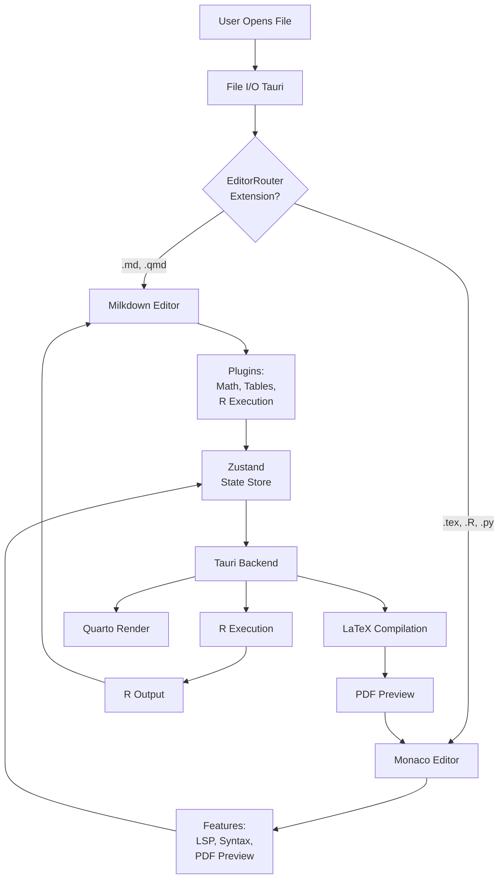

# 🧠 BRAINSTORM: Hybrid Editor Architecture (Milkdown + Monaco)

**Date:** 2025-12-31
**Mode:** Architecture | **Depth:** Default
**Focus:** Dual-editor system for markdown + LaTeX
**Duration:** Generated in < 5 min

---

## Context

**User Requirements:**
- File types: `.md`, `.qmd`, `.tex`, `.R`
- Use case: Mixed academic workflow (papers + research notes)
- Switching: Automatic by file extension
- LaTeX: Live PDF preview (Overleaf-style split pane)

**Current State:**
- CodeMirror Live Preview has performance issues (jerky editing)
- Viewport optimization didn't fully resolve smoothness
- Need editor that excels at each file type

**Goal:** Seamless dual-editor system where users get best-in-class experience for each file type without thinking about which editor is active.

---

## 🎯 Core Architecture

### Dual-Editor Strategy

```
┌─────────────────────────────────────────────────────────────┐
│                    Scribe Application                        │
│                  (Tauri + React + Zustand)                   │
├─────────────────────────────────────────────────────────────┤
│                                                              │
│  ┌──────────────────────────────────────────────────────┐   │
│  │        EditorRouter (File Type Detection)            │   │
│  │  - Detects file extension on open                    │   │
│  │  - Routes to appropriate editor component            │   │
│  │  - Maintains editor state per file                   │   │
│  └──────────────────┬──────────────┬────────────────────┘   │
│                     │              │                         │
│         ┌───────────▼───────┐  ┌──▼──────────────────┐      │
│         │ Milkdown Editor   │  │  Monaco Editor      │      │
│         ├───────────────────┤  ├─────────────────────┤      │
│         │ Files:            │  │ Files:              │      │
│         │ - .md (markdown)  │  │ - .tex (LaTeX)      │      │
│         │ - .qmd (Quarto)   │  │ - .R (R code)       │      │
│         │                   │  │ - .py (Python)      │      │
│         ├───────────────────┤  ├─────────────────────┤      │
│         │ Features:         │  │ Features:           │      │
│         │ ✓ Live Preview    │  │ ✓ Syntax Highlight  │      │
│         │ ✓ Math (KaTeX)    │  │ ✓ Auto-complete     │      │
│         │ ✓ R chunk exec    │  │ ✓ Error checking    │      │
│         │ ✓ Citations       │  │ ✓ LSP support       │      │
│         │ ✓ Tables          │  │ ✓ PDF preview       │      │
│         └───────────────────┘  └─────────────────────┘      │
│                     │                      │                 │
│                     └──────────┬───────────┘                 │
│                                │                             │
│                  ┌─────────────▼──────────────┐              │
│                  │   Shared Services Layer    │              │
│                  ├────────────────────────────┤              │
│                  │ - File I/O (Tauri)         │              │
│                  │ - State Management (Zustand)│             │
│                  │ - R Execution (Tauri)      │              │
│                  │ - LaTeX Compilation (Tauri)│              │
│                  │ - Quarto Render (Tauri)    │              │
│                  └────────────────────────────┘              │
└─────────────────────────────────────────────────────────────┘
```

---

## ⚡ Quick Wins (< 30 min each)

### 1. EditorRouter Component

**Benefit:** Single source of truth for editor selection

```typescript
// src/renderer/src/components/EditorRouter.tsx

export const EditorRouter = ({ filePath, content, onChange }) => {
  const ext = filePath.split('.').pop()?.toLowerCase()

  // Route by extension
  if (ext === 'md' || ext === 'qmd') {
    return <MilkdownEditor content={content} onChange={onChange} />
  }

  if (ext === 'tex' || ext === 'R' || ext === 'py') {
    return <MonacoEditor
      content={content}
      onChange={onChange}
      language={ext === 'tex' ? 'latex' : ext}
      showPdfPreview={ext === 'tex'}
    />
  }

  // Fallback: plain text
  return <TextEditor content={content} onChange={onChange} />
}
```

**Implementation:** 30-45 minutes
**Risk:** Low (simple routing logic)

---

### 2. File Extension Detection

**Benefit:** Automatic editor switching, zero user friction

```typescript
// src/renderer/src/hooks/useEditorType.ts

export const useEditorType = (filePath: string) => {
  const ext = filePath.split('.').pop()?.toLowerCase()

  const editorMap = {
    md: 'milkdown',
    qmd: 'milkdown',
    tex: 'monaco',
    R: 'monaco',
    py: 'monaco',
    js: 'monaco',
    ts: 'monaco'
  }

  return editorMap[ext] || 'text'
}
```

**Implementation:** 15 minutes
**Risk:** None

---

### 3. Shared State Layer (Zustand)

**Benefit:** Editor-agnostic state management

```typescript
// src/renderer/src/store/editorStore.ts

import create from 'zustand'

interface EditorState {
  // Current file
  currentFilePath: string | null
  currentContent: string
  currentEditorType: 'milkdown' | 'monaco' | 'text'

  // Editor-specific state
  milkdownState: MilkdownState | null
  monacoState: MonacoState | null

  // Actions
  setFile: (path: string, content: string) => void
  setContent: (content: string) => void
  switchEditor: (type: string) => void
}

export const useEditorStore = create<EditorState>((set) => ({
  currentFilePath: null,
  currentContent: '',
  currentEditorType: 'milkdown',
  milkdownState: null,
  monacoState: null,

  setFile: (path, content) => {
    const editorType = detectEditorType(path)
    set({ currentFilePath: path, currentContent: content, currentEditorType: editorType })
  },

  setContent: (content) => set({ currentContent: content }),

  switchEditor: (type) => set({ currentEditorType: type })
}))
```

**Implementation:** 20-30 minutes
**Risk:** Low

---

## 🔧 Medium Effort (1-2 hours each)

### 4. Milkdown Editor Component

**Outcome:** Production-ready Milkdown with all academic features

```typescript
// src/renderer/src/components/MilkdownEditor.tsx

import { Editor } from '@milkdown/core'
import { commonmark } from '@milkdown/preset-commonmark'
import { math } from '@milkdown/plugin-math'
import { prism } from '@milkdown/plugin-prism'
import { table } from '@milkdown/plugin-table'
import { listener } from '@milkdown/plugin-listener'
import { history } from '@milkdown/plugin-history'
import { refractor } from 'refractor/lib/common'
import r from 'refractor/lang/r.js'

refractor.register(r)

export const MilkdownEditor = ({ content, onChange }) => {
  const editorRef = useRef(null)
  const [editor, setEditor] = useState(null)

  useEffect(() => {
    const editor = Editor.make()
      .config((ctx) => {
        ctx.set(rootCtx, editorRef.current)
        ctx.set(defaultValueCtx, content)

        ctx.get(listenerCtx).markdownUpdated((ctx, markdown) => {
          onChange(markdown)
        })
      })
      .use(commonmark)
      .use(math)         // LaTeX math support
      .use(prism)        // Syntax highlighting (R, Python, etc.)
      .use(table)        // Table editing
      .use(listener)     // Change events
      .use(history)      // Undo/redo
      .create()

    setEditor(editor)

    return () => editor.destroy()
  }, [])

  return (
    <div
      ref={editorRef}
      className="milkdown-editor"
      style={{ width: '100%', height: '100%' }}
    />
  )
}
```

**Features:**
- ✅ Markdown editing with live preview
- ✅ Math equations (inline `$...$` and block `$$...$$`)
- ✅ R/Python syntax highlighting
- ✅ Tables
- ✅ Undo/redo

**Implementation:** 1-2 hours
**Dependencies:** `@milkdown/*` packages
**Risk:** Low (well-documented)

---

### 5. Monaco Editor Component with LaTeX Support

**Outcome:** VSCode-quality editor for code and LaTeX

```typescript
// src/renderer/src/components/MonacoEditor.tsx

import * as monaco from 'monaco-editor'
import { useEffect, useRef, useState } from 'react'
import { invoke } from '@tauri-apps/api/tauri'

export const MonacoEditor = ({
  content,
  onChange,
  language,
  showPdfPreview = false
}) => {
  const editorRef = useRef(null)
  const monacoRef = useRef(null)
  const [pdfPath, setPdfPath] = useState(null)
  const [compiling, setCompiling] = useState(false)

  useEffect(() => {
    // Initialize Monaco editor
    const editor = monaco.editor.create(editorRef.current, {
      value: content,
      language: language, // 'latex', 'r', 'python'
      theme: 'vs-dark',
      fontSize: 16,
      minimap: { enabled: false },
      wordWrap: 'on',
      lineNumbers: 'on',
      automaticLayout: true
    })

    // Listen for changes
    editor.onDidChangeModelContent(() => {
      onChange(editor.getValue())

      // Auto-compile LaTeX on change (debounced)
      if (language === 'latex' && showPdfPreview) {
        debouncedCompile(editor.getValue())
      }
    })

    monacoRef.current = editor

    return () => editor.dispose()
  }, [language])

  const compileLatex = async (content) => {
    setCompiling(true)
    try {
      const pdfPath = await invoke('compile_latex', { content })
      setPdfPath(pdfPath)
    } catch (error) {
      console.error('LaTeX compilation failed:', error)
    } finally {
      setCompiling(false)
    }
  }

  const debouncedCompile = useMemo(
    () => debounce(compileLatex, 2000),
    []
  )

  return (
    <div className="monaco-container">
      <div
        ref={editorRef}
        className="monaco-editor"
        style={{
          width: showPdfPreview ? '50%' : '100%',
          height: '100%'
        }}
      />

      {showPdfPreview && (
        <div className="pdf-preview-pane" style={{ width: '50%' }}>
          {compiling && <div>Compiling...</div>}
          {pdfPath && <PDFViewer pdfPath={pdfPath} />}
        </div>
      )}
    </div>
  )
}
```

**Features:**
- ✅ LaTeX syntax highlighting
- ✅ Auto-completion (built-in Monaco)
- ✅ Error squiggles (via language server)
- ✅ Split-pane PDF preview (for .tex files)
- ✅ Auto-compile on save (debounced)

**Implementation:** 1.5-2 hours
**Dependencies:** `monaco-editor`, `react-pdf` (for PDF viewer)
**Risk:** Low (Monaco is mature)

---

### 6. Tauri Backend: LaTeX Compilation

**Outcome:** Fast, reliable PDF generation from .tex files

```rust
// src-tauri/src/latex.rs

use std::process::Command;
use std::fs;
use std::path::PathBuf;

#[tauri::command]
pub async fn compile_latex(content: String) -> Result<String, String> {
    let temp_dir = std::env::temp_dir();
    let tex_file = temp_dir.join("scribe_temp.tex");
    let pdf_file = temp_dir.join("scribe_temp.pdf");

    // Write LaTeX content to temp file
    fs::write(&tex_file, content).map_err(|e| e.to_string())?;

    // Compile with pdflatex
    let output = Command::new("pdflatex")
        .args(&[
            "-interaction=nonstopmode",
            "-output-directory", temp_dir.to_str().unwrap(),
            tex_file.to_str().unwrap()
        ])
        .output()
        .map_err(|e| format!("Failed to run pdflatex: {}", e))?;

    if !output.status.success() {
        return Err(String::from_utf8_lossy(&output.stderr).to_string());
    }

    // Return PDF path
    Ok(pdf_file.to_str().unwrap().to_string())
}

#[tauri::command]
pub async fn check_latex_installed() -> Result<bool, String> {
    match Command::new("pdflatex").arg("--version").output() {
        Ok(_) => Ok(true),
        Err(_) => Ok(false)
    }
}
```

**Features:**
- ✅ Compiles LaTeX to PDF
- ✅ Error handling
- ✅ Temp file management
- ✅ Check if pdflatex installed

**Implementation:** 45-60 minutes
**Dependencies:** `pdflatex` (system requirement)
**Risk:** Low

---

## 🚀 Long-term (Future sessions)

### 7. Advanced Editor Features

**Milkdown:**
- [ ] Custom live preview plugin for cursor-aware syntax
- [ ] R chunk execution integration
- [ ] Citation picker (Zotero integration)
- [ ] Backlinks panel
- [ ] Cross-references (@fig-, @tbl-)

**Monaco:**
- [ ] LaTeX language server (ChkTeX integration)
- [ ] Auto-completion for LaTeX commands
- [ ] Bibliography management (BibTeX viewer)
- [ ] Forward/inverse search (SyncTeX)
- [ ] Multi-file LaTeX projects

---

### 8. Performance Optimization

- [ ] Lazy load Monaco only when .tex file opened
- [ ] Code splitting for editor bundles
- [ ] Web worker for LaTeX compilation (avoid blocking UI)
- [ ] Incremental PDF updates (only re-compile changed sections)
- [ ] Viewport-based rendering for long documents

---

### 9. UX Enhancements

- [ ] Keyboard shortcut to switch editors (Cmd+Shift+E)
- [ ] Editor preference per file type (user can override)
- [ ] Minimap for long documents (Monaco)
- [ ] Breadcrumb navigation (LaTeX sections)
- [ ] Split pane for .qmd (edit + preview side-by-side)

---

## 🎨 Component Architecture

### File Structure

```
src/renderer/src/
├── components/
│   ├── EditorRouter.tsx          ← Main routing component
│   ├── MilkdownEditor/
│   │   ├── MilkdownEditor.tsx    ← Milkdown wrapper
│   │   ├── plugins/
│   │   │   ├── rExecution.ts     ← R chunk execution
│   │   │   ├── livePreview.ts    ← Cursor-aware syntax
│   │   │   └── citations.ts      ← Citation support
│   │   └── styles/
│   │       └── milkdown.css      ← Milkdown styles
│   ├── MonacoEditor/
│   │   ├── MonacoEditor.tsx      ← Monaco wrapper
│   │   ├── PDFViewer.tsx         ← PDF preview component
│   │   └── LatexCompiler.tsx     ← Compile UI
│   └── SharedEditor/
│       ├── EditorToolbar.tsx     ← Shared toolbar
│       └── StatusBar.tsx         ← Word count, line numbers
├── hooks/
│   ├── useEditorType.ts          ← Detect editor by extension
│   └── useEditorState.ts         ← Editor state management
├── store/
│   └── editorStore.ts            ← Zustand state
└── lib/
    ├── monaco-config.ts          ← Monaco initialization
    └── milkdown-config.ts        ← Milkdown initialization
```

---

## 📊 Data Flow Diagram



---

## 🔀 State Management Strategy

### Zustand Store Structure

```typescript
interface EditorStore {
  // Current file state
  currentFile: {
    path: string | null
    content: string
    editorType: 'milkdown' | 'monaco' | 'text'
    isDirty: boolean
    lastSaved: number
  }

  // Editor-specific state
  milkdown: {
    instance: MilkdownEditor | null
    cursorPosition: number
    scrollPosition: number
  }

  monaco: {
    instance: MonacoEditor | null
    language: string
    pdfPath: string | null
    isCompiling: boolean
  }

  // Actions
  openFile: (path: string) => Promise<void>
  saveFile: () => Promise<void>
  setContent: (content: string) => void
  switchEditor: (type: string) => void
  compileLaTeX: () => Promise<void>
  executeRChunk: (code: string) => Promise<void>
}
```

---

## ⚠️ Technical Considerations

### 1. Bundle Size Management

| Component | Size | Strategy |
|-----------|------|----------|
| Milkdown | ~200KB | Core only, lazy load plugins |
| Monaco | ~3MB | Lazy load only when .tex opened |
| React PDF | ~500KB | Lazy load with Monaco |
| **Total** | ~3.7MB | Code splitting reduces initial load |

**Mitigation:**
- Dynamic imports for Monaco
- Tree-shaking for unused Milkdown plugins
- CDN for Monaco (optional)

---

### 2. Editor State Synchronization

**Challenge:** Keep file content in sync across editor switches

**Solution:**
```typescript
// When switching from Milkdown to Monaco
const switchToMonaco = (filePath: string) => {
  // 1. Save Milkdown state
  const milkdownContent = milkdown.instance.getValue()
  editorStore.setContent(milkdownContent)

  // 2. Persist to file
  await editorStore.saveFile()

  // 3. Load in Monaco
  monaco.instance.setValue(milkdownContent)
}
```

---

### 3. LaTeX Compilation Performance

| Document Size | Compile Time | Strategy |
|---------------|--------------|----------|
| Small (< 10 pages) | 1-2s | Auto-compile on save |
| Medium (10-50 pages) | 2-5s | Debounce 3s |
| Large (50+ pages) | 5-15s | Manual compile only |

**Optimization:**
- Use `latexmk` for incremental compilation
- Cache unchanged sections
- Web worker to avoid UI blocking

---

### 4. R Execution Safety

**Security concerns:**
- Arbitrary code execution in R chunks
- File system access from R

**Mitigation:**
- Run R in sandboxed Tauri subprocess
- Whitelist allowed R packages
- User confirmation for file operations
- Timeout for long-running chunks (30s default)

---

## 🎯 Recommended Implementation Order

### Week 1: Foundation (5-7 days)

**Goal:** Dual editor working for .md and .tex files

1. **Day 1-2:** EditorRouter + File type detection
   - Create `EditorRouter.tsx`
   - File extension → editor mapping
   - Basic Zustand store

2. **Day 3-4:** Milkdown Editor
   - Setup `@milkdown/core` and plugins
   - Math plugin (`@milkdown/plugin-math`)
   - Syntax highlighting (`@milkdown/plugin-prism`)

3. **Day 5-6:** Monaco Editor
   - Setup `monaco-editor`
   - LaTeX syntax highlighting
   - Basic PDF preview skeleton

4. **Day 7:** Integration testing
   - Test .md → Milkdown routing
   - Test .tex → Monaco routing
   - State persistence across switches

**Deliverable:** Open .md files in Milkdown, .tex files in Monaco

---

### Week 2: LaTeX Features (5 days)

**Goal:** Full LaTeX workflow with PDF preview

1. **Day 8-9:** Tauri LaTeX backend
   - `compile_latex` command (Rust)
   - Error handling
   - Temp file management

2. **Day 10-11:** PDF Preview UI
   - `react-pdf` integration
   - Split pane layout
   - Auto-compile on save (debounced)

3. **Day 12:** Polish
   - Compile button UI
   - Progress indicator
   - Error display

**Deliverable:** Edit .tex files with live PDF preview

---

### Week 3: Quarto + R (5 days)

**Goal:** .qmd files with R chunk execution

1. **Day 13-14:** R Execution Backend
   - Tauri `execute_r_chunk` command
   - Capture stdout/plots
   - Output rendering

2. **Day 15-16:** Milkdown R Plugin
   - Detect R chunks in .qmd
   - "Run Chunk" button
   - Inline output display

3. **Day 17:** Quarto Render
   - Tauri `quarto_render` command
   - Full document preview

**Deliverable:** Execute R chunks in .qmd files

---

### Week 4: Polish (3-5 days)

**Goal:** Production-ready UX

1. **Day 18-19:** UX Improvements
   - Keyboard shortcuts
   - Toolbar unification
   - Status bar (word count, line numbers)

2. **Day 20-21:** Performance
   - Code splitting
   - Lazy loading
   - Bundle optimization

3. **Day 22:** Testing & Documentation
   - E2E tests
   - Update CLAUDE.md
   - User documentation

**Deliverable:** Polished, production-ready hybrid editor

---

## 🎬 Success Criteria

### Must Have (v1.0)

- [x] Open .md files in Milkdown
- [x] Open .tex files in Monaco
- [x] Automatic editor switching by extension
- [x] Math equations in .md files ($...$, $$...$$)
- [x] LaTeX PDF preview (split pane)
- [x] R syntax highlighting in .qmd files
- [x] File save across both editors

### Should Have (v1.1)

- [ ] R chunk execution in .qmd
- [ ] LaTeX auto-completion
- [ ] Citation picker integration
- [ ] Table editing in Milkdown
- [ ] Forward/inverse search (SyncTeX)

### Nice to Have (v2.0)

- [ ] Multi-file LaTeX projects
- [ ] Collaborative editing
- [ ] Version history
- [ ] Advanced Quarto features

---

## 🔍 Open Questions

1. **Monaco lazy loading:**
   - Should Monaco bundle be loaded on startup or dynamically?
   - Trade-off: Initial load time vs first .tex open latency
   - **Recommendation:** Lazy load (most users start with .md files)

2. **PDF viewer library:**
   - Use `react-pdf` or custom iframe?
   - Trade-off: Bundle size vs features
   - **Recommendation:** `react-pdf` (better UX, print support)

3. **LaTeX compilation:**
   - Require user to install TeX Live or bundle minimal TeX?
   - Trade-off: App size vs user setup friction
   - **Recommendation:** Require TeX Live (documented in setup)

4. **Editor preference override:**
   - Should users be able to force Monaco for .md files?
   - Trade-off: Flexibility vs confusion
   - **Recommendation:** Yes, but hidden in settings (power users only)

---

## 📈 Performance Metrics

### Target Latencies

| Operation | Target | Stretch |
|-----------|--------|---------|
| **Open .md file** | < 200ms | < 100ms |
| **Open .tex file** | < 500ms | < 300ms |
| **Switch editor** | < 100ms | < 50ms |
| **Type in Milkdown** | < 16ms | < 8ms |
| **Type in Monaco** | < 16ms | < 8ms |
| **Compile LaTeX** | < 5s | < 3s |
| **R chunk exec** | < 2s | < 1s |

### Memory Footprint

| Scenario | Memory | Notes |
|----------|--------|-------|
| **Only .md open** | 150-200MB | Milkdown loaded |
| **Only .tex open** | 250-300MB | Monaco + PDF |
| **Both editors used** | 350-450MB | Both loaded |
| **Large .tex (200 pages)** | 500-600MB | PDF memory |

---

## 🛡️ Risk Assessment

| Risk | Impact | Probability | Mitigation |
|------|--------|-------------|------------|
| **Monaco bundle too large** | High | Medium | Lazy load, code split |
| **LaTeX compilation slow** | Medium | High | Use latexmk, incremental builds |
| **Editor state sync bugs** | High | Medium | Comprehensive E2E tests |
| **R execution security** | Critical | Low | Sandbox, whitelist packages |
| **PDF preview memory leak** | Medium | Medium | Proper cleanup, limit cache |

---

## 💡 Alternative Considered (Not Recommended)

### Extending Milkdown for LaTeX

**Rejected because:**
- Would need 2000-3000 line custom LaTeX parser
- Architecture mismatch (markdown ≠ LaTeX)
- No community support
- Monaco already solves this problem

**See:** `PURE-LATEX-EDITING-RESEARCH.md` for full analysis

---

## 🎓 Lessons from Research

1. **Use right tool for job:** Milkdown for markdown, Monaco for code
2. **Don't fight frameworks:** Each editor has strengths
3. **Lazy load heavy deps:** Monaco only when needed
4. **State management critical:** Zustand for editor-agnostic state
5. **Tauri backend powerful:** Offload heavy ops (LaTeX compile, R exec)

---

## 📚 Dependencies

### Milkdown Stack

```json
{
  "@milkdown/core": "^7.0.0",
  "@milkdown/preset-commonmark": "^7.0.0",
  "@milkdown/plugin-math": "^7.0.0",
  "@milkdown/plugin-prism": "^7.0.0",
  "@milkdown/plugin-table": "^7.0.0",
  "@milkdown/plugin-listener": "^7.0.0",
  "@milkdown/plugin-history": "^7.0.0",
  "katex": "^0.16.0",
  "refractor": "^4.8.0"
}
```

### Monaco Stack

```json
{
  "monaco-editor": "^0.44.0",
  "react-pdf": "^7.5.0",
  "pdfjs-dist": "^3.11.0"
}
```

### Shared

```json
{
  "zustand": "^4.4.0",
  "@tauri-apps/api": "^1.5.0"
}
```

**Total Bundle Impact:** ~4MB (gzipped: ~1.2MB)

---

## ✅ Next Steps

### Immediate (This Session)

1. **Review this brainstorm:** Does architecture align with vision?
2. **Approve or adjust:** Any changes needed before implementation?
3. **Capture as spec:** Create formal implementation spec?

### After Approval

1. **Week 1:** Build dual-editor foundation
2. **Week 2:** Add LaTeX PDF preview
3. **Week 3:** Add R/Quarto support
4. **Week 4:** Polish and ship v1.0

---

## 🏁 Summary

**Recommended Architecture:** Hybrid dual-editor system

- **Milkdown** for `.md` and `.qmd` files (markdown-first)
- **Monaco** for `.tex`, `.R`, `.py` files (code-first)
- **EditorRouter** automatically switches based on file extension
- **Zustand** manages shared state across editors
- **Tauri backend** handles LaTeX compilation and R execution

**Timeline:** 3-4 weeks to v1.0
**Risk:** Low (both editors are mature, proven solutions)
**Benefit:** Best-in-class experience for each file type

**This gives you RStudio + Overleaf + Obsidian in one app.**

---

**🧠 Brainstorm generated in < 5 min | Architecture focus | Default depth**
