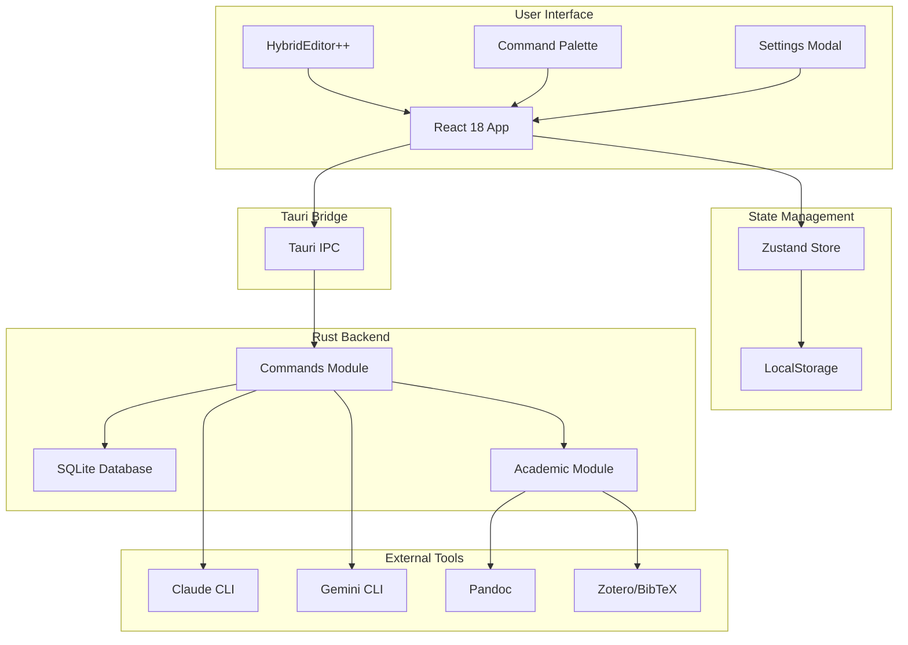
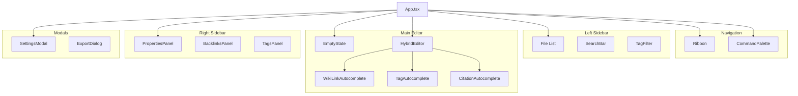
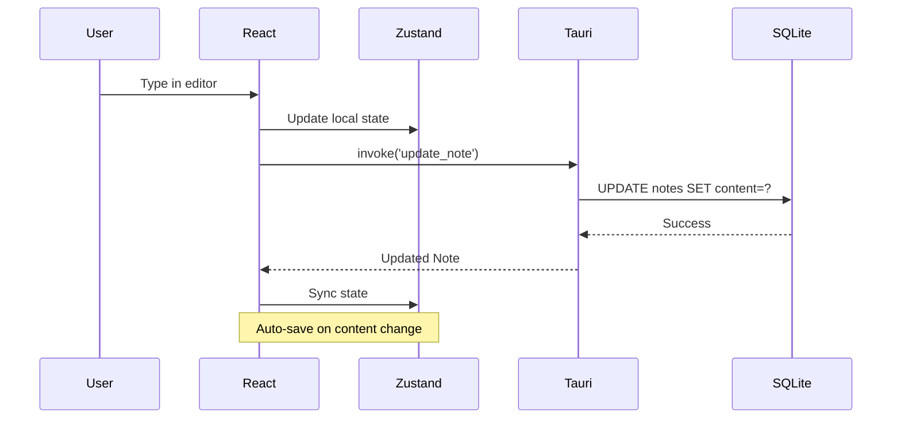
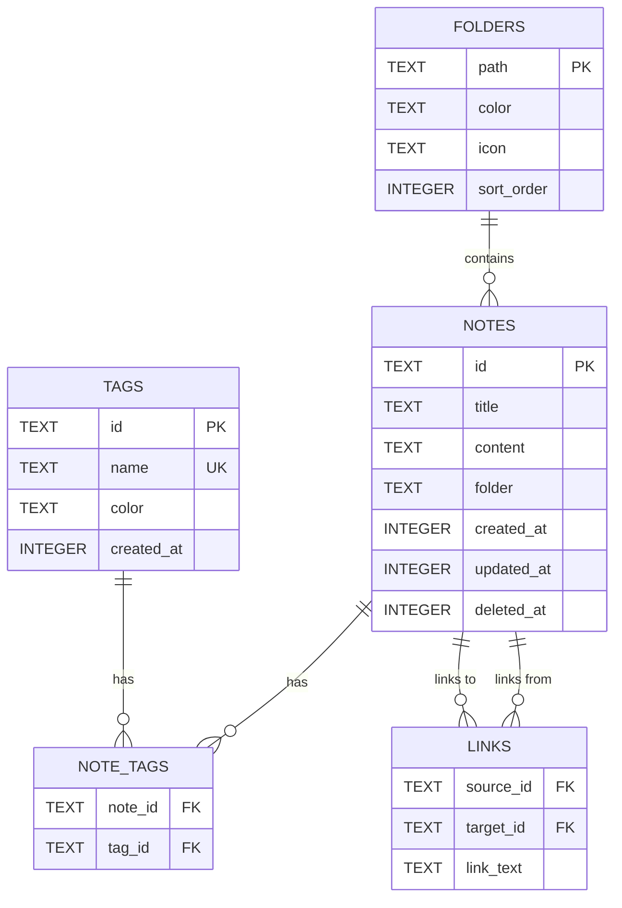
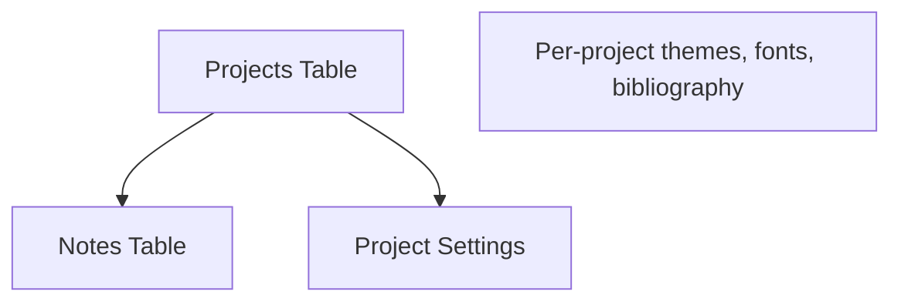
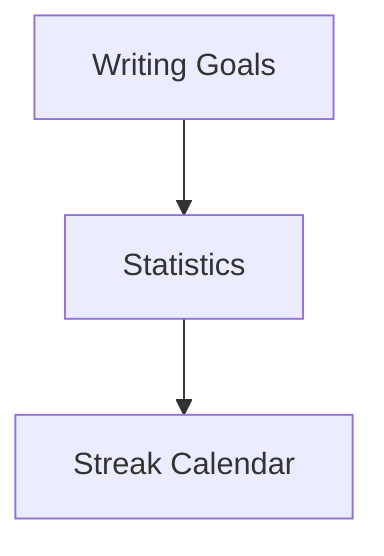

# Scribe Architecture

> System architecture and design documentation

---

## System Overview



---

## Component Architecture



---

## Data Flow



---

## Database Schema



---

## File Structure

```
scribe/
├── src/
│   ├── main/                    # Electron main (not used - Tauri)
│   └── renderer/
│       └── src/
│           ├── App.tsx          # Main application component
│           ├── main.tsx         # React entry point
│           ├── index.css        # Global styles + Tailwind
│           │
│           ├── components/
│           │   ├── HybridEditor.tsx      # Main editor component
│           │   ├── EmptyState.tsx        # Empty state with quotes
│           │   ├── Ribbon.tsx            # Left icon bar
│           │   ├── CommandPalette.tsx    # ⌘K command palette
│           │   ├── SettingsModal.tsx     # Settings dialog
│           │   ├── SearchBar.tsx         # Note search
│           │   ├── TagFilter.tsx         # Tag filtering UI
│           │   ├── TagsPanel.tsx         # Right sidebar tags
│           │   ├── PropertiesPanel.tsx   # Note properties
│           │   ├── BacklinksPanel.tsx    # Backlinks display
│           │   ├── ExportDialog.tsx      # Pandoc export
│           │   ├── MathRenderer.tsx      # KaTeX math rendering
│           │   ├── SimpleWikiLinkAutocomplete.tsx
│           │   ├── SimpleTagAutocomplete.tsx
│           │   └── CitationAutocomplete.tsx
│           │
│           ├── lib/
│           │   ├── api.ts               # Tauri IPC wrapper
│           │   ├── themes.ts            # Theme definitions
│           │   └── mathjax.ts           # KaTeX processing
│           │
│           ├── store/
│           │   └── useNotesStore.ts     # Zustand state
│           │
│           ├── types/
│           │   └── index.ts             # TypeScript interfaces
│           │
│           └── utils/
│               ├── search.ts            # Search utilities
│               └── sanitize.ts          # HTML sanitization
│
├── src-tauri/
│   └── src/
│       ├── main.rs              # Tauri entry point
│       ├── lib.rs               # Tauri setup + command registration
│       ├── commands.rs          # IPC command handlers
│       ├── database.rs          # SQLite operations
│       └── academic.rs          # Citations + Pandoc export
│
├── docs/
│   ├── API.md                   # API reference
│   ├── ARCHITECTURE.md          # This file
│   └── planning/
│       ├── SPRINT-12-UI-POLISH.md
│       └── SPRINT-13-PROJECT-SYSTEM.md
│
├── .STATUS                      # Project status
├── CLAUDE.md                    # AI assistant guidance
├── PROJECT-DEFINITION.md        # Scope control
└── PROPOSAL-UI-IMPROVEMENTS.md  # UI improvement plan
```

---

## Technology Stack

| Layer | Technology | Purpose |
|-------|------------|---------|
| **Shell** | Tauri 2 | Native desktop wrapper |
| **UI** | React 18 | Component framework |
| **Styling** | Tailwind CSS | Utility-first CSS |
| **State** | Zustand | Lightweight state management |
| **Database** | SQLite (rusqlite) | Local persistence |
| **Editor** | HybridEditor++ | Custom contenteditable + markdown |
| **Math** | KaTeX | LaTeX rendering |
| **AI** | Claude/Gemini CLI | AI assistance (no API keys) |
| **Export** | Pandoc | Document conversion |
| **Citations** | BibTeX/Zotero | Bibliography management |
| **Testing** | Vitest + Testing Library | Unit/integration tests |

---

## Key Design Decisions

### 1. CLI-Based AI (No API Keys)

**Decision:** Use Claude/Gemini CLI tools instead of API.

**Rationale:**
- Zero API key management
- Uses existing CLI subscriptions
- Simpler security model
- Works offline after initial setup

**Trade-off:** Requires CLI tools installed.

---

### 2. HybridEditor++ (Custom Editor)

**Decision:** Build custom editor instead of using BlockNote/TipTap.

**Rationale:**
- Full control over markdown handling
- Better wiki-link `[[...]]` support
- Lighter weight than full rich-text editors
- ADHD-optimized: minimal distractions

**Trade-off:** More maintenance, less features.

---

### 3. SQLite for Storage

**Decision:** Use SQLite via rusqlite in Rust.

**Rationale:**
- Single file database
- No external dependencies
- Full-text search built-in
- Fast for note-taking workloads

**Trade-off:** No real-time sync (handled separately).

---

### 4. Tauri Instead of Electron

**Decision:** Use Tauri 2 for desktop shell.

**Rationale:**
- 10x smaller bundle size
- Lower memory usage
- Native performance
- Rust security benefits

**Trade-off:** Smaller ecosystem than Electron.

---

## Security Considerations

1. **No External API Calls** - AI uses local CLI only
2. **Font Installation** - Validates cask names start with "font-"
3. **File Access** - Scoped to user directories
4. **No Network Sync** - All data stays local
5. **Obsidian Export** - User-controlled export path

---

## Performance Optimizations

1. **Lazy Loading** - Components loaded on demand
2. **Debounced Saves** - Auto-save with debounce
3. **SQLite FTS** - Full-text search index
4. **CSS Animations** - No JavaScript for micro-interactions
5. **KaTeX** - Faster than MathJax, smaller bundle

---

## Future Architecture

### Sprint 13: Project System



### Sprint 15: Search + Goals


