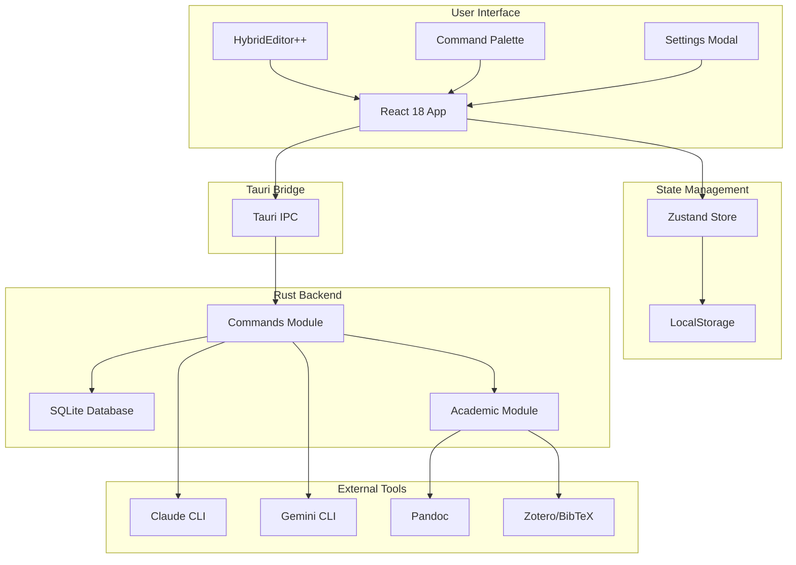
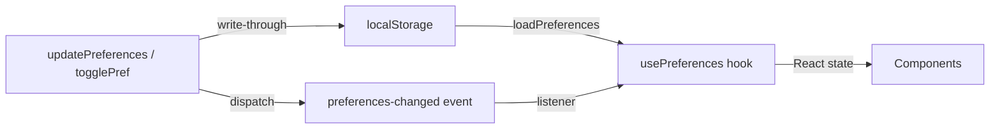
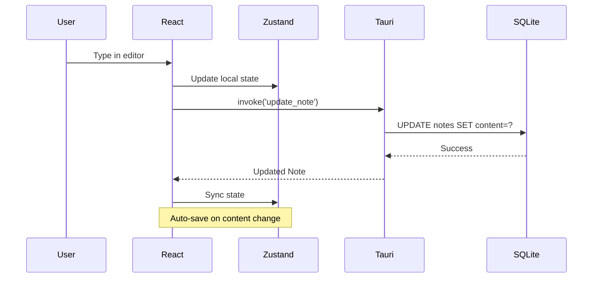
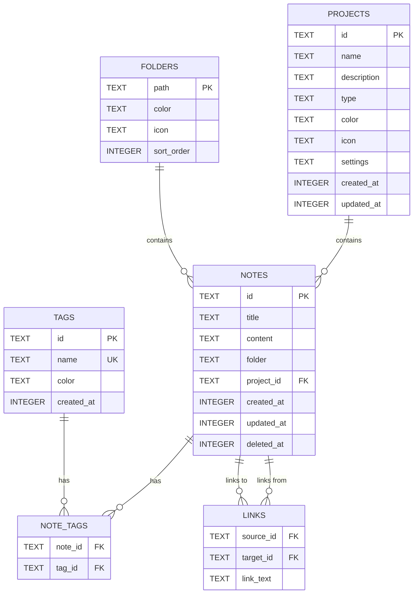

# Scribe Architecture

> System architecture and design documentation

---

## System Overview



---

## Component Architecture

```mermaid
graph TD
    App[App.tsx]

    subgraph "Left Sidebar"
        MissionSidebar[MissionSidebar]
        IconBar[IconBar]
        ExpandedPanel[ExpandedIconPanel]
    end

    subgraph "Navigation"
        KSH[KeyboardShortcutHandler]
        CommandPalette[CommandPalette]
        EditorTabs[EditorTabs]
    end

    subgraph "Main Editor"
        EditorOrch[EditorOrchestrator]
        HybridEditor[HybridEditor]
        CodeMirror[CodeMirrorEditor]
        WikiLink[WikiLinkAutocomplete]
        TagAuto[TagAutocomplete]
        Citation[CitationAutocomplete]
    end

    subgraph "Right Sidebar"
        PropertiesPanel[PropertiesPanel]
        BacklinksPanel[BacklinksPanel]
        TagsPanel[TagsPanel]
        StatsPanel[StatsPanel]
        ClaudePanel[ClaudePanel]
        TerminalPanel[TerminalPanel]
    end

    subgraph "Status Bar"
        PomodoroTimer[PomodoroTimer]
        WritingProgress[WritingProgress]
    end

    subgraph "Modals"
        SettingsModal[SettingsModal]
        ExportDialog[ExportDialog]
        GraphView[GraphView / D3]
        QuickCapture[QuickCaptureOverlay]
        CreateProject[CreateProjectModal]
    end

    App --> MissionSidebar
    MissionSidebar --> IconBar
    MissionSidebar --> ExpandedPanel
    App --> KSH
    App --> CommandPalette
    App --> EditorTabs
    App --> EditorOrch
    EditorOrch --> HybridEditor
    HybridEditor --> CodeMirror
    HybridEditor --> WikiLink
    HybridEditor --> TagAuto
    HybridEditor --> Citation
    App --> PropertiesPanel
    App --> SettingsModal
    App --> PomodoroTimer
```



---

## Preferences System

The preferences system provides lightweight, event-driven state management
for user settings that persist to `localStorage`. It operates alongside
the Zustand store but uses a simpler read/write model suited to key-value
preferences.



### Key Modules

| Module | File | Purpose |
|--------|------|---------|
| `preferences.ts` | `src/renderer/src/lib/preferences.ts` | Load, save, merge preferences to localStorage |
| `usePreferences()` | `src/renderer/src/hooks/usePreferences.ts` | React hook — cached reads, event-based sync across components |
| `shortcuts.ts` | `src/renderer/src/lib/shortcuts.ts` | `SHORTCUTS` registry — single source of truth for all 27 keyboard shortcuts |
| `matchesShortcut()` | `src/renderer/src/lib/shortcuts.ts` | Registry-based `KeyboardEvent` matching (cmd/shift/alt modifiers) |
| `SettingsToggle` | `src/renderer/src/components/Settings/SettingsToggle.tsx` | Reusable toggle switch component for boolean settings |

### How It Works

1. **`loadPreferences()`** reads from `localStorage`, merges with defaults so new fields get sensible values on upgrade.
2. **`usePreferences()`** calls `loadPreferences()` once on mount and caches the result in React state. It listens for the `preferences-changed` custom event to stay in sync with other components.
3. **`updatePreferences()` / `togglePref()`** write-through to `localStorage` and dispatch `preferences-changed`, triggering all mounted hooks to re-read.
4. **`SHORTCUTS`** defines every keyboard shortcut with `key`, `mod`, and `label`. UI components reference `SHORTCUTS.xxx.label` for display; handlers call `matchesShortcut(event, shortcutId)` instead of manual key checks.

### Pre-commit ORCHESTRATE Guard

A husky `pre-commit` hook prevents accidental commits of `ORCHESTRATE-*.md` planning files to protected branches. These files belong on feature branches during development and are cleaned up on merge.

---

## Data Flow



---

## Database Schema



---

## File Structure

```
scribe/
├── src/
│   └── renderer/
│       └── src/
│           ├── App.tsx               # Main application component
│           ├── main.tsx              # React entry point
│           ├── index.css             # Global styles + Tailwind
│           │
│           ├── components/
│           │   ├── sidebar/          # MissionSidebar system
│           │   │   ├── MissionSidebar.tsx
│           │   │   ├── IconBar.tsx
│           │   │   ├── ExpandedIconPanel.tsx
│           │   │   ├── SmartIconButton.tsx
│           │   │   ├── ActivityBar.tsx
│           │   │   └── ...           # 25+ sidebar components
│           │   ├── EditorTabs/       # Tab management
│           │   │   └── EditorTabs.tsx
│           │   ├── Settings/         # Settings subsystem
│           │   │   ├── SettingsModal.tsx
│           │   │   ├── GeneralSettingsTab.tsx
│           │   │   ├── EditorSettingsTab.tsx
│           │   │   └── ...           # 12 settings components
│           │   ├── HybridEditor.tsx
│           │   ├── CodeMirrorEditor.tsx
│           │   ├── EditorOrchestrator.tsx
│           │   ├── KeyboardShortcutHandler.tsx
│           │   ├── CommandPalette.tsx
│           │   ├── PomodoroTimer.tsx
│           │   ├── GraphView.tsx
│           │   ├── TerminalPanel.tsx
│           │   ├── ClaudePanel.tsx
│           │   └── ...               # 50+ components total
│           │
│           ├── hooks/
│           │   ├── usePreferences.ts
│           │   ├── useIconGlowEffect.ts
│           │   └── useForestTheme.ts
│           │
│           ├── lib/
│           │   ├── api.ts            # API factory (Tauri/Browser)
│           │   ├── browser-api.ts    # Browser-mode IndexedDB API
│           │   ├── browser-db.ts     # IndexedDB schema
│           │   ├── preferences.ts    # localStorage preferences R/W
│           │   ├── shortcuts.ts      # SHORTCUTS registry + matcher
│           │   ├── themes.ts         # Theme definitions
│           │   ├── quarto-completions.ts  # Quarto/LaTeX completions
│           │   ├── settingsSchema.ts # Settings validation
│           │   └── ...
│           │
│           ├── store/                # Zustand stores (singular)
│           │   ├── useNotesStore.ts
│           │   ├── useProjectStore.ts
│           │   ├── useAppViewStore.ts
│           │   ├── usePomodoroStore.ts
│           │   └── useSettingsStore.ts
│           │
│           └── __tests__/            # 76 test files, 2280+ tests
│
├── src-tauri/
│   └── src/
│       ├── main.rs               # Tauri entry point
│       ├── lib.rs                # Tauri setup + command registration
│       ├── commands.rs           # IPC command handlers
│       ├── database.rs           # SQLite operations
│       ├── database/             # Database modules
│       ├── academic.rs           # Citations + Pandoc export
│       └── terminal.rs           # PTY terminal backend
│
├── docs/                         # Documentation site (mkdocs)
├── .STATUS                       # Project status
└── CLAUDE.md                     # AI assistant guidance
```

---

## Technology Stack

| Layer | Technology | Purpose |
|-------|------------|---------|
| **Shell** | Tauri 2 | Native desktop wrapper |
| **UI** | React 18 | Component framework |
| **Styling** | Tailwind CSS | Utility-first CSS |
| **State** | Zustand | Lightweight state management |
| **Database** | SQLite (rusqlite) | Local persistence |
| **Editor** | CodeMirror 6 | Source editor with extensions |
| **Math** | KaTeX | LaTeX rendering |
| **Terminal** | xterm.js | Embedded terminal emulator |
| **Graph** | D3.js | Knowledge graph visualization |
| **AI** | Claude/Gemini CLI | AI assistance (no API keys) |
| **Export** | Pandoc | Document conversion |
| **Citations** | BibTeX/Zotero | Bibliography management |
| **Testing** | Vitest + Testing Library | Unit/integration tests |

---

## Key Design Decisions

### 1. CLI-Based AI (No API Keys)

**Decision:** Use Claude/Gemini CLI tools instead of API.

**Rationale:**
- Zero API key management
- Uses existing CLI subscriptions
- Simpler security model
- Works offline after initial setup

**Trade-off:** Requires CLI tools installed.

---

### 2. CodeMirror 6 Editor

**Decision:** Use CodeMirror 6 for source editing with custom extensions.

**Rationale:**
- Full control over markdown handling
- Extensible via CodeMirror's extension API
- Better wiki-link `[[...]]` and LaTeX support via custom completions
- Three modes: Source (CodeMirror), Live Preview (split), Reading (rendered)

**Trade-off:** More maintenance than drop-in editors, but full control over academic workflows.

---

### 3. SQLite for Storage

**Decision:** Use SQLite via rusqlite in Rust.

**Rationale:**
- Single file database
- No external dependencies
- Full-text search built-in
- Fast for note-taking workloads

**Trade-off:** No real-time sync (handled separately).

---

### 4. Tauri Instead of Electron

**Decision:** Use Tauri 2 for desktop shell.

**Rationale:**
- 10x smaller bundle size
- Lower memory usage
- Native performance
- Rust security benefits

**Trade-off:** Smaller ecosystem than Electron.

---

## Security Considerations

1. **No External API Calls** - AI uses local CLI only
2. **Font Installation** - Validates cask names start with "font-"
3. **File Access** - Scoped to user directories
4. **No Network Sync** - All data stays local
5. **Obsidian Export** - User-controlled export path

---

## Performance Optimizations

1. **Lazy Loading** - Components loaded on demand
2. **Debounced Saves** - Auto-save with debounce
3. **SQLite FTS** - Full-text search index
4. **CSS Animations** - No JavaScript for micro-interactions
5. **KaTeX** - Faster than MathJax, smaller bundle

---

## State Management

Scribe uses five Zustand stores, all in `src/renderer/src/store/`:

| Store | Responsibility |
|-------|----------------|
| `useNotesStore` | Notes CRUD, selected note, search |
| `useProjectStore` | Projects list, current project |
| `useAppViewStore` | Sidebar state, tabs, pinned vaults |
| `usePomodoroStore` | Pomodoro timer state machine |
| `useSettingsStore` | App settings, quick actions |

Stores communicate with the database exclusively through the API layer (`api.ts`). Stores do not call Tauri IPC or IndexedDB directly.
