# SPEC: Settings Enhancement - ADHD-Optimized UI

**Status:** ✅ COMPLETE - Shipped in v1.8.0
**Created:** 2025-12-31
**Completed:** 2025-12-31
**Shipped:** v1.8.0 (2026-01-01)
**From Brainstorm:** `BRAINSTORM-settings-enhancement-2025-12-31.md`
**Priority:** P1 (Sprint 27)
**Release:** https://github.com/Data-Wise/scribe/releases/tag/v1.8.0

---

## Overview

Enhance Scribe's settings system with ADHD-friendly design patterns inspired by Obsidian, Typora, and modern accessibility research. Implement a hybrid tab+search architecture with progressive disclosure, visual organization, and contextual hints to reduce cognitive load while improving feature discoverability.

**Key Goals:**
- Make newly added settings (Quick Actions, @ References, chat persistence) easily discoverable
- Reduce overwhelm through progressive disclosure and visual hierarchy
- Enable quick customization of AI workflow (Quick Actions reordering, prompt editing, shortcuts)
- Provide project template system to streamline setup

---

## Primary User Story

**As a** Scribe user with ADHD
**I want** to discover and customize new feature settings without feeling overwhelmed
**So that** I can tailor the app to my workflow quickly and confidently

**Acceptance Criteria:**
1. ✅ Settings search finds any setting in < 3 keystrokes (fuzzy match)
2. ✅ New features are visually highlighted (badge system)
3. ✅ Quick Actions can be reordered via drag-and-drop
4. ✅ Project creation offers 5 preconfigured templates
5. ✅ Theme selection uses gallery view with visual previews

---

## Secondary User Stories

### Story 2: Quick Actions Customization

**As a** researcher
**I want** to customize AI prompts and assign keyboard shortcuts
**So that** I can optimize Quick Actions for academic writing

**Acceptance Criteria:**
- ✅ Edit any of the 5 default prompts
- ✅ Add up to 5 custom Quick Actions (10 total max)
- ✅ Assign ⌘⌥1-9 shortcuts to specific actions
- ✅ Choose Claude vs Gemini per action

### Story 3: Project Template Quick Start

**As a** new user
**I want** to select a preconfigured project template
**So that** I can start working immediately without configuring dozens of settings

**Acceptance Criteria:**
- ✅ 5 templates available: Research+, Teaching+, Dev+, Writing+, Minimal
- ✅ Each template shows preview of included settings
- ✅ Templates auto-configure: daily notes, Quick Actions, working directory, theme

---

## Technical Requirements

### Architecture

**Component Structure:**
```
<SettingsModal>
  ├── <SettingsHeader>
  │   ├── <SearchBox />        // ⌘F within settings, fuzzy search
  │   └── <CloseButton />
  ├── <SettingsBody>
  │   ├── <Sidebar>
  │   │   ├── <CategoryTab id="editor" badge="new" />
  │   │   ├── <CategoryTab id="themes" />
  │   │   ├── <CategoryTab id="ai" badge={3} />      // 3 new settings
  │   │   ├── <CategoryTab id="projects" />
  │   │   └── <CategoryTab id="advanced" />
  │   └── <Content>
  │       ├── <SettingsSection collapsed={false}>
  │       │   ├── <SectionHeader />
  │       │   ├── <Setting type="toggle" />
  │       │   ├── <Setting type="select" />
  │       │   └── <Setting type="gallery" />  // Theme picker
  │       └── <SettingsSection collapsed={true}>
  │           └── {/* Progressive disclosure */}
  └── <SettingsFooter>
      ├── <Button>Reset to Defaults</Button>
      ├── <Button>Export Settings</Button>
      └── <Button>Save</Button>
</SettingsModal>
```

**State Management (Zustand):**
```typescript
interface SettingsStore {
  // Settings values
  settings: Record<string, any>

  // UI state
  activeCategory: string
  searchQuery: string
  collapsedSections: Set<string>

  // Actions
  updateSetting: (id: string, value: any) => void
  resetToDefaults: () => void
  searchSettings: (query: string) => SearchResult[]
  exportSettings: () => JSON
  importSettings: (json: JSON) => void

  // Quick Actions specific
  quickActions: QuickAction[]
  reorderQuickActions: (fromIndex: number, toIndex: number) => void
  toggleQuickAction: (id: string, enabled: boolean) => void
  updateQuickActionPrompt: (id: string, prompt: string) => void
  assignShortcut: (id: string, shortcut: string) => void
}
```

**Data Model:**
```typescript
interface SettingsCategory {
  id: 'editor' | 'themes' | 'ai' | 'projects' | 'advanced'
  label: string
  icon: string
  sections: SettingsSection[]
  badge?: 'new' | number
}

interface SettingsSection {
  id: string
  title: string
  description?: string
  collapsed: boolean
  settings: Setting[]
}

interface Setting {
  id: string
  type: 'toggle' | 'select' | 'text' | 'number' | 'color' | 'keymap' | 'gallery'
  label: string
  description?: string
  tooltip?: string
  defaultValue: any
  options?: SelectOption[]
  validation?: (value: any) => boolean
  contextualHintLocation?: string  // e.g., 'ClaudePanel'
  addedInVersion?: string          // e.g., 'v1.7.0'
}

interface QuickAction {
  id: string
  emoji: string
  label: string
  prompt: string
  enabled: boolean
  order: number
  shortcut?: string  // e.g., '⌘⌥1'
  model: 'claude' | 'gemini'
  isCustom: boolean
}

interface ProjectTemplate {
  id: string
  name: string
  description: string
  icon: string
  settings: {
    dailyNoteTemplate?: string
    quickActions?: string[]
    workingDirectory?: string
    theme?: string
  }
}
```

### API Design

**Tauri Commands (Rust):**
```rust
#[tauri::command]
async fn get_settings() -> Result<Settings, String>

#[tauri::command]
async fn update_setting(key: String, value: serde_json::Value) -> Result<(), String>

#[tauri::command]
async fn reset_settings() -> Result<(), String>

#[tauri::command]
async fn export_settings() -> Result<String, String>  // Returns JSON

#[tauri::command]
async fn import_settings(json: String) -> Result<(), String>

#[tauri::command]
async fn get_project_templates() -> Result<Vec<ProjectTemplate>, String>
```

**Browser API (IndexedDB):**
```typescript
// src/renderer/src/lib/browser-api.ts
async getSettings(): Promise<Settings>
async updateSetting(key: string, value: any): Promise<void>
async resetSettings(): Promise<void>
async exportSettings(): Promise<string>
async importSettings(json: string): Promise<void>
async getProjectTemplates(): Promise<ProjectTemplate[]>
```

### Data Models

**Database Schema (SQLite):**
```sql
-- Migration 010: Settings and Templates

CREATE TABLE IF NOT EXISTS settings (
  key TEXT PRIMARY KEY,
  value TEXT NOT NULL,       -- JSON-encoded
  category TEXT NOT NULL,    -- 'editor' | 'themes' | 'ai' | 'projects' | 'advanced'
  added_in_version TEXT,     -- e.g., 'v1.7.0'
  updated_at TEXT NOT NULL
);

CREATE TABLE IF NOT EXISTS project_templates (
  id TEXT PRIMARY KEY,
  name TEXT NOT NULL,
  description TEXT,
  icon TEXT,
  settings TEXT NOT NULL,    -- JSON-encoded
  is_builtin BOOLEAN NOT NULL DEFAULT 0,
  created_at TEXT NOT NULL
);
```

**IndexedDB Schema (Browser):**
```typescript
// src/renderer/src/lib/browser-db.ts
const db = new Dexie('ScribeDB')
db.version(10).stores({
  settings: 'key, category, added_in_version',
  project_templates: 'id, is_builtin'
})
```

### Dependencies

**New packages:**
- `@dnd-kit/core` - Drag-and-drop for Quick Actions reordering
- `@dnd-kit/sortable` - Sortable list utilities
- `fuse.js` - Fuzzy search for settings search

**Existing packages:**
- `zustand` - State management
- `react-hook-form` - Form handling
- `zod` - Settings validation

---

## UI/UX Specifications

### User Flow: Discover New Settings

```mermaid
graph TD
    A[Open Scribe v1.7.0] --> B{See badge on Settings icon?}
    B -->|Yes| C[Click Settings ⌘,]
    B -->|No| D[Use app normally]

    C --> E[Settings modal opens]
    E --> F[AI & Workflow tab highlighted with badge]
    F --> G[Click AI & Workflow]
    G --> H[See Quick Actions section expanded]
    H --> I[Discover: reorder, edit prompts, shortcuts]

    D --> J[Use Quick Action ✨]
    J --> K[See gear icon inline]
    K --> L[Click gear]
    L --> H
```



### Wireframes

**Settings Modal (ASCII):**
```
┌─────────────────────────────────────────────────────────────────┐
│ Settings                                [🔍 Search...] [×]      │
├────────┬────────────────────────────────────────────────────────┤
│        │                                                        │
│ Editor │  Editor                                                │
│ Themes │  ──────────────────────────────────────────────────   │
│ AI (3) │                                                        │
│Projects│  Font & Spacing                               [▾]     │
│Advanced│  ┌────────────────────────────────────────────┐      │
│        │  │ ☑ Enable ligatures                         │      │
│        │  │ Font size: [16] px                          │      │
│        │  │ Line height: [1.6]                          │      │
│        │  └────────────────────────────────────────────┘      │
│        │                                                        │
│        │  Focus Mode                                    [▾]     │
│        │  ┌────────────────────────────────────────────┐      │
│        │  │ ☑ Dim other panes                           │      │
│        │  │ Dimming: [40]%                              │      │
│        │  └────────────────────────────────────────────┘      │
│        │                                                        │
│        │  Advanced Editor Settings                      [▸]     │
│        │  {collapsed}                                          │
│        │                                                        │
└────────┴────────────────────────────────────────────────────────┘
│ [Reset to Defaults] [Export Settings]              [Save]      │
└─────────────────────────────────────────────────────────────────┘
```

**Theme Gallery:**
```
┌─────────────────────────────────────────────────────────────────┐
│ Themes                                                          │
├─────────────────────────────────────────────────────────────────┤
│                                                                 │
│ ⭐ FAVORITES                                                    │
│ ┌──────────┐ ┌──────────┐ ┌──────────┐                         │
│ │  ████████│ │  ████████│ │  ████████│                         │
│ │  ████████│ │  ████████│ │  ████████│                         │
│ │  Slate   │ │  Ocean   │ │  Forest  │                         │
│ │  ★       │ │  ★       │ │  ★       │                         │
│ └──────────┘ └──────────┘ └──────────┘                         │
│                                                                 │
│ 🌙 DARK (5 themes)                                              │
│ ┌──────────┐ ┌──────────┐ ┌──────────┐                         │
│ │  ▓▓▓▓▓▓▓▓│ │  ▓▓▓▓▓▓▓▓│ │  ▓▓▓▓▓▓▓▓│                         │
│ │  ▓▓▓▓▓▓▓▓│ │  ▓▓▓▓▓▓▓▓│ │  ▓▓▓▓▓▓▓▓│                         │
│ │  Dracula │ │  Nord    │ │  Tokyo   │                         │
│ │  ☐       │ │  ☐       │ │  ☐       │                         │
│ └──────────┘ └──────────┘ └──────────┘                         │
│                                                                 │
│ ☀️ LIGHT (5 themes)                                             │
│ ┌──────────┐ ┌──────────┐ ┌──────────┐                         │
│ │  ░░░░░░░░│ │  ░░░░░░░░│ │  ░░░░░░░░│                         │
│ │  ░░░░░░░░│ │  ░░░░░░░░│ │  ░░░░░░░░│                         │
│ │  Linen   │ │  Paper   │ │  Cream   │                         │
│ │  ☐       │ │  ☐       │ │  ☐       │                         │
│ └──────────┘ └──────────┘ └──────────┘                         │
│                                                                 │
│ [+ Import Theme from JSON]  [Create Custom Theme]              │
└─────────────────────────────────────────────────────────────────┘
```

**Quick Actions Settings:**
```
┌─────────────────────────────────────────────────────────────────┐
│ Quick Actions                              [+ Add Custom (5/10)]│
├─────────────────────────────────────────────────────────────────┤
│                                                                 │
│ Drag to reorder • Toggle to show/hide • Click gear to edit     │
│                                                                 │
│ ┌───────────────────────────────────────────────────────────┐  │
│ │ ☑ ✨ Improve                                        [⚙️] │  │
│ │   "Improve clarity and flow, fix grammar, and enhance    │  │
│ │    readability while preserving the author's voice."     │  │
│ │   Shortcut: ⌘⌥1        Model: Claude Sonnet 4.5          │  │
│ └───────────────────────────────────────────────────────────┘  │
│ │                                                               │
│ ┌───────────────────────────────────────────────────────────┐  │
│ │ ☑ 📝 Expand                                         [⚙️] │  │
│ │   "Expand on this idea with more detail, examples, and   │  │
│ │    supporting information."                              │  │
│ │   Shortcut: ⌘⌥2        Model: Claude Sonnet 4.5          │  │
│ └───────────────────────────────────────────────────────────┘  │
│ │                                                               │
│ ┌───────────────────────────────────────────────────────────┐  │
│ │ ☐ 📋 Summarize                                      [⚙️] │  │
│ │   "Create a concise summary highlighting key points."    │  │
│ │   Shortcut: ⌘⌥3        Model: Gemini 2.0 Flash           │  │
│ └───────────────────────────────────────────────────────────┘  │
│ │                                                               │
│ ┌───────────────────────────────────────────────────────────┐  │
│ │ ☑ 💡 Explain                                        [⚙️] │  │
│ │   "Explain this concept in simpler terms, suitable for   │  │
│ │    someone unfamiliar with the topic."                   │  │
│ │   Shortcut: ⌘⌥4        Model: Claude Sonnet 4.5          │  │
│ └───────────────────────────────────────────────────────────┘  │
│                                                                 │
│ Display Options:                                                │
│ ☑ Show in sidebar    ☑ Show in context menu                    │
└─────────────────────────────────────────────────────────────────┘
```

### Accessibility Checklist

- [x] All settings have proper ARIA labels
- [x] Keyboard navigation works throughout (Tab/Shift+Tab)
- [x] Settings search is keyboard accessible (⌘F)
- [x] Drag-and-drop has keyboard alternative (Move Up/Down buttons)
- [x] Focus visible on all interactive elements
- [x] Screen reader announces category changes
- [x] High contrast mode supported
- [x] Reduced motion respected (no drag animations if `prefers-reduced-motion`)

---

## Open Questions

### Q1: Settings Precedence

**Question:** How should global vs project-specific settings interact?

**Options:**
1. Global defaults → Project overrides → User overrides (Recommended)
2. Separate global and project settings (no mixing)
3. Project settings inherit global, can override individually

**Decision:** Option 1 (cascade model) - most flexible, matches Obsidian

---

### Q2: Theme Gallery Source

**Question:** Should we support community themes from day 1?

**Options:**
1. Ship 10 built-in themes only (v1.7.1), add import later (Recommended)
2. Support theme import/export from day 1
3. Build theme marketplace (future v2.0)

**Decision:** Option 1 - focus on core UX first, add import in v1.8.0

---

### Q3: Quick Actions Limit

**Question:** Cap at 10 custom actions or allow unlimited?

**Options:**
1. 10 max (5 default + 5 custom) (Recommended)
2. 20 max (more flexibility)
3. Unlimited (let users decide)

**Decision:** Option 1 - prevents UI clutter, encourages curation

---

### Q4: Keyboard Shortcut Conflicts

**Question:** How to handle shortcut conflicts?

**Options:**
1. Show warning + offer to reassign (Recommended)
2. Prevent assignment (error state)
3. Allow conflicts (last assigned wins)

**Decision:** Option 1 - user-friendly, prevents accidental overwrites

---

### Q5: Template Storage

**Question:** Store project templates in JSON files or database?

**Options:**
1. JSON files in `~/.scribe/templates/` (Recommended)
2. Database table (same as projects)
3. Hybrid (built-in in DB, custom in JSON)

**Decision:** Option 1 - easier sharing, versioning, editing

---

## Review Checklist

**Design Review:**
- [ ] Wireframes approved by team
- [ ] ADHD accessibility expert consulted
- [ ] Obsidian settings UX patterns studied and adapted

**Technical Review:**
- [ ] Data model reviewed for extensibility
- [ ] State management approach approved
- [ ] Database migration plan validated
- [ ] API contracts finalized

**UX Review:**
- [ ] User flow tested with 3+ ADHD users
- [ ] Settings search tested with real queries
- [ ] Drag-and-drop tested with keyboard alternatives
- [ ] Theme gallery tested on different screen sizes

**Implementation Ready:**
- [ ] All open questions resolved
- [ ] Dependencies approved and installed
- [ ] Test plan written (unit + E2E)
- [ ] Documentation outline prepared

---

## Implementation Notes

### Phase 1: Foundation (Sprint 27 P2)

**Files to create:**
- `src/renderer/src/store/settingsStore.ts` - Zustand store
- `src/renderer/src/components/Settings/SettingsModal.tsx` - Main modal
- `src/renderer/src/components/Settings/SettingsSidebar.tsx` - Category tabs
- `src/renderer/src/components/Settings/SettingsContent.tsx` - Settings display
- `src/renderer/src/components/Settings/SettingsSearch.tsx` - Search box
- `src/renderer/src/lib/settingsSchema.ts` - Settings definitions

**Files to modify:**
- `src-tauri/src/database/mod.rs` - Add settings table migration
- `src/renderer/src/lib/browser-db.ts` - Add settings store
- `src/renderer/src/App.tsx` - Add ⌘, shortcut for settings

**Testing:**
- Unit tests for `settingsStore` (15 tests)
- E2E tests for settings search (5 tests)
- E2E tests for category navigation (5 tests)

---

### Phase 2: Quick Wins (Sprint 27 P2)

**Files to create:**
- `src/renderer/src/components/Settings/QuickActionsSettings.tsx` - Customization panel
- `src/renderer/src/components/Settings/ProjectTemplates.tsx` - Template picker
- `src/renderer/src/components/Settings/Badge.tsx` - "What's New" badge

**Files to modify:**
- `src/renderer/src/components/QuickActions/QuickActionsPanel.tsx` - Add gear icon
- `src/renderer/src/components/MissionControl/CreateProjectModal.tsx` - Add template selector

**Testing:**
- E2E tests for Quick Actions reordering (3 tests)
- E2E tests for project template selection (3 tests)
- Unit tests for badge visibility logic (5 tests)

---

### Phase 3: Visual Polish (Sprint 28)

**Files to create:**
- `src/renderer/src/components/Settings/ThemeGallery.tsx` - Theme browser
- `src/renderer/src/components/Settings/ContextualHint.tsx` - Inline gear icons

**Files to modify:**
- `src/renderer/src/components/Settings/QuickActionsSettings.tsx` - Add Pro features

**Testing:**
- E2E tests for theme gallery (5 tests)
- E2E tests for contextual hints (3 tests)
- Visual regression tests for theme previews (5 snapshots)

---

## History

**2025-12-31:** Initial specification created from brainstorm session
- Deep mode (8 questions) used to gather comprehensive requirements
- Research conducted on Obsidian, Typora, Bear, Notion settings UX
- ADHD accessibility patterns studied from 2025 research
- User priorities: AI & Workflow, Projects, Editor Experience, Visual Customization
- Preferred architecture: Hybrid (Tabs + Search)
- Spec saved to `docs/specs/SPEC-settings-enhancement-2025-12-31.md`
