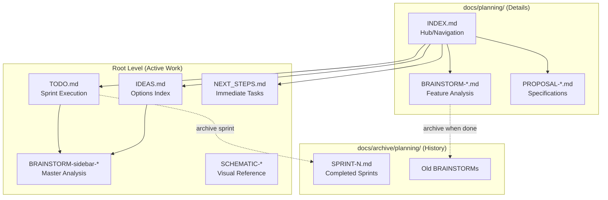
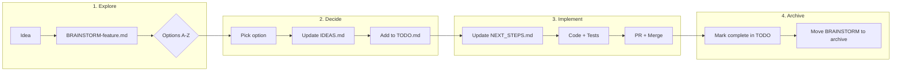
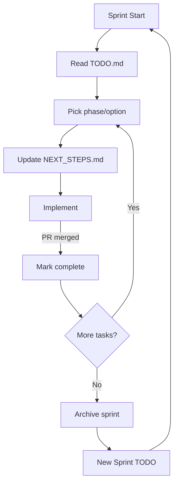
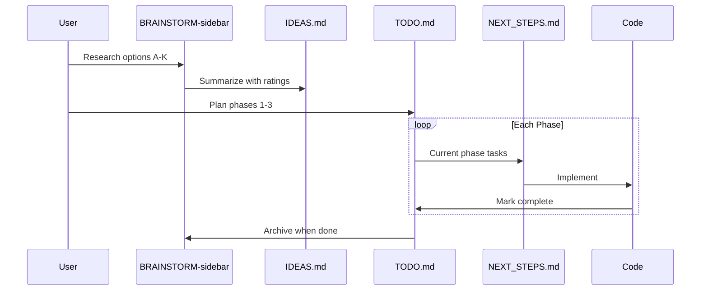
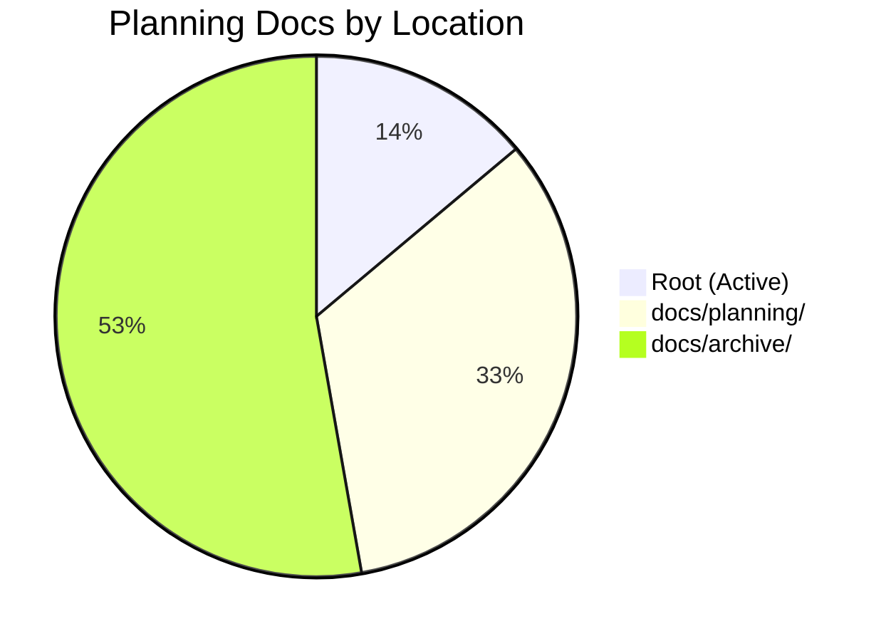

# Planning Documentation Workflow

**Created:** 2025-12-30
**Purpose:** Guide for managing Scribe planning documents

---

## Document Hierarchy



---

## Document Types

| Type | Prefix | Purpose | Location |
|------|--------|---------|----------|
| Sprint Tracking | `TODO` | Current tasks, phases | Root |
| Options Index | `IDEAS` | Quick reference table | Root |
| Immediate Work | `NEXT_STEPS` | Today's focus | Root |
| Feature Analysis | `BRAINSTORM-` | Deep dive, options | Root (active) or docs/planning/ |
| Specifications | `PROPOSAL-` | Implementation specs | docs/planning/ |
| Visual Reference | `SCHEMATIC-` | Diagrams, layouts | Root |
| Navigation Hub | `INDEX` | Links to all docs | docs/planning/ |

---

## Workflow: New Feature



---

## Workflow: Sprint Cycle



---

## File Flow Example: Sidebar Consolidation



---

## Quick Commands

```bash
# View planning hub
cat docs/planning/INDEX.md

# Check current sprint
cat TODO.md

# See immediate tasks
cat NEXT_STEPS.md

# List all planning docs
ls -la docs/planning/

# Archive a completed brainstorm
git mv BRAINSTORM-feature.md docs/archive/planning/
```

---

## Document Templates

### BRAINSTORM Template
```markdown
# [Feature] Brainstorm

**Generated:** YYYY-MM-DD
**Context:** [Project area]

## Current State
[What exists now]

## Options

### Option A: [Name]
**Effort:** Quick/Medium/Large
**ADHD:** X/5
**Pros:** ...
**Cons:** ...

## Recommendation
[Which option and why]

## Next Steps
1. [ ] First action
2. [ ] Second action
```

### PROPOSAL Template
```markdown
# PROPOSAL: [Feature Name]

**Created:** YYYY-MM-DD
**Status:** Draft/Approved/Implemented

## Summary
[One paragraph]

## Requirements
- [ ] Requirement 1
- [ ] Requirement 2

## Implementation
[Technical details]

## Testing
[Test plan]
```

---

## Maintenance

### Weekly
- Review TODO.md progress
- Update NEXT_STEPS.md with current focus
- Archive completed BRAINSTORMs

### Per Sprint
- Update IDEAS.md status column
- Move completed sprints to archive
- Update INDEX.md if structure changed

### Per Release
- Create release notes from TODO
- Archive all sprint docs
- Reset TODO for next version

---

## Current State (2025-12-30)



| Phase | Status |
|-------|--------|
| Phase 1 (Stats/Chat) | ✅ Complete |
| Phase 2 (Claude Tab) | ✅ Complete |
| Phase 3 (Terminal/Ambient) | 🚧 Ready |
