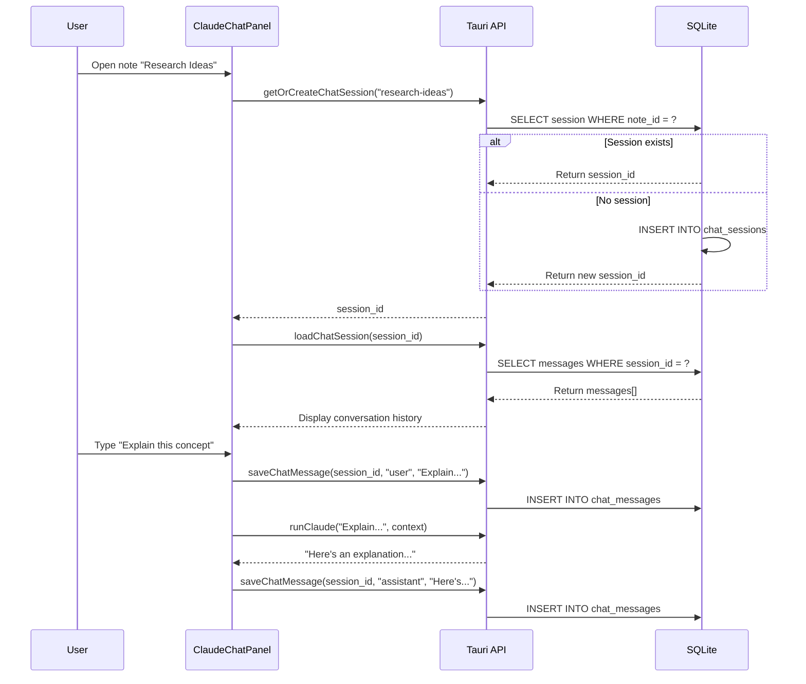

# Chat History Persistence

> **ADHD-friendly AI conversations that survive restarts**

---

## Overview

**Chat History Persistence** saves your Claude/Gemini conversations per note, so you can close the app and pick up exactly where you left off.

**Key Features:**
- ✅ One session per note (isolated conversations)
- ✅ Auto-saves every message (zero manual work)
- ✅ Survives app restarts and crashes
- ✅ Quick Actions for one-click prompts
- ✅ @ References to include other notes

**ADHD Benefits:**
- No "wait, what did I ask?" confusion
- Conversation context stays with the note
- Resume deep work instantly
- Quick Actions reduce decision fatigue

---

## Quick Start

### Basic Chat Flow

```bash
# 1. Open a note
# 2. Click "Claude" tab in right sidebar
# 3. Type your question
# 4. Press Enter (or click send)
```

That's it! The conversation auto-saves.

### After Restarting Scribe

```bash
# 1. Open the same note
# 2. Click "Claude" tab
# 3. Your full conversation history is there
```

No buttons to click, no "load history" step. It just works.

---

## How It Works

### Session Lifecycle



### Database Schema

**Migration 009** adds two tables:

```sql
-- One session per note
CREATE TABLE chat_sessions (
    id TEXT PRIMARY KEY,
    note_id TEXT NOT NULL,
    created_at INTEGER NOT NULL,
    updated_at INTEGER NOT NULL,
    FOREIGN KEY (note_id) REFERENCES notes(id) ON DELETE CASCADE
);

-- Messages belong to sessions
CREATE TABLE chat_messages (
    id TEXT PRIMARY KEY,
    session_id TEXT NOT NULL,
    role TEXT NOT NULL CHECK (role IN ('user', 'assistant')),
    content TEXT NOT NULL,
    timestamp INTEGER NOT NULL,
    FOREIGN KEY (session_id) REFERENCES chat_sessions(id) ON DELETE CASCADE
);
```

**CASCADE deletes:** Delete a note → session + messages auto-deleted.

---

## Quick Actions

**One-click AI prompts** based on your current note:

| Button | Prompt | When to Use |
|--------|--------|-------------|
| ✨ **Improve** | "Improve clarity and flow" | Polish rough drafts |
| 📝 **Expand** | "Expand on this idea" | Add depth to concepts |
| 📋 **Summarize** | "Summarize in 2-3 sentences" | Create TL;DR |
| 💡 **Explain** | "Explain this simply" | Simplify complex topics |
| 🔍 **Research** | "What does research say about this?" | Find evidence/citations |

### How Quick Actions Work

```typescript
// Click "Improve" button
quickActions = {
  improve: 'Improve clarity and flow',
  expand: 'Expand on this idea',
  summarize: 'Summarize in 2-3 sentences',
  explain: 'Explain this simply',
  research: 'What does research say about this?'
}

// Builds context automatically
const context = `
Title: ${noteContext.title}
Content: ${noteContext.content}
`

// Sends to Claude with full note context
await api.runClaude(quickActions.improve, context)
```

**Result:** AI gets your full note + prompt in one click.

---

## @ References

**Include other notes in your prompt** using `@` autocomplete:

### Example

```
User: @Methodology explain how this approach works

Claude: Based on your Methodology note, here's how...
```

### How to Use

1. Type `@` in the chat input
2. Start typing a note title
3. Select from autocomplete dropdown
4. Note appears as a badge above input
5. Press Enter to send

**Multiple references:**
```
@Introduction @Methods @Results compare these three sections
```

**Removing references:**
Click the `×` on any badge to remove it.

---

## Configuration

### Per-Project Settings

Chat sessions are **per-note**, but you can configure AI settings per-project:

```typescript
// Project settings (future enhancement)
{
  "ai": {
    "default_model": "claude",  // or "gemini"
    "temperature": 0.7,
    "max_tokens": 2000
  }
}
```

Currently, all chats use:
- **Model:** Claude (via `claude` CLI)
- **Fallback:** Gemini (if Claude unavailable)
- **Context:** Full note content

---

## Tauri Commands

**Backend API** (Rust):

### `getOrCreateChatSession`

```rust
#[tauri::command]
pub fn get_or_create_chat_session(note_id: String) -> Result<String, String>
```

**Returns:** `session_id` (creates new if needed)

### `saveChatMessage`

```rust
#[tauri::command]
pub fn save_chat_message(
    session_id: String,
    role: String,        // "user" or "assistant"
    content: String,
    timestamp: i64
) -> Result<String, String>
```

**Returns:** `message_id`

### `loadChatSession`

```rust
#[tauri::command]
pub fn load_chat_session(session_id: String) -> Result<Vec<Message>, String>
```

**Returns:** `Message[]` sorted by timestamp

### `clearChatSession`

```rust
#[tauri::command]
pub fn clear_chat_session(session_id: String) -> Result<(), String>
```

**Effect:** Deletes all messages in session (keeps session)

### `deleteChatSession`

```rust
#[tauri::command]
pub fn delete_chat_session(session_id: String) -> Result<(), String>
```

**Effect:** Deletes session + all messages (CASCADE)

---

## Frontend Integration

### Component Structure

```typescript
// src/renderer/src/components/ClaudeChatPanel.tsx

export function ClaudeChatPanel({ noteContext }) {
  const [sessionId, setSessionId] = useState<string | null>(null)
  const [messages, setMessages] = useState<Message[]>([])

  // Auto-create session when note changes
  useEffect(() => {
    if (!noteContext) return

    const noteId = noteContext.title.toLowerCase().replace(/\s+/g, '-')
    const id = await api.getOrCreateChatSession(noteId)
    setSessionId(id)
  }, [noteContext])

  // Auto-load history when session ready
  useEffect(() => {
    if (!sessionId) return

    const history = await api.loadChatSession(sessionId)
    setMessages(history)
  }, [sessionId])

  // Auto-save on send
  const handleSubmit = async () => {
    await api.saveChatMessage(sessionId, 'user', input, Date.now())
    const response = await api.runClaude(input, context)
    await api.saveChatMessage(sessionId, 'assistant', response, Date.now())
  }
}
```

### Browser Mode Fallback

**IndexedDB** provides the same API in browser mode:

```typescript
// src/renderer/src/lib/browser-db.ts

class ScribeBrowserDB extends Dexie {
  chatSessions!: Table<ChatSession>
  chatMessages!: Table<ChatMessage>
}

// Same API surface as Tauri
export const browserApi = {
  getOrCreateChatSession: async (noteId: string) => { /* ... */ },
  saveChatMessage: async (...) => { /* ... */ },
  loadChatSession: async (sessionId: string) => { /* ... */ }
}
```

**API Factory** auto-switches:

```typescript
// src/renderer/src/lib/api.ts
export const api = isTauri() ? tauriApi : browserApi
```

---

## Testing

### Backend Tests

```bash
# Run Rust tests
cd src-tauri
cargo test chat_history

# 12 tests covering:
# - Session creation
# - Message saving/loading
# - CASCADE deletes
# - Role validation
# - Timestamp ordering
```

### Frontend Tests

```bash
# Integration tests
npm test ClaudeChatPanel.persistence

# 16 tests covering:
# - Session management
# - Message persistence
# - Note switching
# - Clear/delete operations
```

### E2E Tests

```bash
# Browser-based tests
npm run test:e2e specs/chat-history-persistence

# 12 tests covering:
# - Session creation across reload
# - Message persistence
# - Quick Actions
# - @ References
# - Browser mode fallbacks
```

---

## Troubleshooting

### Messages not loading

**Symptom:** Open note, chat is empty (but you know you had messages)

**Check:**
1. Is the note title the same? (session tied to `note_id` derived from title)
2. Browser console for errors
3. Database migration ran: `SELECT * FROM chat_sessions;`

**Fix:**
```bash
# Check migration status
sqlite3 ~/.scribe/scribe.db "SELECT * FROM migrations WHERE version = 9;"

# Re-run migration if missing
# (app auto-runs on startup)
```

### Session tied to wrong note

**Symptom:** Messages from Note A appear in Note B

**Cause:** Both notes have similar titles that hash to same `note_id`

**Fix:**
```typescript
// Ensure unique note IDs
const noteId = noteContext.title.toLowerCase().replace(/\s+/g, '-')
// Better: use actual note.id instead of derived slug
```

### Quick Actions not working in browser mode

**Expected:** Browser mode shows stub message:

```
"AI features are only available in the desktop app.
Run 'npm run dev' to test AI features in Tauri mode."
```

**Not a bug:** Browser mode can't access `claude` CLI.

### Clear Chat doesn't work

**Symptom:** Click "Clear Chat" but messages still there after reload

**Check:**
1. `clearChatSession()` vs `deleteChatSession()` - which did you call?
2. Browser console for API errors

**Fix:**
```typescript
// clearChatSession() - deletes messages, keeps session
await api.clearChatSession(sessionId)

// deleteChatSession() - deletes session + messages
await api.deleteChatSession(sessionId)
```

---

## Advanced Usage

### Custom Prompts with Context

```typescript
// Build custom context from multiple sources
const context = `
Current Note: ${noteContext.content}

Referenced Notes:
${referencedNotes.map(n => `
## ${n.title}
${n.content}
`).join('\n')}

Project: ${projectSettings.name}
Tags: ${tags.join(', ')}
`

const response = await api.runClaude(prompt, context)
```

### Session Analytics

```sql
-- Find most active conversations
SELECT
  cs.note_id,
  COUNT(cm.id) as message_count,
  MAX(cm.timestamp) as last_activity
FROM chat_sessions cs
JOIN chat_messages cm ON cm.session_id = cs.id
GROUP BY cs.note_id
ORDER BY message_count DESC
LIMIT 10;
```

### Export Conversations

```typescript
// Export session to markdown
async function exportSession(sessionId: string): Promise<string> {
  const messages = await api.loadChatSession(sessionId)

  return messages.map(m => `
### ${m.role === 'user' ? 'You' : 'Claude'}
*${new Date(m.timestamp).toLocaleString()}*

${m.content}
`).join('\n\n---\n\n')
}
```

---

## Related Features

- **Quick Chat (⌘J):** Ephemeral chat popover (no persistence)
- **Claude Tab:** Full chat panel in right sidebar (persisted)
- **@ References:** Include other notes in prompts
- **Quick Actions:** One-click AI prompts

---

## Future Enhancements

**Planned for v2:**

- [ ] Export conversations to markdown/PDF
- [ ] Search across all chat history
- [ ] Session tagging/categorization
- [ ] Multi-model support (GPT-4, local LLMs)
- [ ] Conversation branching
- [ ] Shared sessions between related notes

---

## See Also

- [Quick Actions Reference](../reference/REFCARD-QUICK-ACTIONS.md)
- [Keyboard Shortcuts](./shortcuts.md)
- [Architecture Overview](../ARCHITECTURE.md)
- [API Reference](../API.md)
