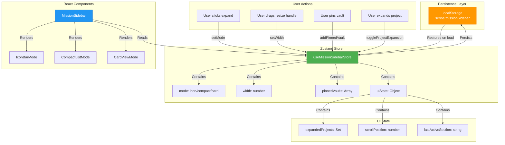
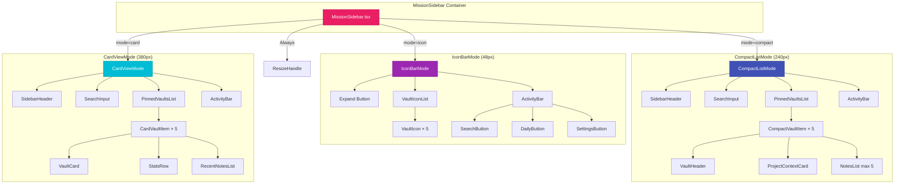
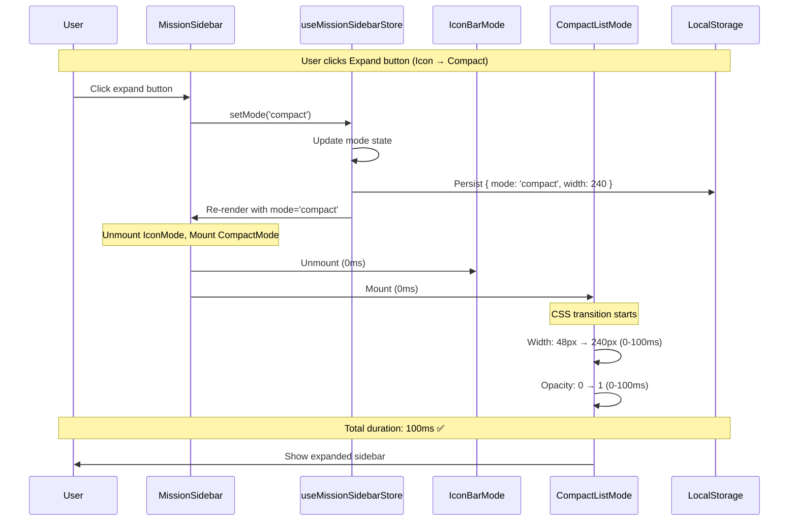
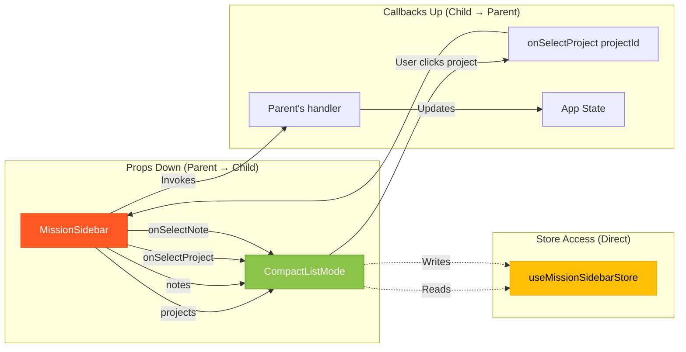
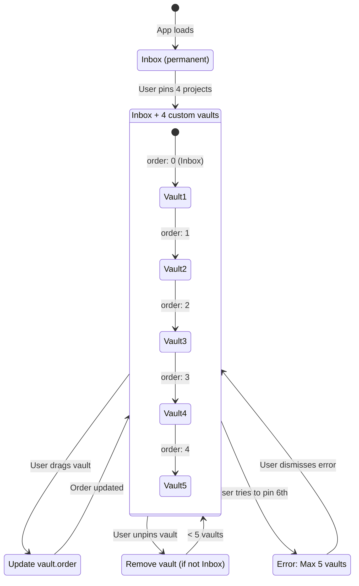
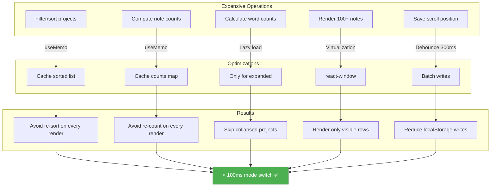
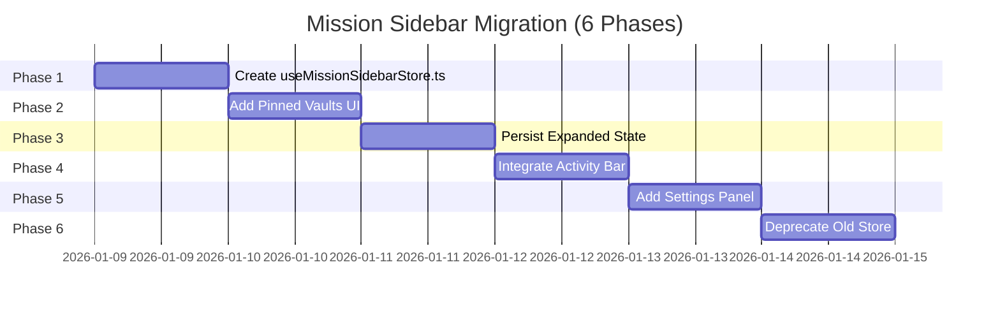
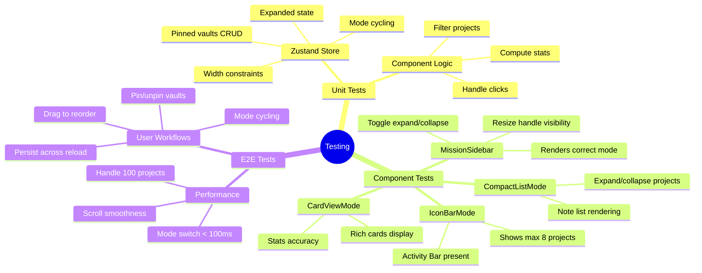
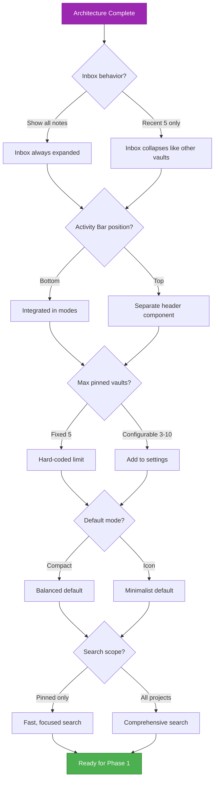

# Mission Sidebar: State Flow Diagrams

**Companion to:** `ARCHITECTURE-mission-sidebar.md`

---

## 1. State Management Architecture

---

## 2. Component Hierarchy

---

## 3. Mode Transition Flow

---

## 4. Data Flow Pattern

---

## 5. Pinned Vaults Management

---

## 6. Performance Optimization Strategy

---

## 7. Migration Timeline

**Estimated Total:** 6 working days (can be split across sessions)

---

## 8. Testing Coverage Map

---

## 9. Open Questions Decision Tree

---

**Recommended Answers (for ADHD users):**
1. **Inbox:** Show recent 5 only (consistent behavior, less overwhelm)
2. **Activity Bar:** Bottom (VSCode-style, always accessible)
3. **Max vaults:** Fixed 5 (simplicity, prevent clutter)
4. **Default mode:** Compact (balanced, not too minimal)
5. **Search scope:** Pinned only (faster, focused)

**Rationale:** Maximize focus, minimize cognitive load, consistent patterns.
