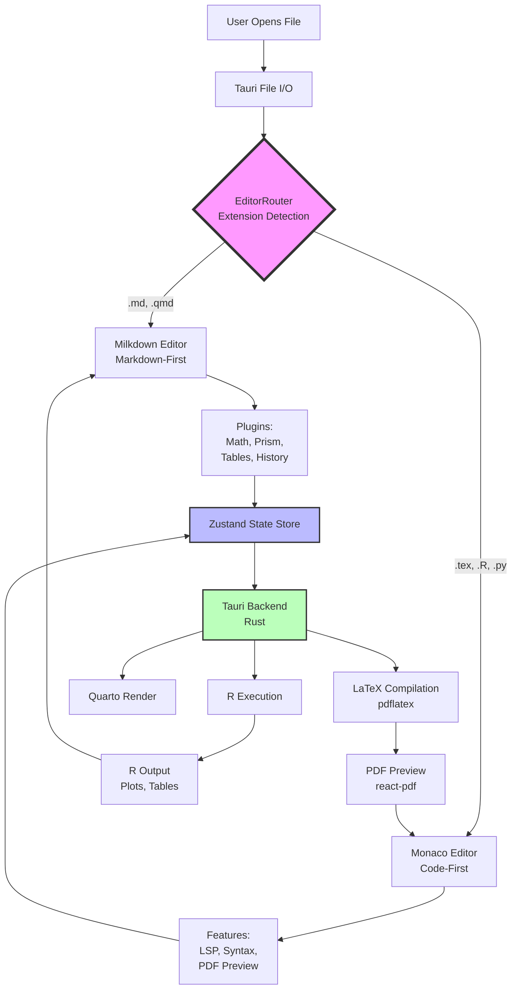
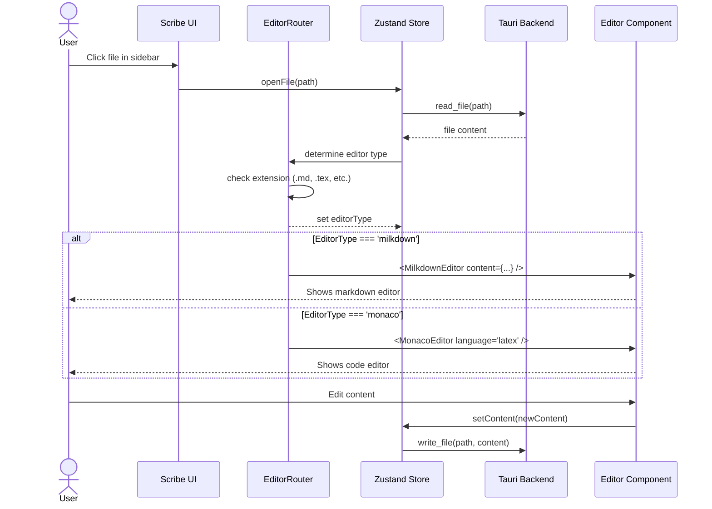

# SPEC: Hybrid Editor Architecture (Milkdown + Monaco)

**Status:** draft
**Created:** 2025-12-31
**From Brainstorm:** [BRAINSTORM-hybrid-editor-2025-12-31.md](../../BRAINSTORM-hybrid-editor-2025-12-31.md)
**Type:** Full Specification

---

## Metadata

| Field | Value |
|-------|-------|
| **Feature Name** | Hybrid Dual-Editor System |
| **Primary User** | Academic researchers, R package developers, data scientists |
| **Complexity** | High (3-4 weeks) |
| **Priority** | Critical (blocks LaTeX + Quarto workflows) |
| **Replaces** | CodeMirror Live Preview (performance issues) |

---

## Overview

Implement a dual-editor system where Scribe automatically routes files to the most appropriate editor based on file type:
- **Milkdown** for markdown-first files (`.md`, `.qmd`)
- **Monaco** for code-first files (`.tex`, `.R`, `.py`)

This architecture provides best-in-class editing experience for each file type without forcing users to choose or configure editors manually.

**Key Innovation:** Seamless editor switching with shared state management, making it feel like one unified editor despite using two different underlying technologies.

---

## Primary User Story

**As an** academic researcher working on mixed content (papers + code + notes)

**I want** files to open in the most appropriate editor automatically

**So that** I get:
- Live markdown preview for notes (.md)
- R chunk execution for analyses (.qmd)
- LaTeX PDF preview for papers (.tex)
- Syntax highlighting for code (.R, .py)

**Without** having to configure or switch editors manually.

---

## Acceptance Criteria

### Must Pass

1. **Automatic Editor Routing**
   - [ ] Opening `.md` file loads Milkdown editor
   - [ ] Opening `.qmd` file loads Milkdown editor
   - [ ] Opening `.tex` file loads Monaco editor with LaTeX mode
   - [ ] Opening `.R` file loads Monaco editor with R mode
   - [ ] Switching between files switches editors automatically
   - [ ] Editor state persists across switches (cursor position, scroll)

2. **Milkdown Features (Markdown/Quarto)**
   - [ ] Live markdown preview renders correctly
   - [ ] Math equations render inline (`$...$`) and block (`$$...$$`)
   - [ ] R/Python syntax highlighting in code blocks
   - [ ] Tables render and are editable
   - [ ] Undo/redo works correctly
   - [ ] Changes auto-save to file

3. **Monaco Features (LaTeX/Code)**
   - [ ] LaTeX syntax highlighting works
   - [ ] Split-pane PDF preview displays on right
   - [ ] PDF updates on save (auto-compile with 2s debounce)
   - [ ] Compile errors display in editor
   - [ ] Manual "Compile" button available
   - [ ] Line numbers and minimap visible

4. **State Management**
   - [ ] Zustand store maintains current file state
   - [ ] File content syncs across editor switches
   - [ ] Dirty state tracked correctly (unsaved changes indicator)
   - [ ] Last saved timestamp accurate

5. **Performance**
   - [ ] Open .md file < 200ms
   - [ ] Open .tex file < 500ms (lazy loads Monaco)
   - [ ] Typing latency < 16ms in both editors
   - [ ] LaTeX compile < 5s for typical document
   - [ ] No memory leaks after 100 file switches

---

## Secondary User Stories

### Story 2: R Package Developer

**As an** R package developer

**I want** to edit `.R` scripts in Monaco with syntax highlighting

**So that** I can write clean R code with proper indentation and auto-completion

**And** have consistent editing experience with my RStudio workflow.

**Acceptance:**
- [ ] `.R` files open in Monaco with R language mode
- [ ] Syntax highlighting for R keywords, functions, strings
- [ ] Auto-indentation on newline
- [ ] Bracket matching works

### Story 3: Quarto Data Scientist

**As a** data scientist using Quarto

**I want** to execute R chunks inline in `.qmd` files

**So that** I can see code output without leaving the editor

**And** iterate on analysis quickly.

**Acceptance:**
- [ ] "Run Chunk" button appears on R code blocks
- [ ] Cmd+Enter executes current chunk
- [ ] Output (text, plots, tables) displays below chunk
- [ ] Errors display with helpful messages

### Story 4: LaTeX Paper Writer

**As a** researcher writing LaTeX papers

**I want** live PDF preview while editing

**So that** I can see formatting changes immediately

**And** catch LaTeX errors early.

**Acceptance:**
- [ ] PDF preview updates automatically on save
- [ ] Compile errors highlight problematic lines
- [ ] PDF scrolls to match cursor position (SyncTeX - optional)
- [ ] Can zoom PDF preview in/out

---

## Architecture

### System Components



### Component Responsibilities

| Component | Responsibility | Technology |
|-----------|----------------|------------|
| **EditorRouter** | File type detection, editor selection | React component |
| **Milkdown Editor** | Markdown/Quarto editing, live preview | @milkdown/core + plugins |
| **Monaco Editor** | Code/LaTeX editing, PDF preview | monaco-editor |
| **Zustand Store** | Shared state (file content, editor state) | zustand |
| **Tauri Backend** | R execution, LaTeX compilation, file I/O | Rust |
| **PDFViewer** | PDF rendering in split pane | react-pdf |

---

## API Design

### Frontend API (Zustand Store)

```typescript
interface EditorStore {
  // Current file
  currentFile: {
    path: string | null
    content: string
    editorType: 'milkdown' | 'monaco' | 'text'
    isDirty: boolean
    lastSaved: number
  }

  // Editor instances
  milkdown: {
    instance: MilkdownEditor | null
    cursorPosition: number
    scrollPosition: number
  }

  monaco: {
    instance: MonacoEditor | null
    language: string
    pdfPath: string | null
    isCompiling: boolean
  }

  // Actions
  openFile(path: string): Promise<void>
  saveFile(): Promise<void>
  setContent(content: string): void
  switchEditor(type: 'milkdown' | 'monaco'): void
  compileLaTeX(): Promise<void>
  executeRChunk(code: string): Promise<ROutput>
}
```

**Usage Example:**

```typescript
import { useEditorStore } from '@/store/editorStore'

const Editor = () => {
  const { currentFile, openFile, saveFile } = useEditorStore()

  return (
    <div>
      <button onClick={() => openFile('/path/to/file.md')}>
        Open Markdown
      </button>
      <button onClick={saveFile}>Save (Cmd+S)</button>

      <EditorRouter
        filePath={currentFile.path}
        content={currentFile.content}
      />
    </div>
  )
}
```

---

### Backend API (Tauri Commands)

#### LaTeX Compilation

```rust
#[tauri::command]
pub async fn compile_latex(content: String) -> Result<String, String>
```

**Input:** LaTeX document content (string)
**Output:** PDF file path (string) or error message
**Side Effects:** Writes temp `.tex` file, runs `pdflatex`, returns PDF path

**Example:**

```typescript
import { invoke } from '@tauri-apps/api/tauri'

const pdfPath = await invoke('compile_latex', {
  content: '\\documentclass{article}\\begin{document}Hello\\end{document}'
})
// Returns: "/tmp/scribe_temp.pdf"
```

#### R Chunk Execution

```rust
#[tauri::command]
pub async fn execute_r_chunk(code: String, session_id: String) -> Result<ROutput, String>

struct ROutput {
    stdout: String,
    stderr: String,
    plots: Vec<String>,  // Base64-encoded PNG images
    tables: String,      // HTML table
    execution_time: u64  // milliseconds
}
```

**Input:** R code string, session ID (for persistent R environment)
**Output:** R execution results (stdout, plots, errors)

**Example:**

```typescript
const output = await invoke('execute_r_chunk', {
  code: 'library(ggplot2)\nggplot(mtcars, aes(wt, mpg)) + geom_point()',
  sessionId: 'session-123'
})

// Returns:
// {
//   stdout: "",
//   stderr: "",
//   plots: ["data:image/png;base64,iVBORw0KGgoAAAANS..."],
//   tables: "",
//   execution_time: 1234
// }
```

#### Quarto Render

```rust
#[tauri::command]
pub async fn quarto_render(input_path: String, format: String) -> Result<String, String>
```

**Input:** `.qmd` file path, output format (`html`, `pdf`, `docx`)
**Output:** Rendered output file path

**Example:**

```typescript
const htmlPath = await invoke('quarto_render', {
  inputPath: '/path/to/analysis.qmd',
  format: 'html'
})
// Returns: "/path/to/analysis.html"
```

---

## Data Models

### File Type Mapping

```typescript
enum EditorType {
  Milkdown = 'milkdown',
  Monaco = 'monaco',
  Text = 'text'
}

interface FileTypeConfig {
  extension: string
  editor: EditorType
  language?: string  // For Monaco
  features?: string[]
}

const FILE_TYPE_MAP: FileTypeConfig[] = [
  { extension: 'md', editor: EditorType.Milkdown },
  { extension: 'qmd', editor: EditorType.Milkdown },
  { extension: 'tex', editor: EditorType.Monaco, language: 'latex', features: ['pdf-preview'] },
  { extension: 'R', editor: EditorType.Monaco, language: 'r' },
  { extension: 'py', editor: EditorType.Monaco, language: 'python' },
  { extension: 'js', editor: EditorType.Monaco, language: 'javascript' },
  { extension: 'ts', editor: EditorType.Monaco, language: 'typescript' }
]
```

### Editor State Persistence

```typescript
interface EditorSnapshot {
  filePath: string
  editorType: EditorType
  content: string
  cursorPosition: number
  scrollPosition: number
  timestamp: number
}

// Saved to localStorage on editor switch
const saveEditorSnapshot = (snapshot: EditorSnapshot) => {
  localStorage.setItem(`editor-snapshot-${snapshot.filePath}`, JSON.stringify(snapshot))
}

// Restored when file reopened
const restoreEditorSnapshot = (filePath: string): EditorSnapshot | null => {
  const data = localStorage.getItem(`editor-snapshot-${filePath}`)
  return data ? JSON.parse(data) : null
}
```

---

## Dependencies

### Frontend Dependencies

```json
{
  "dependencies": {
    "@milkdown/core": "^7.3.0",
    "@milkdown/preset-commonmark": "^7.3.0",
    "@milkdown/plugin-math": "^7.3.0",
    "@milkdown/plugin-prism": "^7.3.0",
    "@milkdown/plugin-table": "^7.3.0",
    "@milkdown/plugin-listener": "^7.3.0",
    "@milkdown/plugin-history": "^7.3.0",
    "monaco-editor": "^0.45.0",
    "react-pdf": "^7.6.0",
    "pdfjs-dist": "^3.11.0",
    "zustand": "^4.4.0",
    "katex": "^0.16.9",
    "refractor": "^4.8.1"
  }
}
```

**Bundle Size Impact:**
- Milkdown: ~200KB (gzipped: ~60KB)
- Monaco: ~3MB (gzipped: ~900KB) - lazy loaded
- React PDF: ~500KB (gzipped: ~150KB)
- **Total:** ~3.7MB (~1.1MB gzipped)

**Mitigation:**
- Lazy load Monaco only when `.tex` file opened
- Code splitting for editor bundles
- Tree shaking for unused Milkdown plugins

### Backend Dependencies

```toml
[dependencies]
tauri = "1.5"
tokio = { version = "1.35", features = ["full"] }
serde = { version = "1.0", features = ["derive"] }
serde_json = "1.0"
base64 = "0.21"
```

**External System Requirements:**
- **TeX Live** (pdflatex, xelatex, latexmk) for LaTeX compilation
- **R** (Rscript) for R chunk execution
- **Quarto CLI** for `.qmd` rendering

**Installation Check:**

```rust
#[tauri::command]
pub async fn check_dependencies() -> DependencyStatus {
    DependencyStatus {
        pdflatex: check_command("pdflatex --version"),
        r: check_command("Rscript --version"),
        quarto: check_command("quarto --version")
    }
}
```

---

## UI/UX Specifications

### User Flow: Opening a File



### Component Layout

#### Milkdown Editor (Full Window)

```
┌────────────────────────────────────────────────────┐
│  [Toolbar: B I U Math Table Save]                 │
├────────────────────────────────────────────────────┤
│                                                    │
│  # Welcome to Scribe                               │
│                                                    │
│  This is **bold** text and *italic* text.         │
│                                                    │
│  Math: E = mc²  (inline)                           │
│                                                    │
│  $$                                                │
│  \int_0^\infty e^{-x^2} dx = \frac{\sqrt{\pi}}{2} │
│  $$                                                │
│                                                    │
│  ```r                                              │
│  library(ggplot2)                                  │
│  ggplot(mtcars, aes(wt, mpg)) + geom_point()       │
│  ```                                               │
│                                                    │
│                                                    │
├────────────────────────────────────────────────────┤
│  Status: Saved • 245 words • 14 lines • Cmd+S     │
└────────────────────────────────────────────────────┘
```

#### Monaco Editor with PDF Preview (Split Pane)

```
┌────────────────────────────────┬───────────────────────────┐
│  [Toolbar: Compile (Cmd+B)]    │   [PDF Zoom: - 100% +]    │
├────────────────────────────────┼───────────────────────────┤
│                                │                           │
│  \documentclass{article}       │   ┌─────────────────────┐ │
│  \usepackage{amsmath}          │   │                     │ │
│  \begin{document}              │   │   Title             │ │
│                                │   │                     │ │
│  \section{Introduction}        │   │   Introduction      │ │
│                                │   │                     │ │
│  Consider the equation:        │   │   Consider the...   │ │
│  \begin{equation}              │   │                     │ │
│    E = mc^2                    │   │    E = mc²          │ │
│  \end{equation}                │   │                     │ │
│                                │   │                     │ │
│  \end{document}                │   └─────────────────────┘ │
│                                │                           │
│                                │   Page 1 of 1             │
├────────────────────────────────┴───────────────────────────┤
│  Status: Compiled 2s ago • Line 8, Col 15 • Cmd+S          │
└────────────────────────────────────────────────────────────┘
```

### Keyboard Shortcuts

| Shortcut | Action | Scope |
|----------|--------|-------|
| **Cmd+S** | Save file | Both editors |
| **Cmd+N** | New file | Global |
| **Cmd+O** | Open file | Global |
| **Cmd+W** | Close file | Global |
| **Cmd+Shift+E** | Switch editor type (override) | Global |
| **Cmd+B** | Bold (Milkdown) / Compile (Monaco) | Editor-specific |
| **Cmd+I** | Italic | Milkdown only |
| **Cmd+Enter** | Run chunk | Milkdown (Quarto) |
| **Cmd+/** | Toggle comment | Monaco only |
| **Cmd+F** | Find | Both editors |
| **Cmd+Shift+F** | Find & Replace | Both editors |

### Accessibility

- [ ] All UI controls keyboard accessible
- [ ] Screen reader announces editor type on switch
- [ ] Focus management on editor switch
- [ ] High contrast mode support
- [ ] Keyboard shortcuts documented in app
- [ ] ARIA labels on buttons

---

## Open Questions

### Q1: Monaco Lazy Loading Strategy

**Question:** Should Monaco bundle be loaded on app startup or dynamically when first `.tex` file opens?

**Options:**
1. **Preload on startup** - Faster first `.tex` open, but increases initial load time
2. **Lazy load on demand** - Slower first `.tex` open (~500ms), but faster app startup

**Recommendation:** Lazy load (Option 2)

**Rationale:** Most users start with `.md` files (notes). Academic users working on papers will accept 500ms delay on first `.tex` open in exchange for faster overall app startup.

**Implementation:**
```typescript
const MonacoEditor = lazy(() => import('./MonacoEditor'))

// In EditorRouter
{ext === 'tex' && (
  <Suspense fallback={<LoadingSpinner />}>
    <MonacoEditor {...props} />
  </Suspense>
)}
```

---

### Q2: PDF Viewer Library

**Question:** Use `react-pdf` (full-featured) or simple iframe (lightweight)?

**Options:**
1. **react-pdf** - 500KB bundle, zoom/search/print, better UX
2. **iframe** - 0KB extra bundle, basic viewing only

**Recommendation:** react-pdf (Option 1)

**Rationale:** Academic users need zoom (for reviewing equations) and print (for proofreading). 500KB is acceptable for the UX improvement.

**Trade-off:** Larger bundle, but better UX for primary use case (writing LaTeX papers).

---

### Q3: LaTeX Compilation Frequency

**Question:** When should LaTeX auto-compile?

**Options:**
1. **On every save** - Fresh PDF always, but expensive (2-5s compile)
2. **Debounced (2-3s after last edit)** - Balance of freshness vs performance
3. **Manual only** - User clicks "Compile" button

**Recommendation:** Debounced (Option 2) with manual override

**Rationale:** Academic users want live preview but don't need instant updates. 2-3s debounce allows typing without interruption, while providing relatively fresh PDF.

**Implementation:**
```typescript
const debouncedCompile = useMemo(
  () => debounce(compileLatex, 2000),
  []
)

// On content change
useEffect(() => {
  if (autoCompile) {
    debouncedCompile(content)
  }
}, [content])
```

**Setting:** Add "Auto-compile LaTeX" toggle in preferences (default: enabled).

---

### Q4: Editor Preference Override

**Question:** Should users be able to manually force Monaco for `.md` files (or vice versa)?

**Options:**
1. **No override** - Automatic routing only, simple UX
2. **Hidden setting** - Advanced users can override in settings
3. **Right-click menu** - "Open with..." option

**Recommendation:** Right-click menu (Option 3)

**Rationale:** Power users occasionally want Monaco for `.md` (e.g., editing large docs where Milkdown is slow). Right-click menu provides discoverability without cluttering UI.

**Implementation:**
```typescript
const contextMenu = [
  { label: 'Open with Milkdown', action: () => switchEditor('milkdown') },
  { label: 'Open with Monaco', action: () => switchEditor('monaco') }
]
```

---

### Q5: R Chunk Execution: Persistent Session vs Fresh

**Question:** Should R chunks share state across executions?

**Options:**
1. **Persistent session** - Variables persist, like RStudio
2. **Fresh session** - Each chunk isolated
3. **User choice** - Setting to toggle

**Recommendation:** Persistent session with reset button (Option 1 + 3)

**Rationale:** Academic users expect RStudio behavior (persistent). But provide "Restart R Session" button for when environment gets messy.

**Implementation:**
```typescript
// Tauri maintains R session per file
const execute_r_chunk = async (code: string, file_path: string) => {
  const session_id = get_or_create_r_session(file_path)
  return execute_in_session(session_id, code)
}

// UI button
<button onClick={restartRSession}>Restart R Session</button>
```

---

## Review Checklist

### Architecture

- [ ] Component diagram reviewed and approved
- [ ] State management strategy (Zustand) appropriate
- [ ] Tauri backend API designed correctly
- [ ] Dependencies justified and documented

### Implementation

- [ ] All acceptance criteria testable
- [ ] Performance targets realistic
- [ ] Security considerations addressed (R execution sandboxing)
- [ ] Error handling specified

### UX

- [ ] User flows documented with diagrams
- [ ] Keyboard shortcuts don't conflict
- [ ] Accessibility requirements clear
- [ ] Loading states designed

### Documentation

- [ ] README updated with new editor info
- [ ] CLAUDE.md updated with architecture
- [ ] User documentation planned
- [ ] API documentation complete

### Testing

- [ ] Unit test strategy defined
- [ ] E2E test scenarios documented
- [ ] Performance testing plan clear
- [ ] Manual testing checklist created

---

## Implementation Notes

### Week-by-Week Plan

**Week 1: Foundation (5-7 days)**

Focus: Get dual-editor routing working

- Day 1-2: EditorRouter + file type detection
- Day 3-4: Milkdown editor with basic plugins
- Day 5-6: Monaco editor with LaTeX syntax
- Day 7: Integration testing

**Deliverable:** Open `.md` → Milkdown, `.tex` → Monaco

---

**Week 2: LaTeX Features (5 days)**

Focus: Live PDF preview working

- Day 8-9: Tauri LaTeX backend (`compile_latex`)
- Day 10-11: PDF preview UI (react-pdf, split pane)
- Day 12: Polish (compile button, error handling)

**Deliverable:** Edit `.tex` with live PDF preview

---

**Week 3: Quarto + R (5 days)**

Focus: R chunk execution in .qmd

- Day 13-14: R execution backend (`execute_r_chunk`)
- Day 15-16: Milkdown R plugin (detect chunks, run button)
- Day 17: Quarto render integration

**Deliverable:** Execute R chunks in `.qmd` files

---

**Week 4: Polish (3-5 days)**

Focus: Production-ready UX

- Day 18-19: UX improvements (shortcuts, toolbar, status bar)
- Day 20-21: Performance (code splitting, lazy loading)
- Day 22: Testing & documentation

**Deliverable:** Production-ready v1.0

---

### Technical Debt Prevention

1. **Code splitting:** Lazy load Monaco to avoid bloating initial bundle
2. **Type safety:** Full TypeScript coverage for editor interfaces
3. **Testing:** E2E tests for editor switching before shipping
4. **Documentation:** Update CLAUDE.md with editor architecture
5. **Performance monitoring:** Add latency tracking for editor operations

### Known Limitations (v1.0)

- LaTeX compilation requires TeX Live installed (not bundled)
- R execution requires R installed (not bundled)
- PDF preview limited to single document (no multi-file LaTeX projects)
- No forward/inverse search (SyncTeX) in v1.0
- Monaco lazy load causes ~500ms delay on first `.tex` open

**Future Improvements (v2.0):**
- Bundle minimal TeX engine (SwiftLaTeX WASM)
- Multi-file LaTeX project support
- SyncTeX for PDF ↔ source synchronization
- Collaborative editing (CRDT)
- Custom themes for each editor

---

## History

| Date | Version | Changes | Author |
|------|---------|---------|--------|
| 2025-12-31 | 0.1.0 | Initial spec from brainstorm | Claude (Sonnet 4.5) |

---

**Next Steps:**

1. **Review & Approval:** Stakeholder review of this spec
2. **Implementation:** Start Week 1 (EditorRouter foundation)
3. **Testing:** Create E2E test plan
4. **Documentation:** Update CLAUDE.md with architecture

---

**Related Documents:**

- [BRAINSTORM-hybrid-editor-2025-12-31.md](../../BRAINSTORM-hybrid-editor-2025-12-31.md)
- [PROSEMIRROR-VS-MILKDOWN-LATEX.md](../../PROSEMIRROR-VS-MILKDOWN-LATEX.md)
- [R-QUARTO-EDITOR-COMPARISON.md](../../R-QUARTO-EDITOR-COMPARISON.md)
- [PURE-LATEX-EDITING-RESEARCH.md](../../PURE-LATEX-EDITING-RESEARCH.md)
