# SPEC: Left Sidebar Redesign - "Focus First" Layout

**Status:** draft
**Created:** 2026-01-08
**From Brainstorm:** [BRAINSTORM-left-sidebar-layouts-2026-01-08.md](../BRAINSTORM-left-sidebar-layouts-2026-01-08.md)
**Expert Analysis:**
- UX: [UX-ANALYSIS-LEFT-SIDEBAR-2026-01-08.md](UX-ANALYSIS-LEFT-SIDEBAR-2026-01-08.md)
- Architecture: [mission-sidebar-state-flow.md](../mission-sidebar-state-flow.md)

---

## Overview

Redesign the left Mission Sidebar to be ADHD-friendly with clear visual hierarchy, starting in minimal icon mode (48px) and expanding to rich card mode (380px) when needed. Features 5 pinned vaults (Inbox + 4 custom), integrated Activity Bar at bottom, and < 100ms mode transitions.

**Key Goals:**
- Reduce visual clutter through progressive disclosure
- Maintain persistent landmarks (Inbox top, Activity Bar bottom)
- Enable instant context switching (< 100ms transitions)
- Support 5 customizable pinned vaults

---

## Primary User Story

**As an** ADHD academic writer (Dr. Sarah Chen persona)
**I want** a minimal sidebar that shows only what I need right now
**So that** I can focus on writing without visual overwhelm, while still having quick access to my projects when needed

**Acceptance Criteria:**
- ✅ Sidebar defaults to icon mode (48px) - maximum editor space
- ✅ Inbox always visible at top with unread badge
- ✅ One-click expansion to compact mode (240px) shows all 5 pinned vaults
- ✅ Activity Bar (Search/Daily/Settings) always accessible at bottom
- ✅ Mode switching completes in < 100ms (no janky animations)
- ✅ Hover tooltips on project dots show name + stats (500ms delay)
- ✅ Settings allow customizing which 4 vaults (beyond Inbox) are pinned

---

## Secondary User Stories

### 2.1 As a power user who switches projects frequently

**I want** to reorder my pinned vaults via drag-and-drop
**So that** my most-used projects are at the top

**Acceptance:**
- Can drag vault icons/rows to reorder in all modes
- Order persists across sessions (localStorage)
- Inbox always stays at top (can't be moved)

### 2.2 As someone who captures ideas quickly

**I want** instant access to Inbox for quick notes
**So that** I don't lose thoughts while context-switching

**Acceptance:**
- Inbox visible in all modes (icon/compact/card)
- Badge shows unread count
- Cmd+Shift+C opens quick capture dialog
- Capture goes to Inbox by default

### 2.3 As a visual thinker

**I want** colored/emoji project indicators
**So that** I can scan quickly without reading text

**Acceptance:**
- Icon mode shows colored dots (project color or emoji)
- Tooltips show full project name + stats on hover
- Active project highlighted with accent color

---

## Technical Requirements

### Architecture

**State Management:**

```typescript
// New Zustand store: useMissionSidebarStore.ts
interface MissionSidebarStore {
  // Mode state
  mode: 'icon' | 'compact' | 'card'
  width: number  // Actual pixel width

  // Vault configuration
  pinnedVaults: PinnedVault[]  // Max 5, Inbox always first

  // UI state (ephemeral)
  expandedProjects: Set<string>  // Which projects show note lists
  scrollPosition: number
  lastActiveSection: 'inbox' | string  // For restoration

  // Actions
  setMode: (mode: SidebarMode) => void
  cycleSidebarMode: () => void
  toggleSidebarCollapsed: () => void
  setSidebarWidth: (width: number) => void
  addPinnedVault: (vault: PinnedVault) => void
  removePinnedVault: (vaultId: string) => void
  reorderPinnedVaults: (fromIndex: number, toIndex: number) => void
  toggleProjectExpansion: (projectId: string) => void
  setScrollPosition: (position: number) => void
}

interface PinnedVault {
  id: 'inbox' | string
  label: string
  emoji: string
  order: number  // 0-4
  isPermanent: boolean  // true for Inbox only
}
```

**Mermaid Diagram:**


### API Design

N/A - No API changes. This is pure frontend UI state management.

### Data Models

**Existing Models (No Changes):**
- `Project` - Existing project type
- `Note` - Existing note type

**New Models:**

```typescript
// src/renderer/src/types/sidebar.ts
export interface PinnedVault {
  id: 'inbox' | string  // 'inbox' reserved, others are project IDs
  label: string
  emoji: string
  order: number  // 0-4
  isPermanent: boolean
}

export type SidebarMode = 'icon' | 'compact' | 'card'

export interface SidebarDimensions {
  mode: SidebarMode
  width: number
  minWidth: number
  maxWidth: number
}
```

### Dependencies

**New:** None - using existing dependencies

**Existing:**
- `zustand` - State management (already in use)
- `lucide-react` - Icons (already in use)
- `react` - UI framework (already in use)

**Dev Dependencies:**
- `@testing-library/react` - Component tests
- `vitest` - Unit tests
- `playwright` - E2E tests

---

## UI/UX Specifications

### User Flow

```mermaid
sequenceDiagram
    participant User
    participant IconMode
    participant Store
    participant CompactMode

    Note over User: App opens, sidebar in icon mode

    User->>IconMode: Hover over Research dot
    IconMode->>User: Show tooltip (500ms delay)

    Note over User: "Research • 3 notes, 2.4k words"

    User->>IconMode: Click Research dot
    IconMode->>Store: setMode('compact')
    Store->>CompactMode: Render compact mode

    Note over CompactMode: Width: 48px → 240px (100ms)

    CompactMode->>User: Show all 5 vaults + notes

    User->>CompactMode: Click Research project
    CompactMode->>Store: toggleProjectExpansion('research-id')
    Store->>CompactMode: Re-render with notes list

    CompactMode->>User: Show 3 notes under Research
```



### Wireframes (ASCII)

**Icon Mode (Default - 48px):**

```
┌────┐
│ ⚡ │  Mission Control
├────┤
│ 📥 │  INBOX
│ •3 │  Badge: 3 unread
├────┤  DIVIDER
│ 🔵 │  Research (active)
│ ⚪ │  Teaching
│ ⚪ │  R pkg
│ ⚪ │  dev tools
│ ➕ │  Add vault
├────┤  SPACER
├────┤  ACTIVITY BAR
│ 🔍 │  Search
│ 📅 │  Daily
│ ⚙️ │  Settings
└────┘
```

**Compact Mode (240px):**

```
┌──────────────────────┐
│  ⚡ Scribe      [◀]  │
├──────────────────────┤
│ 📥 INBOX (3)    [▼]  │
│  • Quick note 1  2h  │
│  • Idea capture  1d  │
│  • Meeting note  2d  │
├──────────────────────┤
│ PINNED           [−] │
│ 🔬 Research      ●  │
│    3 notes, 2.4k     │
│ 📚 Teaching          │
│    12 notes, 8.1k    │
│ 📦 R pkg             │
│    5 notes, 1.2k     │
│ 🛠️ dev tools         │
│    8 notes, 3.4k     │
│ [+ New Project]      │
├──────────────────────┤
│ 🔍  📅  ⚙️          │
└──────────────────────┘
```

**Card Mode (380px):**

```
┌─────────────────────────────┐
│  ⚡ Scribe          [◀] [▣] │
├─────────────────────────────┤
│ 📥 INBOX (3)    [⚡ Capture] │
│ ┌───────────────────────────┐│
│ │ • Quick note 1      2h ago││
│ │ • Idea capture      1d ago││
│ │ • Meeting note      2d ago││
│ └───────────────────────────┘│
├─────────────────────────────┤
│ PINNED PROJECTS             │
│ ┌───────────────────────────┐│
│ │ 🔬 Research           ●   ││
│ │ ───────────────────────   ││
│ │ Mediation Analysis        ││
│ │ 📄 3  📊 2,447  🔥 today  ││
│ └───────────────────────────┘│
│ [+ New Project]             │
├─────────────────────────────┤
│ 🔍 Search  📅 Daily  ⚙️ Set │
└─────────────────────────────┘
```

### Accessibility Checklist

- ✅ All interactive elements keyboard accessible (Tab order)
- ✅ ARIA labels on all buttons (`aria-label`, `aria-expanded`)
- ✅ Focus indicators visible (2px accent outline)
- ✅ Screen reader announces mode changes (`aria-live="polite"`)
- ✅ Color not sole indicator (dots + text, badges + icons)
- ✅ Contrast ratio 4.5:1+ for all text
- ✅ Reduced motion support (`prefers-reduced-motion`)
- ✅ Tooltips associated via `aria-describedby`
- ✅ Keyboard shortcuts documented and customizable

---

## Design Decisions ✅

1. **Inbox behavior:** Show ALL unassigned notes or recent 5 only?
   - **Recommendation:** Recent 5 (consistent with other vaults, less overwhelming)
   - **Decision:** ✅ Recent 5 notes only

2. **Activity Bar icon count:** 3 icons (Search/Daily/Settings) or expand to 5?
   - **Recommendation:** Start with 3, allow customization in settings later
   - **Decision:** ✅ 3 icons (Search, Daily, Settings)

3. **Default mode for first-time users:** Icon (minimal) or Compact (balanced)?
   - **Recommendation:** Icon (matches stated preference for reduced clutter)
   - **Decision:** ✅ Icon mode (48px minimal)

4. **Max pinned vaults:** Fixed 5 or configurable (3-10)?
   - **Recommendation:** Fixed 5 (ADHD: fewer choices, prevent clutter)
   - **Decision:** ✅ Fixed at 5 vaults

5. **Mode switcher UI:** Cmd+0 only (hidden) or add header icon (explicit)?
   - **Recommendation:** Both (Cmd+0 primary, header icon for discoverability)
   - **Decision:** ✅ Both (⌘0 + header icon)

---

## Review Checklist

- [ ] **Functional:** All user stories have clear acceptance criteria
- [ ] **Technical:** Architecture diagram and state management defined
- [ ] **UX:** Wireframes for all 3 modes provided
- [ ] **Accessibility:** WCAG AA compliance checklist completed
- [ ] **Performance:** < 100ms mode transition requirement specified
- [ ] **Testing:** Test strategy defined (unit, component, E2E)
- [ ] **Documentation:** User-facing docs plan outlined
- [ ] **Open Questions:** All decision points identified
- [ ] **Migration:** Backward compatibility considered (existing projects/notes)
- [ ] **Localization:** N/A - UI text minimal, not user-facing product yet

---

## Implementation Notes

### Phase 1: Icon Mode Enhancements (Priority 1)

**Duration:** 6 hours

**Tasks:**
1. Add tooltip component with 500ms delay
2. Implement colored project dots (use project color or emoji)
3. Add Inbox badge (unread count)
4. Create Activity Bar component (3 icons: Search, Daily, Settings)
5. Wire up click handlers (dot → expand to compact)

**Files to Modify:**
- `src/renderer/src/components/sidebar/IconBarMode.tsx`
- `src/renderer/src/components/sidebar/Tooltip.tsx` (new)
- `src/renderer/src/components/sidebar/ActivityBar.tsx` (new)
- `src/renderer/src/store/useAppViewStore.ts` (extend with Activity Bar state)

**Testing:**
- Unit: Tooltip delay, badge calculation, Activity Bar clicks
- E2E: Hover tooltip appears, click expands, badge updates

### Phase 2: Inbox Pinning (Priority 1)

**Duration:** 8 hours

**Tasks:**
1. Create Inbox section component (collapsible in compact/card)
2. Add Inbox to permanent top position in all modes
3. Implement quick capture shortcut (Cmd+Shift+C)
4. Add unread badge logic
5. Style Inbox differently (amber accent)

**Files:**
- `src/renderer/src/components/sidebar/InboxSection.tsx` (new)
- `src/renderer/src/components/sidebar/CompactListMode.tsx`
- `src/renderer/src/components/sidebar/CardViewMode.tsx`
- `src/renderer/src/store/useMissionSidebarStore.ts` (new)

### Phase 3: Vault Pinning System (Priority 2)

**Duration:** 8 hours

**Tasks:**
1. Create Settings panel for pinned vaults
2. Implement drag-to-reorder (react-dnd or @dnd-kit)
3. Add "Pin to Sidebar" context menu option
4. Persist pinned vaults to localStorage
5. Limit to 5 vaults (validation + error message)

**Files:**
- `src/renderer/src/components/settings/PinnedVaultsSettings.tsx` (new)
- `src/renderer/src/components/sidebar/DraggableVaultItem.tsx` (new)
- `src/renderer/src/store/useMissionSidebarStore.ts`

### Phase 4: Visual Polish (Priority 3)

**Duration:** 6 hours

**Tasks:**
1. Add hover states to all interactive elements
2. Implement smooth transitions (150-200ms, ease-out)
3. Add drag-and-drop visual feedback
4. Polish spacing/padding per mode
5. Test with ADHD users for feedback

---

## History

| Date | Version | Changes |
|------|---------|---------|
| 2026-01-08 | 1.0 | Initial spec from comprehensive brainstorm (Option A: Focus First) |
| 2026-01-08 | 1.1 | All design decisions approved - ready for Phase 1 implementation |

---

**Spec Status:** ✅ Approved - Ready for Implementation
**Next:** Begin Phase 1 (Icon Mode Enhancements) - 6 hours estimated
