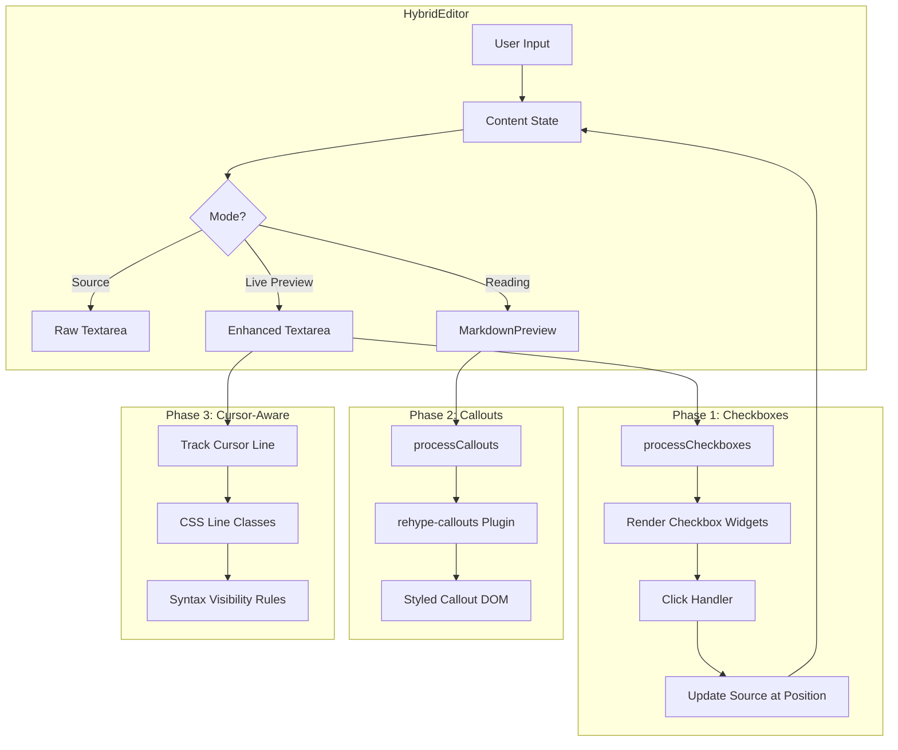
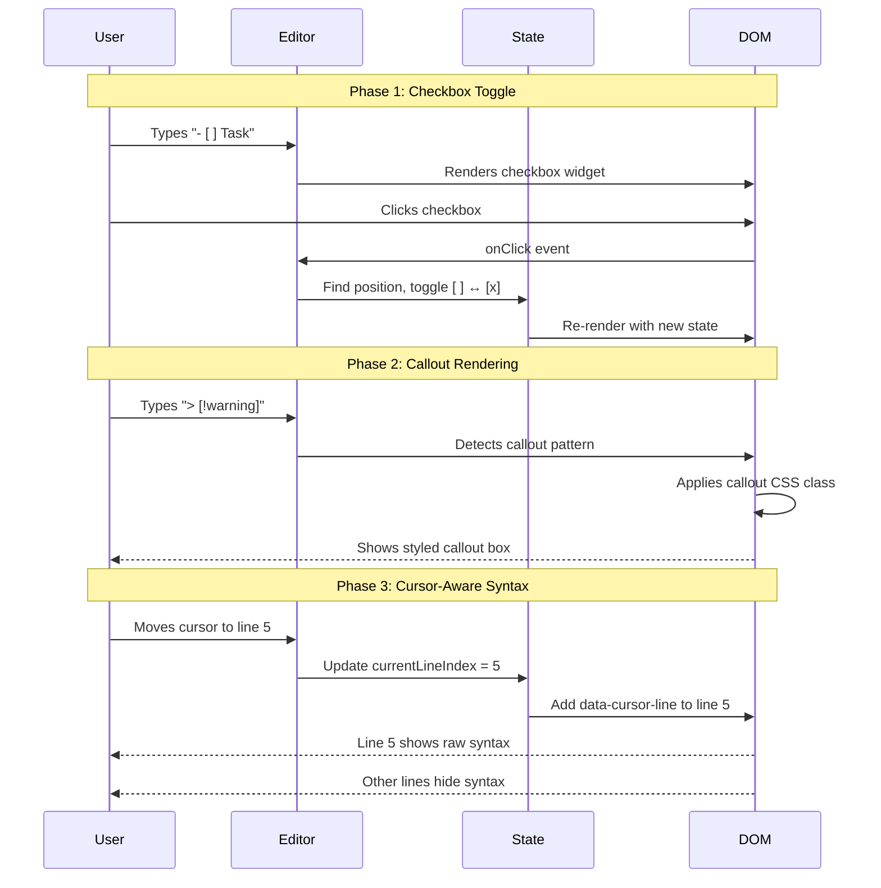

# SPEC: Live Editor Enhancements

**Status:** draft
**Created:** 2025-12-30
**From Brainstorm:** [PLAN-LIVE-EDITOR.md](../../PLAN-LIVE-EDITOR.md)

---

## Overview

Implement Obsidian-style "Live Preview" editing features for Scribe's HybridEditor, including inline checkbox rendering with click-to-toggle, callout/admonition blocks, and cursor-aware syntax hiding. These enhancements transform the editor from a basic markdown textarea into a modern WYSIWYG-like experience while maintaining the simplicity required for ADHD-friendly focus.

---

## Primary User Story

**As a** writer using Scribe for focused writing sessions,
**I want** markdown to render inline while I type (checkboxes, callouts, formatted text),
**So that** I can see the final appearance without switching modes, reducing cognitive load and context switching.

### Acceptance Criteria

- [ ] Task list checkboxes (`- [ ]` / `- [x]`) render as clickable checkboxes
- [ ] Clicking a checkbox toggles its state and updates source markdown
- [ ] Callout blocks (`> [!type]`) render with icons, colors, and borders
- [ ] 8 callout types supported: note, tip, warning, danger, info, quote, example, question
- [ ] Cursor on a line reveals raw markdown syntax; cursor elsewhere hides syntax
- [ ] All features work in both Tauri and Browser modes
- [ ] No regression in existing wiki-link, tag, and citation autocomplete

---

## Secondary User Stories

### Task Management Writer
**As a** writer who tracks tasks within notes,
**I want** to click checkboxes directly in the editor,
**So that** I can mark items complete without editing markdown syntax.

### Research Note-Taker
**As a** researcher organizing notes with callouts,
**I want** visual callout blocks with appropriate icons and colors,
**So that** I can quickly scan notes for warnings, tips, and key information.

### Distraction-Sensitive Writer
**As an** ADHD writer who finds visible markdown syntax distracting,
**I want** syntax to hide automatically when I'm not editing that line,
**So that** I can focus on content without visual clutter.

---

## Technical Requirements

### Architecture



### API Design

N/A - No backend API changes required. All features are frontend-only enhancements to the existing HybridEditor component.

### Data Models

N/A - No database schema changes. Markdown content continues to be stored as plain text strings.

### Dependencies

| Package | Version | Purpose | Phase |
|---------|---------|---------|-------|
| `remark-gfm` | ^4.0.0 | Task list parsing (already installed) | 1 |
| `rehype-callouts` | ^1.0.0 | Obsidian callout rendering | 2 |
| - | - | No new deps for cursor tracking (CSS-based) | 3 |

**Existing Dependencies Leveraged:**
- `react-markdown` - Already used in MarkdownPreview
- `rehype-raw` - Already installed for HTML passthrough
- `remarkGfm` - Already imported but checkboxes not yet rendered

---

## UI/UX Specifications

### User Flow



### Wireframes (ASCII)

**Checkbox Rendering:**
```
┌─────────────────────────────────────────────────────────┐
│ Source Mode:                                            │
│   - [ ] Unchecked task                                  │
│   - [x] Completed task                                  │
├─────────────────────────────────────────────────────────┤
│ Live Preview Mode:                                      │
│   ☐ Unchecked task      ← clickable                    │
│   ☑ Completed task      ← strikethrough + dimmed       │
└─────────────────────────────────────────────────────────┘
```

**Callout Rendering:**
```
┌─────────────────────────────────────────────────────────┐
│ Source:                                                 │
│   > [!warning]                                          │
│   > This is important                                   │
├─────────────────────────────────────────────────────────┤
│ Rendered:                                               │
│ ┌─────────────────────────────────────────────────────┐ │
│ │ ⚠️ Warning                                          │ │
│ │ This is important                                   │ │
│ └─────────────────────────────────────────────────────┘ │
│ (Yellow left border, yellow tint background)            │
└─────────────────────────────────────────────────────────┘
```

**Cursor-Aware Syntax:**
```
┌─────────────────────────────────────────────────────────┐
│ Cursor on line 2:                                       │
│                                                         │
│   Welcome to Scribe          ← rendered (no #)         │
│   This is **bold** text|     ← raw syntax visible      │
│   More content here          ← rendered                │
└─────────────────────────────────────────────────────────┘
```

### Accessibility Checklist

- [ ] Checkboxes are keyboard accessible (Space/Enter to toggle)
- [ ] Checkboxes have proper ARIA role="checkbox" and aria-checked
- [ ] Callouts have role="note" or appropriate landmark
- [ ] Callout icons have aria-hidden="true" (decorative)
- [ ] Color alone does not convey callout meaning (icons required)
- [ ] Focus ring visible on interactive elements
- [ ] Screen reader announces checkbox state changes

---

## Implementation Approach

### Research Findings Summary

| Approach | Package/Method | Pros | Cons | Recommendation |
|----------|---------------|------|------|----------------|
| **BlockNote** | Built-in checkListItem | Native support, battle-tested | Would require editor replacement | Not for this project |
| **react-markdown + remark-gfm** | Custom component renderer | Already in codebase, minimal change | Need custom toggle logic | **Phase 1 choice** |
| **rehype-callouts** | npm package | Obsidian-compatible, no JS needed | New dependency | **Phase 2 choice** |
| **Milkdown inline-sync** | Cursor-aware plugin | Sophisticated, handles edge cases | Different architecture | Reference only |
| **CodeMirror decorations** | CM6 ViewPlugin | Full control, proven pattern | Major refactor | Future consideration |
| **CSS + data attributes** | data-cursor-line | Simple, performant | Limited complex syntax | **Phase 3 choice** |

### Phase 1: Checkboxes (Recommended First)

**Why first:** Quick win with high user value. Leverages existing `remark-gfm` which already parses task lists.

**Implementation:**

1. **Modify MarkdownPreview component** (HybridEditor.tsx:588-727):
   - Add custom `li` renderer to detect task list items
   - Render `<input type="checkbox">` with click handler
   - Pass `onCheckboxToggle` callback to parent

2. **Add toggle handler** in HybridEditor:
   ```typescript
   const handleCheckboxToggle = (lineIndex: number, checked: boolean) => {
     const lines = content.split('\n')
     const line = lines[lineIndex]
     const newLine = checked
       ? line.replace('- [ ]', '- [x]')
       : line.replace('- [x]', '- [ ]')
     lines[lineIndex] = newLine
     onChange(lines.join('\n'))
   }
   ```

3. **Track line positions** during render to enable accurate toggle

**Files to modify:**
- `src/renderer/src/components/HybridEditor.tsx`

### Phase 2: Callouts

**Implementation:**

1. **Install rehype-callouts:**
   ```bash
   npm install rehype-callouts
   ```

2. **Add to ReactMarkdown pipeline:**
   ```typescript
   import rehypeCallouts from 'rehype-callouts'

   <ReactMarkdown
     remarkPlugins={[remarkGfm]}
     rehypePlugins={[rehypeRaw, [rehypeCallouts, { theme: 'obsidian' }]]}
   >
   ```

3. **Add callout CSS** to match Scribe theme variables

**Files to modify:**
- `src/renderer/src/components/HybridEditor.tsx`
- `src/renderer/src/styles/callouts.css` (new)

### Phase 3: Cursor-Aware Syntax

**Implementation approach:** CSS-based with line tracking (simpler than CodeMirror decorations)

1. **Track current line** in textarea:
   ```typescript
   const [currentLineIndex, setCurrentLineIndex] = useState(0)

   const updateCursorLine = (textarea: HTMLTextAreaElement) => {
     const cursorPos = textarea.selectionStart
     const textBeforeCursor = textarea.value.substring(0, cursorPos)
     const lineIndex = textBeforeCursor.split('\n').length - 1
     setCurrentLineIndex(lineIndex)
   }
   ```

2. **Render lines with data attributes:**
   ```tsx
   {lines.map((line, i) => (
     <div
       key={i}
       data-line-index={i}
       data-cursor-line={i === currentLineIndex}
     >
       {i === currentLineIndex ? renderRaw(line) : renderFormatted(line)}
     </div>
   ))}
   ```

3. **CSS for syntax visibility:**
   ```css
   .editor-line .syntax-marker { display: none; }
   .editor-line[data-cursor-line="true"] .syntax-marker { display: inline; }
   ```

**Known challenges** (from research):
- Cursor position can misalign when hiding characters (CodeMirror issue #9354)
- Click-to-position requires careful handling with replaced content
- Undo/redo state needs consideration

**Files to modify:**
- `src/renderer/src/components/HybridEditor.tsx`
- `src/renderer/src/styles/editor.css` (new or extend existing)

---

## Open Questions

1. **Phase 3 Complexity:** Should cursor-aware syntax hiding be deferred to v2.0? The current plan already has a v1.4 deferral note. Given the known issues with cursor positioning, this may be wisest.

2. **Checkbox in Live Preview vs Reading:** Should checkboxes be clickable in Live Preview mode (textarea) or only in Reading mode? Reading mode is easier since it's already rendered DOM.

---

## Review Checklist

- [ ] All acceptance criteria are testable
- [ ] Accessibility requirements addressed
- [ ] No new API keys or external services required
- [ ] Follows ADHD-friendly principles (reduces friction)
- [ ] Compatible with both Tauri and Browser modes
- [ ] Dependencies are actively maintained
- [ ] Implementation order minimizes risk

---

## Implementation Notes

### Key Insights from Research

1. **BlockNote already has checkboxes** - If HybridEditor were BlockNote-based, this would be trivial. But HybridEditor is textarea + ReactMarkdown, so we implement custom.

2. **remark-gfm parses but doesn't render interactive checkboxes** - It creates `<input disabled>` elements. We need custom component renderer for interactivity.

3. **rehype-callouts is the cleanest solution** - Supports Obsidian theme out of box, no JS required for rendering, collapsible callouts work with `<details>`.

4. **Cursor-aware is the hardest** - Multiple open issues in CodeMirror about cursor misalignment. Milkdown's inline-sync plugin is sophisticated but requires their architecture. CSS-based approach is simpler but less powerful.

5. **VS Code Markdown Preview Enhanced** demonstrates checkbox toggle is possible in preview pane - clicking toggles source. This validates our approach.

### Reference Implementations

- [BlockNote checkListItem](https://www.blocknotejs.org/docs/features/blocks/list-types)
- [Milkdown inline-sync](https://milkdown.dev/)
- [rehype-callouts](https://github.com/lin-stephanie/rehype-callouts)
- [VS Code Markdown Checkboxes](https://github.com/mjbvz/vscode-markdown-checkboxes)
- [CodeMirror syntax hiding discussion](https://discuss.codemirror.net/t/hide-markdown-syntax/7602)

---

## History

| Date | Change | Author |
|------|--------|--------|
| 2025-12-30 | Initial spec from brainstorm | Claude |

---

## Sources

- [BlockNote List Types](https://www.blocknotejs.org/docs/features/blocks/list-types)
- [BlockNote GitHub](https://github.com/TypeCellOS/BlockNote)
- [Milkdown WYSIWYG Editor](https://milkdown.dev/)
- [Milkdown GitHub](https://github.com/Milkdown/milkdown)
- [MDXEditor](https://mdxeditor.dev/)
- [Obsidian Callouts Help](https://help.obsidian.md/Editing+and+formatting/Callouts)
- [rehype-callouts npm](https://www.npmjs.com/package/rehype-callouts)
- [rehype-callouts GitHub](https://github.com/lin-stephanie/rehype-callouts)
- [remark-gfm GitHub](https://github.com/remarkjs/remark-gfm)
- [react-markdown GitHub](https://github.com/remarkjs/react-markdown)
- [VS Code Markdown Checkboxes](https://marketplace.visualstudio.com/items?itemName=bierner.markdown-checkbox)
- [VS Code Markdown Checkboxes GitHub](https://github.com/mjbvz/vscode-markdown-checkboxes)
- [CodeMirror Syntax Hiding Discussion](https://discuss.codemirror.net/t/hide-markdown-syntax/7602)
- [CodeMirror Cursor Misalignment Issue](https://discuss.codemirror.net/t/regarding-the-issue-of-cursor-misalignment-when-using-decoration-mark-to-hide-symbols/9354)
- [codemirror-rich-markdoc GitHub](https://github.com/segphault/codemirror-rich-markdoc)
- [TipTap Editor](https://tiptap.dev/)
- [prosemirror-codemark npm](https://www.npmjs.com/package/prosemirror-codemark)
- [Outline Rich Markdown Editor](https://github.com/outline/rich-markdown-editor)
