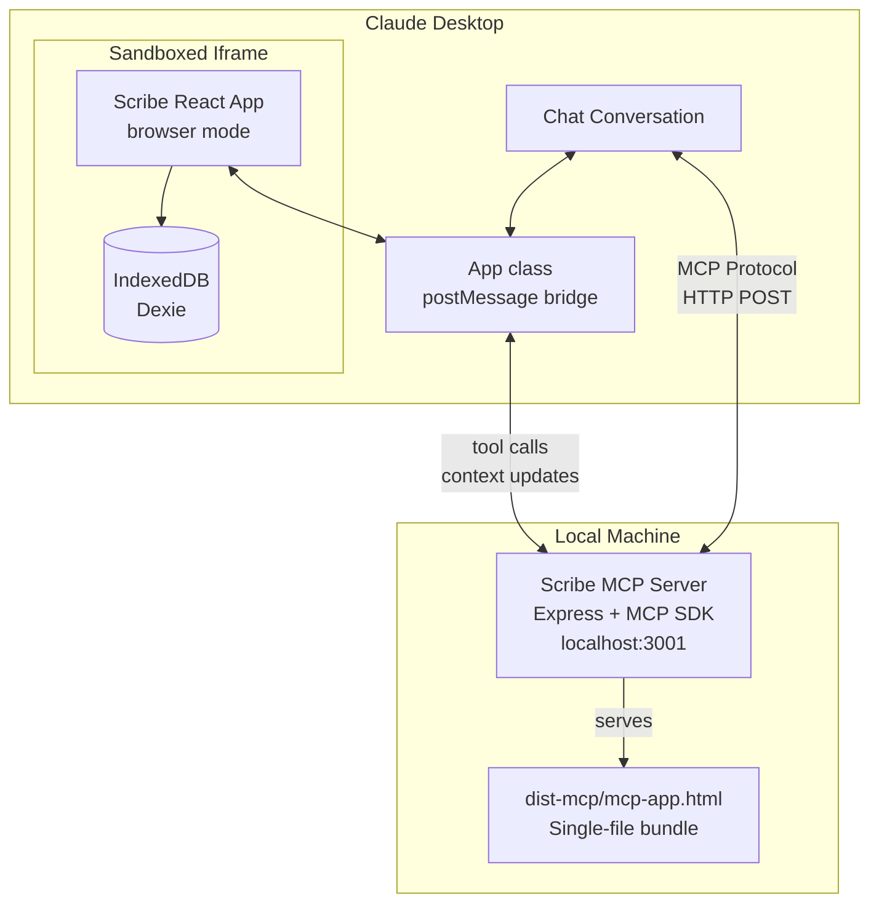
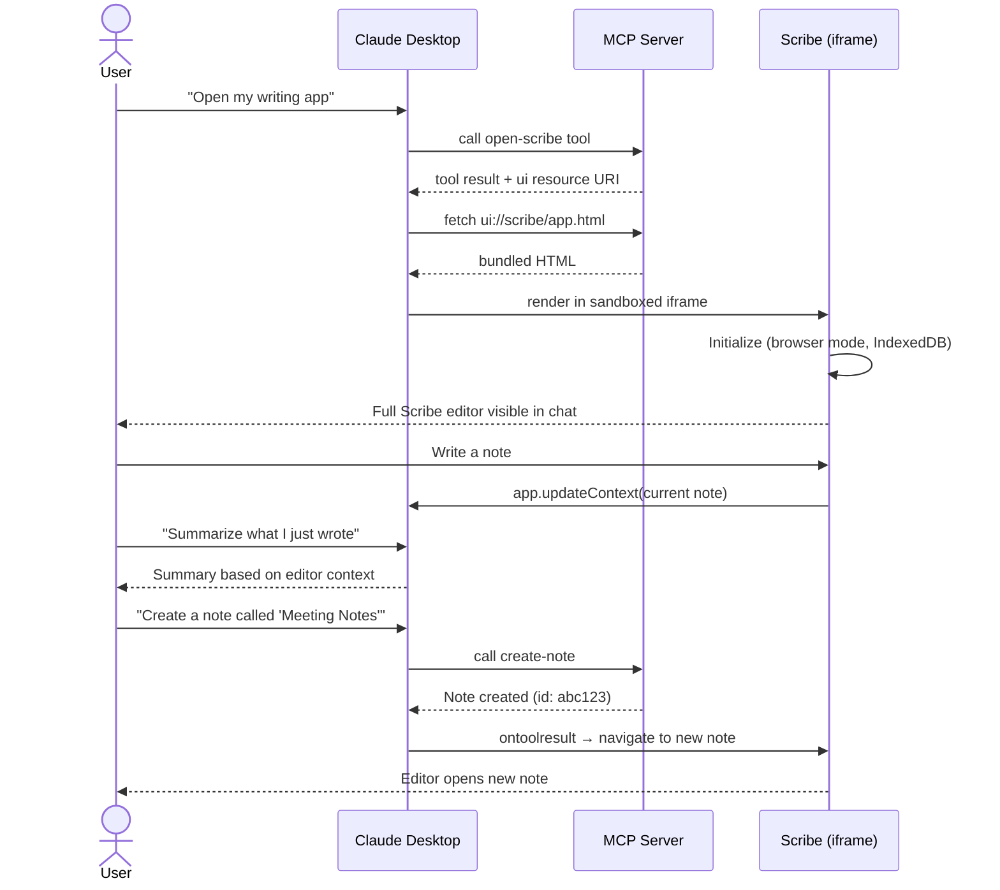

# SPEC: Scribe as MCP App in Claude Desktop

> **Run Scribe's full writing environment inside Claude Desktop's conversation window via MCP Apps**

**Generated:** 2026-02-22
**Status:** Draft
**Priority:** P1 (New Distribution Channel)
**From Brainstorm:** [BRAINSTORM-mcp-app-2026-02-22.md](../../BRAINSTORM-mcp-app-2026-02-22.md)

---

## Overview

MCP Apps is an extension to the Model Context Protocol that allows MCP servers to deliver interactive HTML/JS/CSS applications within a sandboxed iframe in Claude Desktop's chat window. Scribe already has a complete browser-mode fallback (`browserApi` + IndexedDB via Dexie) that mirrors the Tauri backend 1:1. This spec defines how to package Scribe as an MCP App so users can write alongside Claude — drafting and editing notes in-conversation with full tool integration.

**Why this matters:** Scribe becomes the writing surface inside Claude conversations. Users stop context-switching between apps. Claude can read what you're writing, create notes, and organize your work — all within the chat.

---

## Primary User Story

> **As a** Scribe user who also uses Claude Desktop,
> **I want to** open Scribe directly inside my Claude conversation,
> **So that** I can write and organize notes alongside Claude without switching windows.

### Acceptance Criteria

- [ ] Running `npm run mcp:serve` starts a local MCP server on `localhost:3001`
- [ ] Adding the server as a custom connector in Claude Desktop works
- [ ] Asking Claude to "open my writing app" renders Scribe in an iframe
- [ ] The full Scribe UI loads (sidebar, editor, tabs, settings)
- [ ] Notes persist across tool calls within the same conversation
- [ ] Claude can create, search, and retrieve notes via MCP tools
- [ ] Editor is usable at Claude Desktop's iframe dimensions

---

## Secondary User Stories

### Claude as Writing Assistant

> **As a** writer using Scribe in Claude Desktop,
> **I want** Claude to see what I'm currently writing,
> **So that** Claude can provide contextual suggestions, edits, and feedback.

### Note Organization via Chat

> **As a** knowledge worker,
> **I want to** tell Claude "create a note about X" and have it appear in Scribe,
> **So that** I can capture ideas from our conversation without manual copy-paste.

### Quick Research Capture

> **As a** researcher,
> **I want to** ask Claude to search my existing notes while I write,
> **So that** I can reference previous work without leaving the editor.

---

## Architecture

### System Diagram



### Component Responsibilities

| Component | Role |
|-----------|------|
| **MCP Server** (`src/mcp-server/server.ts`) | Registers tools, serves UI resource, handles tool execution |
| **Tool Definitions** (`src/mcp-server/tools.ts`) | Defines MCP tools mapping to Scribe operations |
| **Resource Handler** (`src/mcp-server/resources.ts`) | Serves bundled HTML as `ui://scribe/app.html` |
| **MCP App Entry** (`src/mcp-app/mcp-app.ts`) | Initializes `App` class, bridges host ↔ Scribe |
| **MCP App HTML** (`src/mcp-app/mcp-app.html`) | HTML entry point loading React app |
| **Platform Detection** (`src/renderer/src/lib/platform.ts`) | Extended with `isMcpApp()` for iframe context |
| **Vite MCP Config** (`vite.mcp.config.ts`) | Separate build config with `vite-plugin-singlefile` |

---

## API Design

### MCP Tools (v1 — Phase 1)

| Tool Name | Input Schema | Returns | Has UI? |
|-----------|-------------|---------|---------|
| `open-scribe` | `{}` (no args) | Welcome message | Yes — renders full app |
| `create-note` | `{ title: string, content?: string, project?: string }` | Note ID + confirmation | No |
| `search-notes` | `{ query: string, limit?: number }` | Array of matching notes (title, snippet, id) | No |
| `get-note` | `{ id?: string, title?: string }` | Full note content | No |
| `list-notes` | `{ project?: string, limit?: number }` | Array of note summaries | No |

### MCP Tools (v2 — Phase 2)

| Tool Name | Input Schema | Returns | Has UI? |
|-----------|-------------|---------|---------|
| `update-note` | `{ id: string, content?: string, title?: string }` | Updated note | No |
| `delete-note` | `{ id: string }` | Confirmation | No |
| `list-projects` | `{}` | Array of projects | No |
| `create-project` | `{ name: string, type?: string }` | Project ID | No |
| `search-tags` | `{ query: string }` | Matching tags with counts | No |
| `get-daily-note` | `{ date?: string }` | Today's daily note | Yes — opens editor |
| `export-note` | `{ id: string, format: 'markdown' \| 'html' }` | Exported content | No |

### MCP Resource

```
URI: ui://scribe/app.html
MIME: text/html; ext=mcp
Content: Bundled single-file HTML (Scribe React app)
```

### Host ↔ App Communication

```typescript
// src/mcp-app/mcp-app.ts
import { App } from '@modelcontextprotocol/ext-apps'

const app = new App({ name: 'Scribe', version: '1.17.0' })
app.connect()

// Receive tool results (e.g., after create-note)
app.ontoolresult = (result) => {
  // Navigate editor to newly created note, or refresh note list
}

// Push current editor state to Claude's context
function pushEditorContext(noteTitle: string, content: string) {
  app.updateContext({
    type: 'text',
    text: `Currently editing: "${noteTitle}"\n\n${content}`
  })
}

// Call tools from within the app
async function createNoteFromApp(title: string, content: string) {
  return app.callServerTool({
    name: 'create-note',
    arguments: { title, content }
  })
}
```

---

## Data Models

### v1: Independent IndexedDB (Sandboxed)

No new data models needed. The existing `browser-db.ts` Dexie schema works unchanged:

```typescript
// Existing — works in iframe as-is
class ScribeBrowserDB extends Dexie {
  notes!: Table<NoteRecord>
  tags!: Table<TagRecord>
  note_tags!: Table<NoteTagRecord>
  note_links!: Table<NoteLinkRecord>
  projects!: Table<ProjectRecord>
  chat_sessions!: Table<ChatSessionRecord>
  chat_messages!: Table<ChatMessageRecord>
}
```

**Limitation:** Data is isolated per iframe origin. Notes created in Claude Desktop won't appear in desktop Scribe.

### v2: Shared SQLite via MCP Server

The MCP server reads Scribe's SQLite database directly:

```typescript
// src/mcp-server/db.ts (v2)
import Database from 'better-sqlite3'
import { homedir } from 'os'
import { join } from 'path'

// Scribe stores its DB at a known Tauri path
const DB_PATH = join(homedir(), 'Library/Application Support/com.scribe.app/scribe.db')

export function openScribeDb() {
  return new Database(DB_PATH, { readonly: false })
}
```

---

## Dependencies

### New Dependencies

| Package | Purpose | Version |
|---------|---------|---------|
| `@modelcontextprotocol/sdk` | MCP server SDK | `^1.x` |
| `@modelcontextprotocol/ext-apps` | MCP Apps helpers (server + client) | `^1.x` |
| `express` | HTTP server for MCP transport | `^4.x` |
| `cors` | CORS middleware | `^2.x` |
| `tsx` | TypeScript execution for server | `^4.x` |
| `vite-plugin-singlefile` | Bundle HTML + JS + CSS into one file | `^2.x` |

### Dev Dependencies

| Package | Purpose |
|---------|---------|
| `@types/express` | Express type definitions |
| `@types/cors` | CORS type definitions |

### Existing Dependencies (Reused)

- `react`, `react-dom` — UI framework
- `@uiw/react-codemirror` — Editor
- `dexie` — IndexedDB wrapper
- `zustand` — State management
- `tailwindcss` — Styling
- `lucide-react` — Icons
- `react-markdown`, `remark-gfm` — Markdown rendering
- `katex` — Math rendering

---

## UI/UX Specifications

### User Flow



### Iframe Layout Adaptations

| Viewport | Behavior |
|----------|----------|
| **Width < 600px** | Sidebar collapses to icon bar, editor fills width |
| **Width 600-900px** | Sidebar in compact mode, editor primary |
| **Width > 900px** | Full layout (sidebar + editor + optional panel) |
| **Height** | `max-height: 80vh` with internal scroll on editor |

### Features Hidden in MCP App Mode

These features require Tauri-native APIs and are hidden when `isMcpApp()` returns `true`:

| Feature | Reason | Replacement |
|---------|--------|-------------|
| Terminal panel | Requires PTY access | Hidden tab |
| File export dialogs | Tauri dialog API | Download via blob URL |
| Font installation | Requires Homebrew | Web-safe fonts only |
| Global shortcuts | Tauri shortcut API | In-app shortcuts only |
| Window title bar / drag region | Tauri window chrome | CSS hidden |
| Claude chat sidebar tab | Redundant (already in Claude) | Hidden tab |

### CSS Adaptations

```css
/* Applied when platform === 'mcp-app' */
.mcp-app-mode .drag-region { display: none; }
.mcp-app-mode .terminal-tab { display: none; }
.mcp-app-mode .claude-tab { display: none; }
.mcp-app-mode { max-height: 80vh; overflow: hidden; }
.mcp-app-mode .editor-area { min-height: 400px; }
```

### Accessibility

- [ ] Keyboard navigation works within iframe sandbox
- [ ] Focus trapping respects iframe boundary
- [ ] Screen reader announces MCP App content
- [ ] Color contrast meets WCAG 2.1 AA within Scribe themes
- [ ] `prefers-reduced-motion` respected in animations

---

## Documentation Plan

### User-Facing Documentation

#### 1. Setup Guide (`docs/guides/mcp-app-setup.md`)

Step-by-step guide for running Scribe inside Claude Desktop:

- **Prerequisites:** Node.js 18+, Claude Desktop (Pro/Max/Team), npm
- **Installation:** `cd scribe && npm install && npm run mcp:build`
- **Running:** `npm run mcp:serve`
- **Connecting:** How to add custom connector in Claude Desktop settings
  - Navigate to Settings → Connectors → Add Custom Connector
  - Enter URL: `http://localhost:3001/mcp`
  - Name: "Scribe"
- **First use:** Start a new chat, ask Claude to "open Scribe"
- **Troubleshooting:**
  - Server not starting (port conflicts)
  - Connector not appearing (check URL, ensure server running)
  - Blank iframe (check browser console, rebuild)
  - Data not persisting (IndexedDB storage limits)

#### 2. MCP Tools Reference (`docs/reference/mcp-tools.md`)

Complete reference for all MCP tools:

- Tool name, description, input schema (with examples)
- Response format with sample outputs
- Which tools render UI vs. return text
- Error responses and edge cases
- Example prompts that trigger each tool

#### 3. Architecture Guide (`docs/architecture/mcp-app.md`)

Technical documentation for contributors:

- System diagram (from this spec)
- Build pipeline explanation (Vite dual-config)
- Platform detection logic (`isTauri` / `isBrowser` / `isMcpApp`)
- Data flow: tool call → server → response → iframe
- Host ↔ App communication protocol
- Security model (CSP, iframe sandbox, storage isolation)

### Developer Documentation

#### 4. Contributing Guide Addition (`CONTRIBUTING.md` section)

New section in contributing docs:

- How to develop the MCP App locally
- Running MCP server in dev mode with hot-reload
- Testing with the `basic-host` test harness
- Testing with Claude Desktop (cloudflared tunnel)
- Adding new MCP tools
- Modifying the iframe UI

#### 5. README Update

New section in project README:

```markdown
## Run in Claude Desktop

Scribe can run directly inside Claude Desktop as an MCP App:

\`\`\`bash
npm run mcp:build && npm run mcp:serve
\`\`\`

Then add `http://localhost:3001/mcp` as a custom connector in Claude Desktop.
Ask Claude: "Open my writing app" — Scribe appears in your conversation.

See [MCP App Setup Guide](docs/guides/mcp-app-setup.md) for details.
```

#### 6. Inline Code Documentation

All new files include JSDoc headers:

```typescript
/**
 * Scribe MCP Server
 *
 * Exposes Scribe's writing environment as an MCP App for Claude Desktop.
 * Registers tools for note CRUD + search, and serves the bundled
 * Scribe UI as an interactive resource rendered in-conversation.
 *
 * @see https://modelcontextprotocol.io/extensions/apps/build
 * @module mcp-server
 */
```

---

## Integration Plan

### Phase 1: Local MCP App (v1.17.0)

**Goal:** Scribe renders and works inside Claude Desktop locally.

| Step | Task | Files | Est. |
|------|------|-------|------|
| 1.1 | Install MCP dependencies | `package.json` | 15m |
| 1.2 | Create Vite MCP config with singlefile plugin | `vite.mcp.config.ts` | 30m |
| 1.3 | Create MCP App HTML entry point | `src/mcp-app/mcp-app.html` | 15m |
| 1.4 | Create MCP App bridge (App class) | `src/mcp-app/mcp-app.ts` | 1h |
| 1.5 | Extend platform detection | `src/renderer/src/lib/platform.ts` | 15m |
| 1.6 | Add MCP-app CSS mode | `src/renderer/src/index.css` | 30m |
| 1.7 | Hide Tauri-only features in MCP mode | Various components | 1h |
| 1.8 | Create MCP server with Express | `src/mcp-server/server.ts` | 1h |
| 1.9 | Define `open-scribe` tool + UI resource | `src/mcp-server/tools.ts`, `resources.ts` | 1h |
| 1.10 | Define text-only tools (create, search, get, list) | `src/mcp-server/tools.ts` | 2h |
| 1.11 | Build and test end-to-end | - | 1h |
| 1.12 | Write setup guide | `docs/guides/mcp-app-setup.md` | 1h |
| 1.13 | Write MCP tools reference | `docs/reference/mcp-tools.md` | 1h |
| 1.14 | Update README | `README.md` | 15m |

**Total estimate:** ~10-12 hours

### Phase 2: Full Tool Integration (v1.18.0)

| Step | Task | Est. |
|------|------|------|
| 2.1 | Bidirectional context (`app.updateContext()`) | 2h |
| 2.2 | Extended tool suite (update, delete, projects, tags) | 4h |
| 2.3 | Tool result → UI navigation (open note from tool call) | 2h |
| 2.4 | Shared SQLite backend (server reads Tauri DB) | 4h |
| 2.5 | Write architecture guide | 2h |
| 2.6 | Update contributing guide | 1h |

### Phase 3: Production Distribution (v1.19.0)

| Step | Task | Est. |
|------|------|------|
| 3.1 | Published connector (Claude directory listing) | 4h |
| 3.2 | Theme sync (detect host dark/light mode) | 2h |
| 3.3 | Responsive iframe optimization | 2h |
| 3.4 | Persistence guarantees (`navigator.storage.persist`) | 1h |
| 3.5 | Cloudflare tunnel documentation | 1h |
| 3.6 | End-to-end testing suite | 4h |

### Integration with Existing Build System

```
Existing:
  npm run dev      → tauri dev (Vite + Tauri)
  npm run build    → tauri build (production binary)
  npm run dev:vite → vite (browser-only dev server)

New (added):
  npm run mcp:build → vite build --config vite.mcp.config.ts
  npm run mcp:serve → tsx src/mcp-server/server.ts
  npm run mcp:dev   → mcp:build && mcp:serve
```

### CI/CD Integration

- Add `mcp:build` to CI pipeline to catch build failures
- Bundle size check (warn if single HTML > 5MB)
- MCP server smoke test (start server, call tool, verify response)

---

## Open Questions

1. **IndexedDB persistence in sandboxed iframe** — Does Claude Desktop's iframe allow persistent IndexedDB, or is storage cleared between conversations? Needs testing.
2. **Bundle size** — With CodeMirror + KaTeX + D3 + React, the single-file bundle may be large. Should we lazy-load heavy deps?
3. **MCP Apps spec stability** — The spec is under active development. How should we handle breaking changes?
4. **iframe resize events** — Does Claude Desktop resize the iframe dynamically? How do we handle viewport changes?

---

## Review Checklist

- [ ] All new files have JSDoc documentation headers
- [ ] Platform detection covers all three modes (tauri, browser, mcp-app)
- [ ] MCP server starts clean with `npm run mcp:serve`
- [ ] Single-file HTML bundle renders correctly
- [ ] All 5 v1 tools work end-to-end
- [ ] Tauri-only features are hidden in MCP App mode
- [ ] Setup guide tested on a fresh machine
- [ ] MCP tools reference has examples for every tool
- [ ] README updated with MCP App section
- [ ] No regressions in existing Tauri or browser builds
- [ ] Bundle size < 5MB (target)

---

## Implementation Notes

### Key Architectural Advantage

Scribe's existing `platform.ts` + `browserApi` abstraction means the MCP App requires **zero changes** to core business logic. The entire React app runs unchanged — we're just adding a new entry point, a new build target, and an MCP server wrapper.

### Bundle Size Strategy

The single-file approach (`vite-plugin-singlefile`) inlines all JS/CSS/assets into one HTML file. Expected size breakdown:

| Dependency | Approx. Size (gzipped) |
|-----------|----------------------|
| React + ReactDOM | ~45KB |
| CodeMirror (core + markdown) | ~120KB |
| Tailwind CSS | ~15KB |
| KaTeX | ~90KB |
| D3 (charts) | ~80KB |
| Dexie | ~20KB |
| Scribe app code | ~50KB |
| **Total** | **~420KB gzipped** |

This is well within acceptable iframe loading times.

### Testing Strategy

1. **Unit tests:** MCP server tool handlers (input validation, response format)
2. **Integration tests:** Start server → call tool → verify response
3. **Manual E2E:** Build → serve → add to Claude Desktop → verify rendering
4. **basic-host harness:** Use MCP's test host for automated UI testing

---

## History

| Date | Change |
|------|--------|
| 2026-02-22 | Initial spec created from deep architecture brainstorm |
