# SPEC: Responsive UI Enhancements

| Field | Value |
|-------|-------|
| Status | draft |
| Created | 2026-02-25 |
| From Brainstorm | Deep UX brainstorm session (2026-02-25) |
| Target Version | v1.22.0 |
| Effort | 22-32 hours (5 increments) |
| Priority | P2 |

---

## Overview

Scribe's UI is desktop-first but lacks responsive behavior when the window is resized below ~1000px. Sidebars don't auto-collapse, there's no minimum window size, no global zoom, no window position memory, and no right sidebar resize handle. This spec defines enhancements to make Scribe gracefully adapt to any window size while supporting macOS window management (Stage Manager, split-screen, Sequoia snap zones).

---

## Primary User Story

**As a** writer who uses Scribe side-by-side with a browser or terminal,
**I want** the UI to automatically adapt when I resize the window,
**So that** the editor always has enough space to write, sidebars collapse gracefully, and I don't have to manually manage layout every time I rearrange windows.

### Acceptance Criteria

- [ ] Window enforces minimum size (900×600) preventing layout breakage
- [ ] Window remembers position and size between launches
- [ ] Left sidebar auto-collapses to icon bar (48px) when editor would shrink below 500px
- [ ] Right sidebar auto-collapses to icon bar (48px) when editor would shrink below 500px
- [ ] Sidebars auto-re-expand when window grows back (unless user manually collapsed)
- [ ] ⌘+/⌘-/⌘0 provides global UI zoom (0.5x–2.0x range)
- [ ] Right sidebar has a drag resize handle (parity with left)
- [ ] All transitions are smooth (200ms) and respect `prefers-reduced-motion`
- [ ] macOS Stage Manager, split-screen, and Sequoia snap zones work correctly

---

## Secondary User Stories

### Zoom Accessibility
**As a** user with vision needs,
**I want** to zoom the entire UI with ⌘+/⌘-,
**So that** all text and controls scale together (WCAG 1.4.4 compliant to 200%).

### Right Sidebar Control
**As a** writer using the Properties/Backlinks/Tags panels,
**I want** to drag-resize the right sidebar,
**So that** I can give more or less space to the panel content.

### Window Restoration
**As a** user who arranges my desktop precisely,
**I want** Scribe to reopen in the same position and size,
**So that** I don't have to re-tile my windows every launch.

---

## Architecture

```mermaid
flowchart TD
    subgraph "Window Layer (Tauri)"
        TC[tauri.conf.json] --> |minWidth/minHeight| WS[Window Size Constraints]
        WSP[tauri-plugin-window-state] --> |save/restore| WM[Window Memory]
        WS --> MAC[macOS Tiling Support]
    end

    subgraph "Layout Layer (React)"
        RL[useResponsiveLayout hook] --> |resize events| CALC[Available Width Calculator]
        CALC --> |< 500px editor| AC[Auto-Collapse Logic]
        AC --> |priority: right first| RS[Right Sidebar Collapse]
        AC --> |then left| LS[Left Sidebar Collapse]
        UO[User Override Tracking] --> AC
    end

    subgraph "Zoom Layer"
        GZ[useGlobalZoom hook] --> |Tauri| TZ[WebviewWindow.setZoom]
        GZ --> |Browser| BZ[document.documentElement.style.fontSize]
        KS[KeyboardShortcutHandler] --> |⌘+/⌘-/⌘0| GZ
        GZ --> SB[StatusBar Indicator]
    end

    subgraph "Resize Layer"
        RH[ResizeHandle component] --> LEFT[Left Sidebar]
        RH --> RIGHT[Right Sidebar]
        RH --> |touch events| TOUCH[Touch Support]
    end
```



---

## API Design

N/A — No API changes. This is a frontend-only feature.

---

## Data Models

### New localStorage Keys

| Key | Type | Default | Description |
|-----|------|---------|-------------|
| `scribe:zoomLevel` | float | 1.0 | Global zoom factor (0.5–2.0) |

### Existing Keys (unchanged)
- `rightSidebarWidth` — right sidebar width (320px default)
- `rightSidebarCollapsed` — collapse state
- `scribe:sidebarWidth` — left sidebar preset

### New Zustand State (`useAppViewStore`)

| Field | Type | Description |
|-------|------|-------------|
| `autoCollapsedLeft` | boolean | True when left sidebar was collapsed by resize logic |
| `autoCollapsedRight` | boolean | True when right sidebar was collapsed by resize logic |

### New Constants

```typescript
export const RIGHT_SIDEBAR_WIDTHS = {
  icon: 48,
  expanded: { default: 320, min: 250, max: 600 }
}

export const MIN_EDITOR_WIDTH = 500
```

---

## Dependencies

| Dependency | Purpose | Increment |
|------------|---------|-----------|
| `tauri-plugin-window-state` (Cargo) | Window position/size memory | 1 |
| `@tauri-apps/plugin-window-state` (npm) | JS API for window state | 1 |

No other new dependencies.

---

## UI/UX Specifications

### Auto-Collapse Behavior

```
┌─────────────────────────────────────────────────────────────┐
│ Window at 1200px (normal)                                    │
│ ┌────┬──────────┬──────────────────────────┬──────────┐     │
│ │Icon│ Expanded │         Editor           │  Right   │     │
│ │48px│ 240px    │       (flex: 1)          │  320px   │     │
│ └────┴──────────┴──────────────────────────┴──────────┘     │
│                                                              │
│ Window at ~850px (right collapses first)                     │
│ ┌────┬──────────┬──────────────────────────┬────┐           │
│ │Icon│ Expanded │         Editor           │Icon│           │
│ │48px│ 240px    │       (≥ 500px)          │48px│           │
│ └────┴──────────┴──────────────────────────┴────┘           │
│                                                              │
│ Window at ~640px (both collapse)                             │
│ ┌────┬──────────────────────────────────────┬────┐          │
│ │Icon│              Editor                  │Icon│          │
│ │48px│            (≥ 500px)                 │48px│          │
│ └────┴──────────────────────────────────────┴────┘          │
└─────────────────────────────────────────────────────────────┘
```

### Zoom Indicator (Status Bar)

Only visible when zoom ≠ 100%. Shows "120%" text. Click to reset.

### Right Sidebar Resize Handle

Vertical drag bar on LEFT edge of right sidebar (mirror of left sidebar's right-edge handle). Double-click resets to 320px default.

### Accessibility Checklist

- [x] `prefers-reduced-motion: reduce` disables all sidebar transitions
- [x] Global zoom supports 50%–200% (WCAG 1.4.4)
- [x] ResizeHandle has `role="separator"` + `aria-orientation="vertical"` (already exists)
- [x] Zoom shortcuts announced in keyboard shortcuts panel
- [ ] Touch support for resize handles (tablet/touch screen use)

---

## Open Questions

1. **Should zoom level persist per-project or globally?** — Recommendation: globally (simpler, matches VS Code behavior)
2. **Should auto-collapse show a toast/indicator?** — Recommendation: no, the visual change is self-evident

---

## Review Checklist

- [ ] Spec reviewed by user
- [ ] Architecture diagram accurate
- [ ] Acceptance criteria testable
- [ ] Dependencies identified
- [ ] Effort estimate reasonable
- [ ] No security implications
- [ ] Accessibility requirements met (WCAG 1.4.4)
- [ ] macOS-specific behavior verified

---

## Implementation Notes

- **Tauri window-state plugin** replaces the need for a custom `useWindowMemory` hook. It handles save/restore of position, size, maximized state, and works with macOS tiling.
- **`hiddenTitle: true`** in tauri.conf.json removes the OS-rendered title text (we render our own breadcrumb). This is cosmetic but aligns with modern desktop app patterns.
- **The snapping bug** (Tauri #10225) only affects programmatically-created windows, not config-based ones. Scribe uses config-based, so it's safe.
- **Zoom uses `setZoom()` on Tauri**, which scales the entire webview including scrollbars. Browser fallback adjusts root `fontSize` (rem-based scaling).
- **Right sidebar ResizeHandle** needs negated deltaX since it grows leftward. Reuse the existing component with reversed logic.

---

## History

| Date | Change |
|------|--------|
| 2026-02-25 | Initial draft from deep UX brainstorm |
