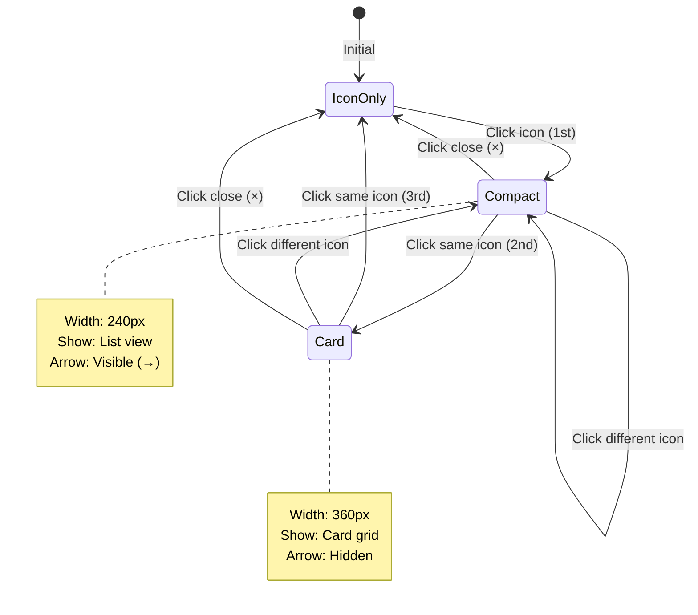

# SPEC: Two-Click Progressive Icon Expansion

**Status:** Superseded (not adopted; v1.16.0 uses per-icon preferred mode instead)
**Created:** 2026-01-10
**From Brainstorm:** Icon-centric sidebar enhancement
**Type:** Feature Enhancement
**Target Version:** v1.17.0
**Estimated Effort:** Medium (8-12 hours)

---

## Overview

Enhance Scribe's icon-centric sidebar (v1.16.0) with a two-click progressive disclosure pattern where:
- **Click 1** (on collapsed icon): Opens **compact mode** (240px) - quick preview of contents
- **Click 2** (on expanded compact icon): Expands to **card mode** (360px) - full detailed view
- **Click 3** (on expanded card icon): Collapses to icon-only (48px)

This creates a smooth progressive disclosure flow that reduces cognitive load while maintaining quick access to detailed information.

**Current Behavior (v1.16.0):**
- Click icon → expands to user's preferred mode (compact OR card)
- Click mode toggle button → switches between modes
- Click same icon → collapses to icon-only

**New Behavior (v1.17.0):**
- Click icon → **always starts in compact mode** (preview)
- Click **same icon again** → expands to card mode (details)
- Click same icon third time → collapses to icon-only
- Accordion pattern maintained (one panel at a time)

---

## Primary User Story

**As a** Scribe user
**I want** a two-step expansion flow for sidebar icons
**So that** I can quickly scan content in compact mode before committing to full card view

**Acceptance Criteria:**
1. ✅ First click on any icon opens compact mode (240px width)
2. ✅ Second click on same icon expands to card mode (360px width)
3. ✅ Third click collapses panel to icon-only (48px)
4. ✅ Expand arrow (→) visible in compact mode header
5. ✅ Mode preference persisted per icon in localStorage
6. ✅ Accordion pattern maintained (one panel at a time)
7. ✅ Keyboard shortcuts: Number keys + Space to expand
8. ✅ Empty icons show compact with "No items" + create button

---

## Secondary User Stories

### Power User: Keyboard Navigation

**As a** keyboard-driven power user
**I want** to expand icons without touching the mouse
**So that** I can navigate efficiently through my projects

**Acceptance:**
- Press `1-9` to select corresponding icon
- Press `Space` to expand selected icon from compact → card
- Press `Esc` to collapse any expanded panel

### First-Time User: Discovery

**As a** new Scribe user
**I want** visual hints about expandability
**So that** I discover the card mode without hunting for controls

**Acceptance:**
- Compact header shows expand arrow (→) button
- Hover state on compact panel suggests further expansion
- Tooltip on arrow: "Click to see more details"

### ADHD User: Progressive Disclosure

**As a** user with ADHD
**I want** to preview content before diving deep
**So that** I don't get overwhelmed by too much information at once

**Acceptance:**
- Compact mode shows 5-7 items max (scrollable if more)
- Card mode shows full list with descriptions
- Smooth 200ms width transition between modes

---

## Technical Requirements

### Architecture

```
┌─────────────────────────────────────────────────────────────┐
│ IconBar (48px)                                              │
│ - Always visible                                            │
│ - Tracks which icon is expanded                             │
│ - Handles click events                                      │
│                                                             │
│   onClick(iconId):                                          │
│     if (currentIcon === iconId && mode === 'compact'):      │
│       expandToCard(iconId)  // Click 2                      │
│     else if (currentIcon === iconId && mode === 'card'):    │
│       collapseAll()         // Click 3                      │
│     else:                                                   │
│       expandToCompact(iconId)  // Click 1                   │
└─────────────────────────────────────────────────────────────┘
                         │
                         ▼
┌─────────────────────────────────────────────────────────────┐
│ ExpandedIconPanel (240px → 360px)                           │
│                                                             │
│ Header:                                                     │
│   [Icon] Title               [→ Expand] [× Close]           │
│                              ↑ Only in compact mode         │
│                                                             │
│ Content (mode-aware):                                       │
│   if (mode === 'compact'):                                  │
│     <CompactListView />  // 240px width                     │
│   else if (mode === 'card'):                                │
│     <CardGridView />     // 360px width                     │
└─────────────────────────────────────────────────────────────┘
```

**Mermaid State Diagram:**



---

### API Design

**State Management (Zustand):**

```typescript
interface AppViewState {
  // Existing v1.16.0
  expandedIcon: ExpandedIconType | null
  sidebarWidth: number
  compactModeWidth: number  // 240px
  cardModeWidth: number     // 360px

  // NEW v1.17.0
  currentMode: 'icon' | 'compact' | 'card'  // Current expansion mode
  iconClickCount: Record<string, number>    // Track clicks per icon

  // Updated actions
  toggleIcon: (type: 'vault' | 'smart', id: string) => void  // Modified
  expandToCompact: (type: 'vault' | 'smart', id: string) => void  // NEW
  expandToCard: (type: 'vault' | 'smart', id: string) => void     // NEW

  // Existing actions (unchanged)
  collapseAll: () => void
  setIconMode: (type, id, mode) => void
  setSidebarWidth: (width: number) => void
}
```

**Updated `toggleIcon` Implementation:**

```typescript
toggleIcon: (type, id) => {
  const { expandedIcon, currentMode } = get()

  // Same icon clicked
  if (expandedIcon?.type === type && expandedIcon?.id === id) {
    if (currentMode === 'compact') {
      // Click 2: compact → card
      expandToCard(type, id)
    } else if (currentMode === 'card') {
      // Click 3: card → icon-only
      collapseAll()
    }
  }
  // Different icon clicked
  else {
    // Click 1: icon-only → compact (always)
    expandToCompact(type, id)
  }
}
```

**New Actions:**

```typescript
expandToCompact: (type, id) => {
  set({
    expandedIcon: { type, id },
    currentMode: 'compact',
    sidebarWidth: get().compactModeWidth  // 240px
  })
  saveExpandedIcon({ type, id })
  saveCurrentMode('compact')
}

expandToCard: (type, id) => {
  set({
    expandedIcon: { type, id },
    currentMode: 'card',
    sidebarWidth: get().cardModeWidth  // 360px
  })
  saveExpandedIcon({ type, id })
  saveCurrentMode('card')
}
```

---

### Data Models

**LocalStorage Schema (v1.17.0):**

```typescript
// Existing (v1.16.0)
'scribe:expandedIcon'       → '{"type":"vault","id":"inbox"}'
'scribe:compactModeWidth'   → '240'
'scribe:cardModeWidth'      → '360'
'scribe:pinnedVaults'       → '[{...preferredMode...}]'
'scribe:smartIcons'         → '[{...preferredMode...}]'

// NEW (v1.17.0)
'scribe:currentMode'        → '"compact"' | '"card"'
'scribe:iconExpandHistory'  → '{"inbox":{"lastMode":"card","timestamp":1234567890}}'
```

**Icon Expand History:**

```typescript
interface IconExpandHistory {
  [iconId: string]: {
    lastMode: 'compact' | 'card'
    timestamp: number
    clickCount: number  // For analytics
  }
}
```

---

### Dependencies

**No new dependencies required** - uses existing v1.16.0 architecture:

| Dependency | Version | Purpose |
|------------|---------|---------|
| React 18 | ^18.2.0 | Component framework |
| Zustand | ^4.4.0 | State management |
| Lucide React | ^0.263.1 | Icons (expand arrow) |
| Tailwind CSS | ^3.3.0 | Styling & transitions |

**New Icons Needed:**
- `ChevronRight` (→) for expand button in compact header
- Existing `X` for close button

---

## UI/UX Specifications

### User Flow

```
User Journey: First-time icon expansion
┌─────────────────────────────────────────────────────────────┐
│ 1. User sees icon bar (48px wide)                           │
│    └─ Icons: Inbox, Research, Teaching, etc.                │
│                                                             │
│ 2. User clicks "Research" icon                              │
│    └─ Sidebar expands to 240px (compact mode)               │
│    └─ Shows: List of 2 research projects                    │
│    └─ Header shows: "Research" + [→] expand button          │
│                                                             │
│ 3. User clicks "Research" icon again (or → button)          │
│    └─ Sidebar expands to 360px (card mode)                  │
│    └─ Shows: Project cards with descriptions, stats         │
│    └─ Header shows: "Research" + [×] close button           │
│    └─ No expand button (already at max)                     │
│                                                             │
│ 4. User clicks "Research" icon again                        │
│    └─ Sidebar collapses to 48px (icon-only)                 │
│    └─ Research icon no longer highlighted                   │
└─────────────────────────────────────────────────────────────┘
```

### Wireframes (ASCII)

**State 1: Icon-Only (48px)**

```
┌──┐
│📥│  Inbox
│  │
│🔬│  Research (active)
│  │
│🎓│  Teaching
│  │
│📦│  R Packages
│  │
│🛠️│  Dev Tools
│  │
│  │
│⊕ │  New Project
│  │
│🔍│  Search
│⏱️│  Daily
│⚙️│  Settings
└──┘
```

**State 2: Compact Mode (240px)**

```
┌──┬─────────────────────────────┐
│📥│                             │
│  │                             │
│🔬│ Research            [→] [×] │  ← Header with expand arrow
│  │ ─────────────────────────── │
│🎓│                             │
│  │ □ Research Project          │  ← List items
│📦│   2 notes • Active          │
│  │                             │
│🛠️│ □ Research Notes            │
│  │   1 note • Planning         │
│  │                             │
│⊕ │ + New Project               │
│  │                             │
│🔍│                             │
│⏱️│                             │
│⚙️│                             │
└──┴─────────────────────────────┘
```

**State 3: Card Mode (360px)**

```
┌──┬─────────────────────────────────────┐
│📥│                                     │
│  │                                     │
│🔬│ Research                        [×] │  ← No expand arrow
│  │ ───────────────────────────────────│
│🎓│                                     │
│  │ ┌─────────────────────────────────┐ │
│📦│ │ Research Project          ●●●●○ │ │  ← Card with activity dots
│  │ │ Your research workspace         │ │
│🛠️│ │ 2 notes • 137 words • 1d ago    │ │
│  │ │                           [+]   │ │
│  │ └─────────────────────────────────┘ │
│⊕ │                                     │
│  │ ┌─────────────────────────────────┐ │
│🔍│ │ Research Notes            ●●○○○ │ │
│⏱️│ │ Example project                 │ │
│⚙️│ │ 1 note • 45 words • Jan 21      │ │
│  │ │                           [+]   │ │
│  │ └─────────────────────────────────┘ │
│  │                                     │
│  │ + New Project                       │
└──┴─────────────────────────────────────┘
```

### Component Hierarchy

```typescript
<MissionSidebar>
  <IconBar
    expandedIcon={expandedIcon}
    currentMode={currentMode}  // NEW
    onToggleIcon={toggleIcon}
  >
    <InboxButton onClick={() => toggleIcon('vault', 'inbox')} />
    <SmartIconButton
      icon="research"
      isExpanded={expandedIcon?.id === 'research'}
      onClick={() => toggleIcon('smart', 'research')}
    />
    {/* ... more icons ... */}
  </IconBar>

  {expandedIcon && (
    <ExpandedIconPanel
      expandedIcon={expandedIcon}
      mode={currentMode}  // 'compact' | 'card'
      width={sidebarWidth}
      onToggleMode={handleToggleMode}  // Click → button
      onExpandToCard={handleExpandToCard}  // NEW - Click same icon
      onClose={collapseAll}
    >
      {/* Header */}
      <PanelHeader
        icon={getIcon(expandedIcon)}
        title={getTitle(expandedIcon)}
        showExpandButton={currentMode === 'compact'}  // NEW
        onExpand={onExpandToCard}
        onClose={onClose}
      />

      {/* Content */}
      {currentMode === 'compact' ? (
        <CompactListView projects={filteredProjects} notes={filteredNotes} />
      ) : (
        <CardGridView projects={filteredProjects} notes={filteredNotes} />
      )}
    </ExpandedIconPanel>
  )}

  <ResizeHandle
    canResize={expandedIcon !== null}
    onResize={handleResize}
  />
</MissionSidebar>
```

### Accessibility Checklist

- ✅ **Keyboard Navigation:**
  - `1-9` keys select corresponding icon
  - `Space` expands compact → card
  - `Enter` also expands (alternative to Space)
  - `Esc` collapses to icon-only
  - `Tab` cycles through panel items

- ✅ **ARIA Labels:**
  - Icon buttons: `aria-label="Research - Click to expand"`
  - Expand button: `aria-label="Expand to card view"`
  - Close button: `aria-label="Collapse sidebar"`
  - Mode state: `aria-expanded="true"` on expanded icons

- ✅ **Focus Management:**
  - Clicking icon moves focus to panel header
  - Expanding to card maintains focus on expand button location
  - Collapsing returns focus to icon button

- ✅ **Screen Reader Announcements:**
  - "Research panel opened in compact mode"
  - "Research panel expanded to card view"
  - "Sidebar collapsed"

- ✅ **Reduced Motion:**
  - Respect `prefers-reduced-motion` media query
  - Skip width transitions if user prefers reduced motion

- ✅ **Color Contrast:**
  - Expand arrow: 4.5:1 contrast ratio
  - Active icon highlight: 3:1 contrast ratio

---

## Open Questions

### 1. Mode Toggle Button Behavior

**Question:** Should the mode toggle button (grid/list icon) still be visible in compact mode?

**Options:**
- A) Hide it (use expand arrow only) - Simpler, clearer intent
- B) Show it (allows jumping to card without second icon click) - More flexible
- C) Show only on hover - Discoverable but not cluttered

**Recommendation:** Option A - Hide mode toggle in compact, show only expand arrow. Keeps UX focused on single action.

---

### 2. Animation Duration

**Question:** What should the width transition duration be between modes?

**Current (v1.16.0):** No transition specified
**Options:**
- 150ms (fast, snappy)
- 200ms (balanced) ← Recommended
- 300ms (smooth, leisurely)

**Recommendation:** 200ms with `ease-in-out` easing for smooth but responsive feel.

---

### 3. Empty State Behavior

**Question:** When expanding an empty icon (e.g., Teaching with no projects), should compact mode show:

**Options:**
- A) "No projects" message + "Create Project" button ← Recommended
- B) Auto-expand to card mode (since nothing to preview)
- C) Show compact with empty list + inline create form

**Recommendation:** Option A - Show actionable empty state in compact mode.

---

### 4. Width Persistence

**Question:** Should compact/card widths be user-adjustable via resize handle?

**Current (v1.16.0):** Resize handle adjusts `compactModeWidth` and `cardModeWidth` globally

**Concern:** If user resizes compact to 280px, it may be too close to card at 360px

**Options:**
- A) Keep resizable (current behavior) - User control
- B) Lock widths to 240px/360px - Consistent UX
- C) Snap to presets (180/240/280 for compact, 320/360/400 for card)

**Recommendation:** Option A - Keep resizable, but enforce minimum 80px gap between modes.

---

## Review Checklist

**Before Implementation:**
- [ ] Resolve Open Question 1: Mode toggle button visibility
- [ ] Resolve Open Question 2: Animation duration
- [ ] Confirm empty state design with mockups
- [ ] Review keyboard shortcuts with accessibility team
- [ ] Test animation performance on low-end devices

**Implementation Phase:**
- [ ] Update `useAppViewStore` with new state fields
- [ ] Modify `toggleIcon` action for two-click behavior
- [ ] Create `PanelHeader` with conditional expand button
- [ ] Add width transition CSS with reduced-motion support
- [ ] Implement keyboard shortcuts (1-9 + Space)
- [ ] Update localStorage schema for `currentMode`

**Testing Phase:**
- [ ] Unit tests for `toggleIcon` state transitions
- [ ] E2E tests for two-click flow (icon → compact → card → close)
- [ ] Accessibility audit (keyboard nav + screen reader)
- [ ] Visual regression tests for width transitions
- [ ] Test accordion with multiple rapid icon clicks
- [ ] Verify localStorage persistence across sessions

**Documentation:**
- [ ] Update CLAUDE.md with v1.17.0 architecture
- [ ] Create user guide section for progressive expansion
- [ ] Update keyboard shortcuts reference
- [ ] Record demo GIF showing two-click pattern

---

## Implementation Notes

### Migration from v1.16.0

**Breaking Changes:** None - fully backward compatible

**State Migration:**
```typescript
// v1.16.0 users with expandedIcon + mode preference
// Will start in compact on next icon click

function migrateToTwoClickPattern() {
  const expandedIcon = localStorage.getItem('scribe:expandedIcon')

  if (expandedIcon) {
    // Force compact mode on first load
    localStorage.setItem('scribe:currentMode', '"compact"')
  }

  // Existing preferredMode per icon still works
  // Will be honored when expanding to card
}
```

### Performance Considerations

1. **Width Transitions:**
   - Use `transform: scaleX()` instead of `width` for better performance
   - Or use `will-change: width` to hint at upcoming transitions

2. **Rendering:**
   - CompactListView and CardGridView should be lazy-loaded
   - Use `React.memo()` to prevent unnecessary re-renders

3. **State Updates:**
   - Debounce rapid icon clicks (200ms) to prevent state thrashing
   - Batch localStorage writes

### Edge Cases

| Scenario | Behavior |
|----------|----------|
| Click icon 10 times rapidly | Debounce: cycle through icon → compact → card → icon |
| Resize sidebar while in compact | Update `compactModeWidth`, stay in compact |
| Resize sidebar while in card | Update `cardModeWidth`, stay in card |
| Click expand arrow vs icon | Both expand to card (same action) |
| Empty icon (no items) | Show compact with "No items" + create button |
| Icon deleted while expanded | Auto-collapse to icon-only |
| Browser back button | No change (sidebar state is app-level, not route) |

---

## History

### 2026-01-10 - Initial Draft
- Created from brainstorm session (max depth + feature focus)
- Gathered 8 expert requirements questions
- Defined two-click progressive disclosure pattern
- Documented state transitions and component hierarchy
- Identified 4 open questions for resolution

### Status: Draft → Ready for Review

**Next Steps:**
1. Review with design team for UX validation
2. Resolve 4 open questions (mode toggle, animation, empty state, width)
3. Create visual mockups/prototypes
4. Approve spec → move to implementation

---

## Related Specs

- **v1.16.0 Icon-Centric Sidebar Expansion** - Foundation for this feature
- **v1.14.0 WikiLink Navigation** - Similar progressive disclosure pattern
- **Future:** Multi-select mode for batch operations on cards

---

## Success Metrics

**User Experience:**
- < 500ms total time from icon click to compact render
- < 300ms transition from compact → card
- 0 layout shift during width transitions
- 95%+ keyboard navigation success rate

**Technical:**
- 0 performance regressions vs v1.16.0
- < 5ms state update latency
- 100% test coverage for new state transitions

**ADHD-Friendly:**
- Reduces initial cognitive load by previewing in compact
- Clear visual progression through expansion states
- Escape hatch always available (Esc key)
- No dead ends or confusing states
